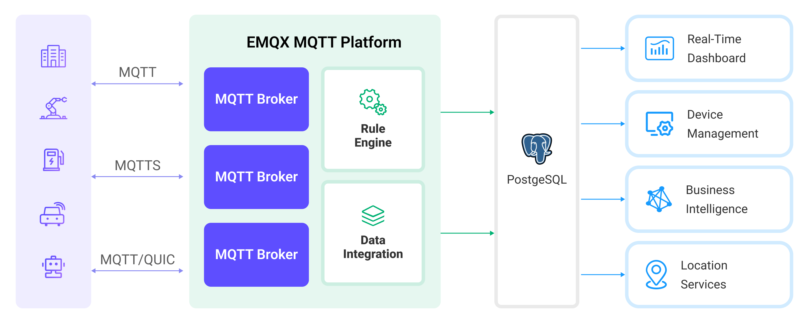

# 将 MQTT 数据写入到 PostgreSQL

[PostgreSQL](https://www.postgresql.org/) 是世界上最先进的开源关系数据库，拥有强大的数据处理能力，适用于从简单的应用程序到复杂的数据处理任务。EMQX Platform 支持与 PostgreSQL 集成，使其能够高效地处理来自物联网设备的实时数据流，能够在保证数据完整性的同时，支持大规模的数据存储、精准查询和复杂的数据关联分析。通过 EMQX Platform 的高效消息路由和 PostgreSQL 的灵活数据模型，可以轻松实现设备状态的监控、事件的追踪以及操作的审核，为企业提供深入的数据洞见和强大的业务智能支持。

本页面提供了 EMQX Platform 与 PostgreSQL 数据集成的全面介绍，并提供了实用的规则和创建指导。

:::tip
本页内容同样适用于 MatrixDB。
:::

## 工作原理

PostgreSQL 数据集成是 EMQX Platform 的开箱即用功能，结合了 EMQX Platform 的设备接入、消息传输能力和 PostgreSQL 强大的数据存储能力。通过内置的[规则引擎](./rules.md)组件，该集成简化了从 EMQX Platform 到 PostgreSQL 的数据摄取过程，用于存储和管理数据，无需复杂编码。通过 PostgreSQL 数据集成可以将 MQTT 消息和客户端事件存储到 PostgreSQL 中，也可以通过事件触发对 PostgreSQL 中数据的更新或删除操作，从而实现对诸如设备在线状态、上下线历史等的记录。

下图展示了 EMQX Platform 和 PostgreSQL 之间的数据集成的典型架构:



将 MQTT 数据摄取到 PostgreSQL 的工作流程如下：

- **物联网设备连接到 EMQX Platform**：物联网设备通过 MQTT 协议成功连接后，将触发在线事件。事件包括设备 ID、源 IP 地址和其他属性等信息。
- **消息发布和接收**：设备向特定主题发布遥测和状态数据。当 EMQX Platform 接收到这些消息时，它将在其规则引擎中启动匹配过程。
- **规则引擎处理消息**：借助内置规则引擎，可以根据主题匹配处理来自特定来源的消息和事件。规则引擎匹配相应规则并处理消息和事件，例如转换数据格式、过滤特定信息或使用上下文信息丰富消息。
- **消息写入 PostgreSQL**：规则触发将消息写入 PostgreSQL。借助 SQL 模板，用户可以从规则处理结果中提取数据来构造 SQL 并发送到 PostgreSQL 执行，从而将消息的特定字段写入或更新到数据库的相应表和列中。

在事件和消息数据写入 PostgreSQL 后，您可以连接到 PostgreSQL 读取数据，进行灵活的应用程序开发，例如：

- 连接到可视化工具，如 Grafana，根据数据生成图表并展示数据变化。
- 连接到设备管理系统，查看设备列表和状态，检测异常设备行为，并及时消除潜在问题。

## 特性与优势

PostgreSQL 是一款流行的开源关系型数据库，具备丰富的功能。与 PostgreSQL 的数据集成可以为您的业务带来以下特性和优势：

- **灵活的事件处理**：通过 EMQX Platform 规则引擎，PostgreSQL 可以处理设备生命周期事件，极大地促进了物联网应用实施所需的各种管理和监控任务的开发。通过分析事件数据，您可以及时发现设备故障、异常行为或趋势变化，采取适当措施。
- **消息转换**：消息可以在写入 PostgreSQL 之前通过 EMQX Platform 规则进行广泛的处理和转换，使存储和使用更加方便。
- **灵活的数据操作**：借助 PostgreSQL 数据桥提供的 SQL 模板，可以轻松地将特定字段的数据写入或更新到 PostgreSQL 数据库中相应的表和列中，实现灵活的数据存储和管理。
- **业务流程集成**：PostgreSQL 数据桥使您能够将设备数据与 PostgreSQL 丰富的生态系统应用集成，便于与 ERP、CRM 或其他自定义业务系统集成，实现先进的业务流程和自动化。

- **将物联网与 GIS 技术结合**：PostgreSQL 提供了 GIS 数据存储和查询能力，支持地理空间索引、地理围栏和提醒、实时位置追踪以及地理数据处理等功能，结合 EMQX Platform 可靠的消息传输能力，能够高效处理和分析来自移动设备例如车辆的地理位置信息，实现实时监控、智能决策和业务优化。
- **运行时指标**：支持查看每个规则的运行时指标，如总消息数、成功/失败计数、当前速率等。

通过灵活的事件处理、广泛的消息转换、灵活的数据操作以及实时监控和分析能力，您可以构建高效、可靠、可扩展的物联网应用程序，有利于您的业务决策和优化。

## 准备工作

本节介绍了在 EMQX Platform 中创建 PostgreSQL 数据集成之前需要做的准备工作。

### 前置准备

- 了解[数据集成](./introduction.md)。
- 了解[规则](./rules.md)。

### 网络设置

<!--@include: ./network-setting.md-->

### 安装 PostgreSQL

1. 通过 Docker 安装并启动 PostgreSQL：

```bash
# 启动一个 PostgreSQL 容器并设置密码为 public
docker run --name PostgreSQL -p 5432:5432 -e POSTGRES_PASSWORD=public -d postgres

# 进入容器
docker exec -it PostgreSQL bash

# 在容器中连接到 PostgreSQL 服务器，需要输入预设的密码
psql -U postgres -W

# 创建并选择数据库

CREATE DATABASE emqx_data;

\c emqx_data;
```

2. 温湿度表创建，使用以下 SQL 语句将创建 `temp_hum` 表，该表将用于存放设备上报的温度和湿度数据：

```sql
CREATE TABLE temp_hum (
  up_timestamp   TIMESTAMPTZ       NOT NULL,
  client_id      TEXT              NOT NULL,
  temp           DOUBLE PRECISION  NULL,
  hum            DOUBLE PRECISION  NULL
);
```

3. 插入测试数据，并查看数据

```sql
INSERT INTO temp_hum(up_timestamp, client_id, temp, hum)
VALUES (to_timestamp(1603963414), 'temp_hum-001', 19.1, 55);
```

```bash
emqx_data=# SELECT * FROM temp_hum;
      up_timestamp      |  client_id   | temp | hum
------------------------+--------------+------+-----
 2020-10-29 09:23:34+00 | temp_hum-001 | 19.1 |  55
(1 row)
```

## 创建连接器

在创建数据集成的规则之前，您需要先创建一个 PostgreSQL 连接器用于访问 PostgreSQL 服务器。

1. 在部署菜单中选择 **数据集成**，在数据持久化服务分类下选择 PostgreSQL 服务。如果您已经创建了其他的连接器，点击**新建连接器**，然后在数据持久化服务分类下选择 PostgreSQL 服务。
2. **连接器名称**：系统将自动生成一个连接器的名称。
3. 输入连接信息：
   - **服务器地址**：填写服务器的 IP 地址以及端口。
   - **数据库名字**：填写 `emqx_data`。
   - **用户名**：填写 `postgres`。
   - **密码**：填写 `public`。
4. 如果您想建立加密连接，请点击 **启用 TLS** 切换开关。
5. 点击**测试连接**按钮，如果 PostgreSQL 服务能够正常访问，则会返回成功提示。
6. 点击**新建**按钮完成连接器的创建。

## 创建规则

接下来您需要创建一条规则来指定需要写入的数据，并在规则中添加响应动作以将经规则处理的数据转发到 PostgreSQL

1. 点击连接器列表**操作**列下的新建规则图标或在**规则列表**中点击**新建规则**进入**新建规则**步骤页。

2. 在 SQL 编辑器中输入规则，在下面规则中我们从 `temp_hum/emqx` 主题读取消息上报时间 `up_timestamp`、客户端 ID、消息体(Payload)，并从消息体中分别读取温度和湿度：

   ```sql
    SELECT
      timestamp div 1000 as up_timestamp,
      clientid as client_id,
      payload.temp as temp,
      payload.hum as hum
    FROM
      "temp_hum/emqx"
   ```

3. 点击**下一步**开始创建动作。

4. 从**使用连接器**下拉框中选择您之前创建的连接器。

5. 配置 SQL 模板，使用如下 SQL 完成数据插入，此处为预处理 SQL，字段不应当包含引号，SQL 末尾不要带分号 `;`：

   ```sql
    INSERT INTO temp_hum(up_timestamp, client_id, temp, hum)
    VALUES (
      to_timestamp(${up_timestamp}),
      ${client_id},
      ${temp},
      ${hum}
    )
   ```

6. 根据需要配置高级设置选项（可选）。

7. 点击**确认**按钮完成动作的配置。

8. 在弹出的**成功创建规则**提示框中点击**返回规则列表**，从而完成了整个数据集成的配置链路。

## 测试规则

推荐使用 [MQTTX](https://mqttx.app/) 模拟温湿度数据上报，同时您也可以使用其他任意客户端完成。

1. 使用 MQTTX 连接到部署，并向以下 Topic 发送消息。

   - topic: `temp_hum/emqx`

   - payload:

     ```json
     {
       "temp": "27.5",
       "hum": "41.8"
     }
     ```

2. 查看数据转存结果

```bash
emqx_data=# SELECT * from temp_hum ORDER BY up_timestamp DESC LIMIT 10;
      up_timestamp      |  client_id   | temp | hum
------------------------+--------------+------+------
 2024-03-20 09:39:17+00 | test_client  | 27.5 | 41.8
 2020-10-29 09:23:34+00 | temp_hum-001 | 19.1 |   55
(2 rows)
```

3. 在控制台查看运行数据。在规则列表点击规则 ID，在运行统计页面可以查看到规则的统计以及此规则下所有动作的统计。
