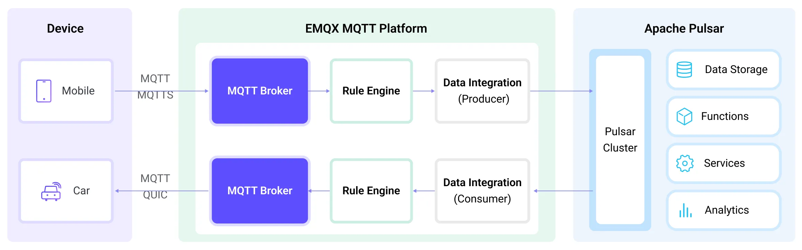

# 将 MQTT 数据传输到 Apache Pulsar

[Apache Pulsar](https://pulsar.apache.org/) 是一款流行的开源分布式事件流平台，专为处理实时数据流在应用程序和系统之间的传输而设计。Apache Pulsar 具有更高的可伸缩性，并提供了更快的吞吐量和更低的延迟。在物联网应用中，设备生成的数据通常通过轻量级的 MQTT 协议进行传输。通过与 Aphache Pulsar 的数据集成，用户可以轻松地将 MQTT 数据传入 Apache Pulsar，并与其他数据系统连接，实现对物联网设备生成的数据进行实时处理、存储和分析。

本页详细介绍了 EMQX Cloud 与 Apache Pulsar 的数据集成并提供了实用的规则和 Sink 创建指导。

## 工作原理

Apache Pulsar 数据集成是 EMQX 的开箱即用功能，结合了 EMQX 的设备接入、消息传输能力与 Pulsar 的强大数据处理能力。借助内置的规则引擎组件，数据流传输和处理过程在两个平台之间更加简化。这意味着您可以轻松地将 MQTT 数据传输到 Pulsar，并利用 Pulsar 的强大功能进行数据处理，而无需额外的开发工作，使得物联网数据的管理和利用变得更加高效和方便。



EMQX Cloud 通过规则引擎将 MQTT 数据转发至 Apache Pulsar，其完整流程如下：

1. **设备消息发布与接收**：物联网设备通过 MQTT 协议连接成功后向特定的主题发布遥测和状态数据，EMQX 接收到消息后将在规则引擎中进行比对。
2. **规则引擎处理消息**：通过内置的规则引擎，可以根据主题匹配处理特定来源的 MQTT 消息。规则引擎会匹配对应的规则，并对消息进行处理，例如转换数据格式、过滤掉特定信息或使用上下文信息丰富消息。
3. **桥接到 Apache Pulsar**：规则触发将消息转发到 Pulsar 的动作，允许轻松配置数据到 Pulsar 消息的键（Key）和值（Value），以及 MQTT 主题到 Pulsar 主题的映射关系，以便更好地组织和标识数据，方便后续的数据处理和分析。

MQTT 消息数据写入到 Apache Pulsar 后，您可以进行灵活的应用开发，例如：

- 编写 Pulsar 消费者应用程序来订阅并处理这些消息，根据业务需求，将 MQTT 数据与其他数据源进行关联、聚合或转换，实现实时的数据同步和整合。
- 接收到特定的 MQTT 消息时，可以使用 Pulsar 的规则引擎组件触发相应的操作或事件，实现跨系统和应用的事件驱动功能。
- 在 Pulsar 中实时分析 MQTT 数据流，检测异常或特定的事件模式，并基于这些情况触发警报通知或执行相应的操作。
- 将来自多个 MQTT 主题的分散数据集中到一个统一的数据流中，并利用 Pulsar 的计算功能进行实时的聚合、计算和分析，以获得更全面的数据洞察。

## 特性与优势

在 EMQX Cloud 中使用 Pulsar 数据集成能够为您的业务带来以下特性与优势：

- **可靠的物联网数据消息传递**：EMQX Cloud 可以将 MQTT 消息可靠地批量发送到 Pulsar，实现物联网设备到 Pulsar 以及应用系统的集成。
- **MQTT 消息转换**：EMQX Cloud 通过规则引擎可以对 MQTT 消息进行过滤和转换，消息可以在发送到 Pulsar 之前进行数据提取、过滤、丰富和转换。
- **灵活的主题映射**：Pulsar 支持将 MQTT 主题灵活映射到 Pulsar 主题，允许轻松配置数据到 Pulsar 消息的键（Key）和值（Value）。
- **灵活的分区选择能力**：Pulsar 可以根据 MQTT 主题或客户端，按照不同的策略选择 Pulsar 分区，更灵活的地组织和标识数据。
- **高吞吐量场景下的处理能力**：Pulsar 支持同步与异步不同的写入模式，可以根据不同场景实现延迟和吞吐量之间的灵活平衡。

## 准备工作

本节介绍了在 EMQX Cloud 中创建 Pulsar 数据集成之前需要做的准备工作，包括安装 Pulsar 服务器和创建 Pulsar 主题。

### 前置准备

- 了解[数据集成](./introduction.md)。
- 了解[规则](./rules.md)。

### 安装 Pulsar 服务器

在 Docker 中运行 Pulsar。

```bash
docker run --rm -it -p 6650:6650 --name pulsar apachepulsar/pulsar:2.11.0 bin/pulsar standalone -nfw -nss
```

具体的操作步骤可参阅 [Quick Start section in Pulsar Documentation](https://pulsar.apache.org/docs/2.11.x/getting-started-home/)。

### 创建 Pulsar 主题

在 EMQX 中创建 Sink 之前需要先创建相关的 Pulsar 主题。在 Pulsar 的 `public` 租户、`default` 命名空间下创建名为 `my-topic` 的主题，并指定 1 个分区。使用以下命令创建主题 `my-topic`：

```bash
docker exec -it pulsar bin/pulsar-admin topics create-partitioned-topic persistent://public/default/my-topic -p 1
```

## 创建连接器

在创建数据集成的规则之前，您需要先创建一个 Pulsar 连接器用于访问 Pulsar 服务。

1. 在部署菜单中选择 **数据集成**，在数据转发分类下选择 Pulsar。如果您已经创建了其他的连接器，点击**新建连接器**，然后在数据转发服务分类下选择 Pulsar。

2. **连接器名称**：系统将自动生成一个连接器的名称。

3. 填写连接相关配置：

   - **服务器地址**：输入 `pulsar://xxx:6650`。如果远程运行 Pulsar，请根据情况对**xxx**调整设置。
   - **客户端认证**：根据实际情况选择身份认证方式：`none`、`基础认证` 或 `Token`。
   - 根据您的业务需求配置其他选项以及配置高级设置选项（可选）。

4. 点击**测试连接**按钮，如果 Pulsar 能够正常访问，则会返回**连接器可用**提示。

5. 点击**新建**按钮完成连接器的创建。

接下来，您可以基于此连接器创建数据桥接规则。

## 创建规则

本节演示了如何创建 Pulsar 数据集成的规则来指定需要转发至 Pulsar 的数据并为规则添加触发的动作。

1. 点击连接器列表**操作**列下的新建规则图标或在**规则列表**中点击**新建规则**进入**新建规则**步骤页。

2. 在 SQL 编辑器中输入规则，客户端将温湿度消息发送到 `temp_hum/emqx` 主题时，就会触发引擎。这里需要对 SQL 进行一定的处理：

   ```sql
    SELECT
     timestamp as up_timestamp, clientid as client_id, payload.temp as temp, payload.hum as hum
    FROM
      "temp_hum/emqx"
   ```

   ::: tip

   如果您初次使用 SQL，可以点击 **SQL 示例**和**启用调试**来学习和测试规则 SQL 的结果。

   :::

3. 点击**下一步**开始创建动作。

4. 从**使用连接器**下拉框中选择您之前创建的连接器。

5. 完成消息从 EMQX Cloud 到发布到 Pulsar 的配置：

   - **Pulsar 主题名称**：输入 `persistent://public/default/my-topic`，即您之前创建的 Pulsar 主题。注意：这里不支持变量。
   - **分区选择策略**：选择生产者将消息分派到 Pulsar 分区的方式：`random`、`roundrobin` 或 `Key_dispatch`。
   - **压缩**：指定是否使用压缩算法以及在 Pulsar 消息中用于压缩/解压缩记录的算法。可选值为：`no_compression`、`snappy` 或 `zlib`。
   - **启用 TLS**: 如果您想建立一个加密连接，单击切换按钮。有关 TLS 连接的更多信息，请参见[启用 TLS 加密访问外部资源](../network/overview.md/#tls-for-external-resource-access)。
   - **消息的键**：Pulsar 消息密钥。在此处插入字符串，可以是纯字符串或包含占位符（${var}）的字符串。
   - **消息的值**：Pulsar 消息值。在此处插入字符串，可以是纯字符串或包含占位符（${var}）的字符串。

6. 展开**高级设置**，根据需要配置高级设置选项（可选），详细请参考[高级设置](#高级设置)。

7. 点击**确认**按钮完成动作的配置。
8. 在弹出的**成功创建规则**提示框中点击**返回规则列表**，从而完成了整个数据集成的配置链路。

## 测试规则

推荐使用 [MQTTX](https://mqttx.app/) 模拟温湿度数据上报，同时您也可以使用其他任意客户端完成。

1. 使用 MQTTX 连接到 EMQX Cloud 部署，并向以下 Topic 发送消息。

   - topic: `temp_hum/emqx`

   - client id: `test_client`

   - payload:

     ```json
     {
       "temp": "27.5",
       "hum": "41.8"
     }
     ```

2. 通过 Pulsar 命令查看 persistent://public/default/my-topic 主题是否写入消息：

   ```bash
   docker exec -it pulsar bin/pulsar-client consume -n 0 -s mysubscriptionid -p Earliest persistent://public/default/my-topic
   ```

## 高级设置

本节将深入介绍可用于 Pulsar 连接器和动作的高级配置选项。在配置连接器和动作时，您可以根据您的特定需求展开**高级设置**，调整以下参数。

| 字段名称            | 描述                                                                                                                                                                                                                                                                                                                                                                                              | 默认值     |
| ------------------- | ------------------------------------------------------------------------------------------------------------------------------------------------------------------------------------------------------------------------------------------------------------------------------------------------------------------------------------------------------------------------------------------------- | ---------- |
| 同步发布超时        | 发布者等待响应或消息成功传递的最长时间，以确保数据可靠性。<br />如果出现传递问题或网络问题，此超时设置非常重要，它可以防止发布者无限期地阻塞。                                                                                                                                                                                                                                                    | `3` 秒     |
| Socket 发送缓存大小 | 管理套接字缓冲区的大小，以优化网络传输性能。                                                                                                                                                                                                                                                                                                                                                      | `1` MB     |
| 最大批量请求大小    | 指定在 Pulsar 消息中批处理的最大个别请求数。                                                                                                                                                                                                                                                                                                                                                      | `100`      |
| 最大批量字节数      | Pulsar 一般情况下会有默认的批处理大小限制为 1 MB。不过，EMQX 的默认值故意设置稍低于 1 MB，以考虑 Pulsar 消息编码开销，特别是当个别消息非常小的情况。如果消息超过此限制，单个消息仍然将作为单独的批处理发送。                                                                                                                                                                                      | `900` KB   |
| 连接超时            | 等待 TCP 连接建立的最长时间，包括启用认证时的时间。                                                                                                                                                                                                                                                                                                                                               | `5` 秒     |
| 缓存模式            | 定义消息在发送之前是否存储在缓冲区中。内存缓冲可以增加传输速度。<br />`memory`：消息在内存中缓存。如果 EMQX 节点重新启动，消息将丢失。<br />`disk`：消息在磁盘上缓存，确保它们在 EMQX 节点重新启动时仍然存在。<br />`hybrid`：消息最初在内存中缓存。当它们达到一定限制时（更多详细信息请参考 `segment_bytes` 配置），它们会逐渐转移到磁盘上。与内存模式类似，如果 EMQX 节点重新启动，消息将丢失。 | `Memory`   |
| Pular 分区缓存上限  | 每个 Pulsar 分区的最大允许缓冲区大小，以字节为单位。当达到此限制时，较旧的消息将被丢弃，以腾出缓冲区空间供新消息使用。此选项有助于平衡内存使用和性能。                                                                                                                                                                                                                                            | `2` GB     |
| 缓存文件大小        | 此设置适用于缓存模式配置为 `disk` 或 `hybrid` 时。它控制用于存储消息的分段文件的大小，影响磁盘存储的优化级别。                                                                                                                                                                                                                                                                                    | `100` MB   |
| 内存过载保护        | 当缓存模式配置为 `memory` 时，此设置生效。EMQX 在遇到高内存压力时会自动丢弃较旧的缓存消息。它有助于防止由于内存使用过多而导致系统不稳定，确保系统可靠性。<br />**注意**：高内存使用的阈值在配置参数 `sysmon.os.sysmem_high_watermark` 中定义。此配置仅在 Linux 系统上生效。                                                                                                                       | `disabled` |
| 启动超时时间        | 确定连接器在自动启动的资源达到健康状态之前等待的最长时间间隔，然后才响应资源创建请求。此设置有助于确保连接器在执行操作之前验证已连接的资源（例如 Polar 中的实例）已完全运行并准备好处理数据事务。                                                                                                                                                                                                 | `5` 秒     |
| 健康检查间隔        | 用于检查 Sink 运行状态的时间间隔。                                                                                                                                                                                                                                                                                                                                                                | `15` 秒    |
