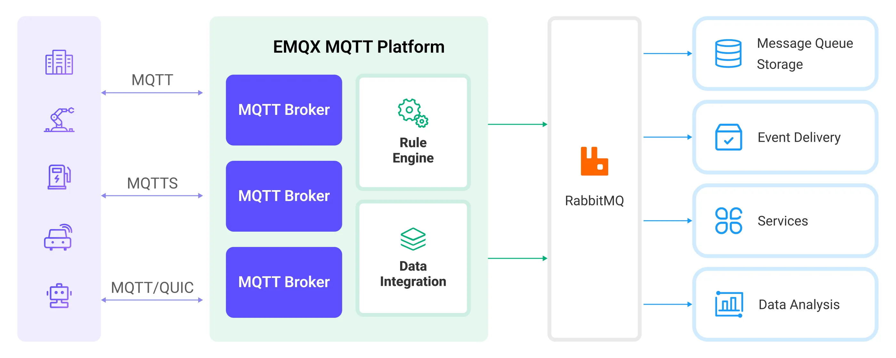

# 将 MQTT 数据传输到 RabbitMQ

作为一款广泛使用的开源消息代理，[RabbitMQ](https://www.rabbitmq.com/) 应用了高级消息队列协议（AMQP），为分布式系统之间的消息传递提供了一个强大而可扩展的平台。EMQX Cloud 支持与 RabbitMQ 的数据集成，能够让您将 MQTT 消息和事件转发至 RabbitMQ。

本页面提供了 EMQX Cloud 与 RabbitMQ 数据集成的全面介绍，并提供了创建规则和动作的实用指导。

## 工作原理

RabbitMQ 数据集成是 EMQX Cloud 中的开箱即用功能，结合了 EMQX Cloud 的设备接入、消息传输能力与 RabbitMQ 强大的消息队列处理能力。通过内置的[规则引擎](./rules.md)组件，该集成简化了从 EMQX Cloud 到 RabbitMQ 的数据摄取过程，无需复杂编码。

下图展示了 EMQX Cloud 与 RabbitMQ 之间数据集成的典型架构:



MQTT 数据摄取到 RabbitMQ 的工作流程如下：

1. **消息发布和接收**：工业物联网设备通过 MQTT 协议与 EMQX Cloud 建立成功连接，并向 EMQX Cloud 发布实时 MQTT 数据。EMQX Cloud 收到这些消息后，将启动其规则引擎中的匹配过程。
2. **消息数据处理**：消息到达后，它将通过规则引擎进行处理，然后由 EMQX Cloud 中定义的规则处理。根据预定义的标准，规则将决定哪些消息需要路由到 RabbitMQ。如果任何规则指定了载荷转换，则将应用这些转换，例如转换数据格式、过滤特定信息或用额外的上下文丰富载荷。
3. **消息传入到 RabbitMQ**：规则处理完消息后，它将触发一个动作，将消息转发到 RabbitMQ。处理过的消息将无缝写入 RabbitMQ。
4. **数据持久化和利用**：RabbitMQ 将消息存储在队列中，并将它们传递给适当的消费者。消息可以被其他应用程序或服务消费以进行进一步处理，如数据分析、可视化和存储。

## 特性与优势

RabbitMQ 数据集成为您的业务带来以下特性和优势：

- **可靠的物联网数据消息传递**：EMQX Cloud 确保从设备到云的可靠连接和消息传递，而 RabbitMQ 负责消息的持久化和在不同服务之间的可靠传递，确保了各个流程中数据的可靠性。
- **MQTT 消息转换**：使用规则引擎，EMQX Cloud 可以过滤和转换 MQTT 消息。在发送到 RabbitMQ 之前，消息可以经过数据提取、过滤、丰富和转换。
- **灵活的消息映射**：RabbitMQ 数据桥支持灵活的将 MQTT 主题映射到 RabbitMQ Routing Key 和 Exchange，允许 MQTT 和 RabbitMQ 之间的无缝集成。
- **高可用性和集群支持**：EMQX Cloud 和 RabbitMQ 都支持构建高可用的消息代理集群，确保即使在节点失败的情况下系统也能继续提供服务。利用集群能力还提供了出色的可扩展性。
- **高吞吐量场景中的处理能力**：RabbitMQ 数据集成支持同步和异步写入模式，允许根据不同场景在延迟和吞吐量之间灵活平衡。

## 准备工作

本节介绍了在 EMQX Cloud 中创建 RabbitMQ 数据集成之前需要做的准备工作，包括启动 RabbitMQ 服务器并创建 RabbitMQ test exchange 和 queue。

### 前置准备

- 了解[数据集成](./introduction.md)。
- 了解[规则](./rules.md)。
- 了解 UNIX 终端及命令

### 启动 RabbitMQ 服务器

本节介绍了如何使用 [Docker](https://www.docker.com/) 启动 RabbitMQ 服务器。

运行以下命令以启动启用管理插件的 RabbitMQ 服务器。管理插件允许您通过 Web 界面管理和监测 RabbitMQ。

```bash
docker run -it --rm --name rabbitmq -p 5672:5672 -p 15672:15672 rabbitmq:3.11-management
```

关于更多如何在 docker 中运行 RabbitMQ 的信息，可参阅 [RabbitMQ in Docker on Docker Hub](https://hub.docker.com/_/rabbitmq)。

### 创建 RabbitMQ Test Exchange 和 Queue

在启动 RabbitMQ 服务器后，您可以使用 RabbitMQ 管理界面创建一个 test exchange 和一个 queue。如果您已经有一个用于测试的 test exchange 和 queue，您可以跳过此部分。

1. 打开您的网页浏览器并在地址栏输入 http://{ip address}:15672/ 以访问 RabbitMQ 管理界面。在登录页面上，输入登录信息，然后点击**Login**。
   - **Username**: `guest`
   - **Password**: `guest`
2. 点击顶部菜单栏中的 **Exchanges** 页签，展开 **Add a new exchange** 并输入以下信息：

   - **Name**: 输入 `test_exchange`
   - **Type**: 从下拉列表中选择 `direct`
   - **Durability**: 选择 `Durable` 使 exchange 持久化
   - **Auto delete**: `No`
   - **Internal**: `No`
   - **Arguments**: 留空

3. 点击 **Add exchange** 按钮完成 test_exchange 的创建。
4. 点击顶部菜单栏中的 **Queues** 页签，展开 **Add a new queue** 并输入以下信息：
   - **Type**: `Default for virtual host`
   - **Name**: 输入 `test_queue`
   - **Durability**: 选择 `Durable` 使 exchange 持久化
   - **Arguments**: 留空
5. 点击 **Add queue** 按钮完成 queue 的创建。 新建的 **test_queue** 应出现在 **All queues** 区域。
6. 点击 **Name** 列中的 **test_queue** 以打开详情页。展开 **Bindings**，在 **Add binding to this queue** 区域，输入以下信息：
   - **From exchange**: 输入 `test_exchange`
   - **Routing key**: 输入 `test_routing_key`
   - **Arguments**: 留空
7. 点击 **Bind** 按钮将 test_queue 通过指定的 routing key 与 test_exchange 绑定。

## 创建连接器

在创建数据集成的规则之前，您需要先创建一个 RabbitMQ 连接器用于访问 RabbitMQ 服务。

1. 在部署菜单中选择 **数据集成**，在数据转发分类下选择 RabbitMQ。如果您已经创建了其他的连接器，点击**新建连接器**，然后在数据转发服务分类下选择 RabbitMQ。

2. **连接器名称**：系统将自动生成一个连接器的名称。

3. 填写连接相关配置：

   - **服务器地址**：输入 你想要连接的 RabbitMQ 服务器地址（例如，localhost），如果 RabbitMQ 服务器在远程运行，则填写实际服务器地址。
   - **端口**：RabbitMQ 服务器监听的端口号（默认为 5672），如果 RabbitMQ 服务器在远程运行，则填写实际端口号。
   - **用户名**: 输入 `guest`。
   - **密码**: 输入 `guest`。
   - **虚拟主机**: 输入 RabbitMQ 虚拟主机; 默认值为 `/` 。
   - **启用 TLS**: 如果您想建立一个加密连接，单击切换按钮。
   - 根据业务需求配置高级设置（可选）。

4. 点击**测试连接**按钮，如果 RabbitMQ 能够正常访问，则会返回**连接器可用**提示。

5. 点击**新建**按钮完成连接器的创建。

接下来，您可以基于此连接器创建数据桥接规则。

## 创建规则

本节演示了如何创建 RabbitMQ 数据集成的规则来指定需要转发至 RabbitMQ 的数据并为规则添加触发的动作。

1. 点击连接器列表**操作**列下的新建规则图标或在**规则列表**中点击**新建规则**进入**新建规则**步骤页。

2. 在 SQL 编辑器中输入规则，客户端将温湿度消息发送到 `temp_hum/emqx` 主题时，就会触发引擎。这里需要对 SQL 进行一定的处理：

   ```sql
    SELECT
     timestamp, clientid, payload
    FROM
      "temp_hum/emqx"
   ```

   ::: tip

   如果您初次使用 SQL，可以点击 **SQL 示例**和**启用调试**来学习和测试规则 SQL 的结果。

   :::

3. 点击**下一步**开始创建动作。

4. 从**使用连接器**下拉框中选择您之前创建的连接器。

5. 完成消息从 EMQX Cloud 到发布到 RabbitMQ 的配置：

   - **交换机**: 输入之前创建的 `test_exchange`， 消息将被发送到该交换机。
   - **路由键**: 输入之前创建的 `test_routing_key`，用于将消息路由到 RabbitMQ 交换中的正确队列。
   - 在 **消息传递模式**下拉框中选择 `non_persistent` 或 `persistent`：

     - `non_persistent` （默认选项）：消息不会持久化到磁盘，如果 RabbitMQ 重新启动或崩溃，消息可能会丢失。

     - `persistent`：消息被持久化到磁盘，以确保在 RabbitMQ 重新启动或崩溃时的数据持久性。

       ::: tip

       如果需要在 RabbitMQ 重新启动时防止消息丢失，您可能还需要将 queue 和 exchange 设置为 `durable`。有关更多信息，请参阅 RabbitMQ 的[文档](https://www.rabbitmq.com/documentation.html)。

       :::

   - **有效载荷模版**： 默认值为空字符串，意味着将被转发至 RabbitMQ 服务器的消息载荷是未经任何修改的 JSON 格式文本。

     您也可以自定义消息载荷格式，在模版中使用占位符来包含来自传入 MQTT 消息的动态数据。例如，如果您想要在 RabbitMQ 消息中包含来自 MQTT 消息的载荷和时间戳，可以使用下面的模版：

     ```json
     {"payload": "${payload}", "timestamp": ${timestamp}}
     ```

     该模板将生成一个包含传入 MQTT 消息的载荷和时间戳的 JSON 格式消息。其中，`${payload}` 和 `${timestamp}` 为占位符，当消息转发到 RabbitMQ 服务器时，它们将被实际的值替换。

   - **等待发布确认**: 默认开启以保证消息被成功发送至 RabbitMQ。

     ::: tip

     启用此选项后，消息在被认为成功发送之前，RabbitMQ 代理会确认接收该消息，从而提高了消息传递的可靠性。

     :::

6. 展开**高级设置**，根据情况配置同步/异步模式，队列与批量等参数高级设置选项（可选）

7. 点击**确认**按钮完成动作的配置。
8. 在弹出的**成功创建规则**提示框中点击**返回规则列表**，从而完成了整个数据集成的配置链路。

## 测试规则

推荐使用 [MQTTX](https://mqttx.app/) 模拟温湿度数据上报，同时您也可以使用其他任意客户端完成。

1. 使用 MQTTX 连接到 EMQX Cloud 部署，并向以下 Topic 发送消息。

   - topic: `temp_hum/emqx`

   - client id: `test_client`

   - payload:

     ```json
     {
       "temp": "27.5",
       "hum": "41.8"
     }
     ```

2. 如果动作和规则创建成功，该消息应已通过指定的路由键被发送到 RabbitMQ 指定的 exchange 中。访问 RabbitMQ 管理界面 http://{ip address}:15672 并导航至 Queues 区域。

3. 验证消息是否被路由到相应的 queue(s)。点击 queue 查看详情并点击 **Get Message(s)** 按钮查看消息的详细内容。

   ```json
   {"payload":
    "{
    "temp": "27.5",
    "hum": "41.8"
     }",
     "timestamp": 1711333401673
   }
   ```
