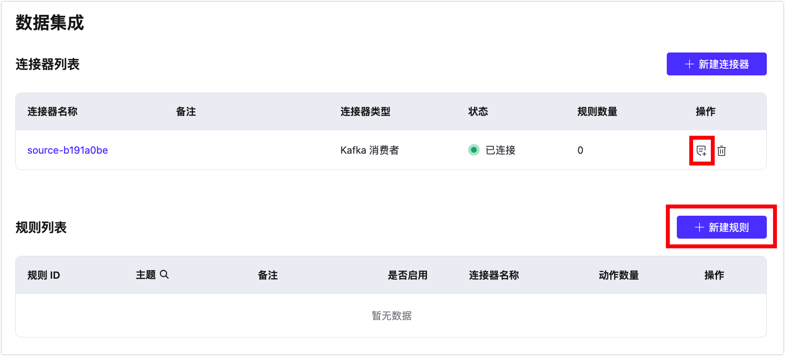
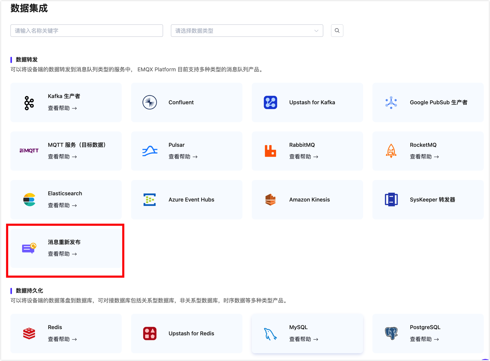
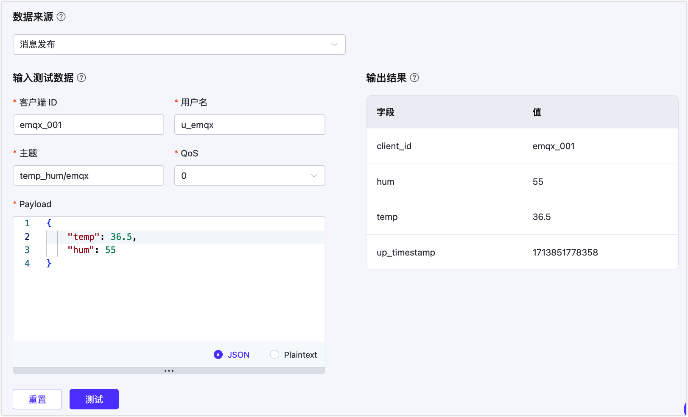
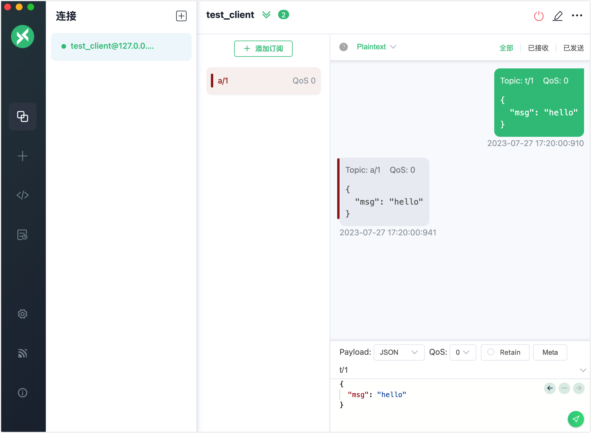
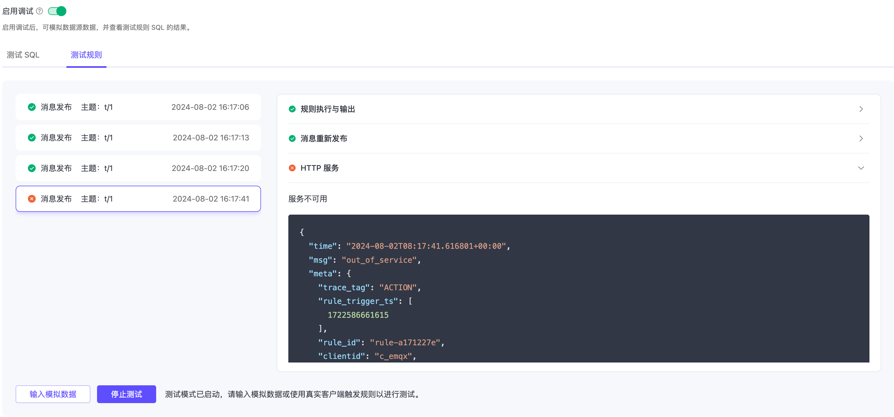
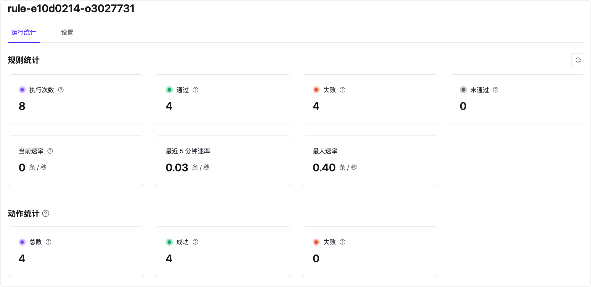
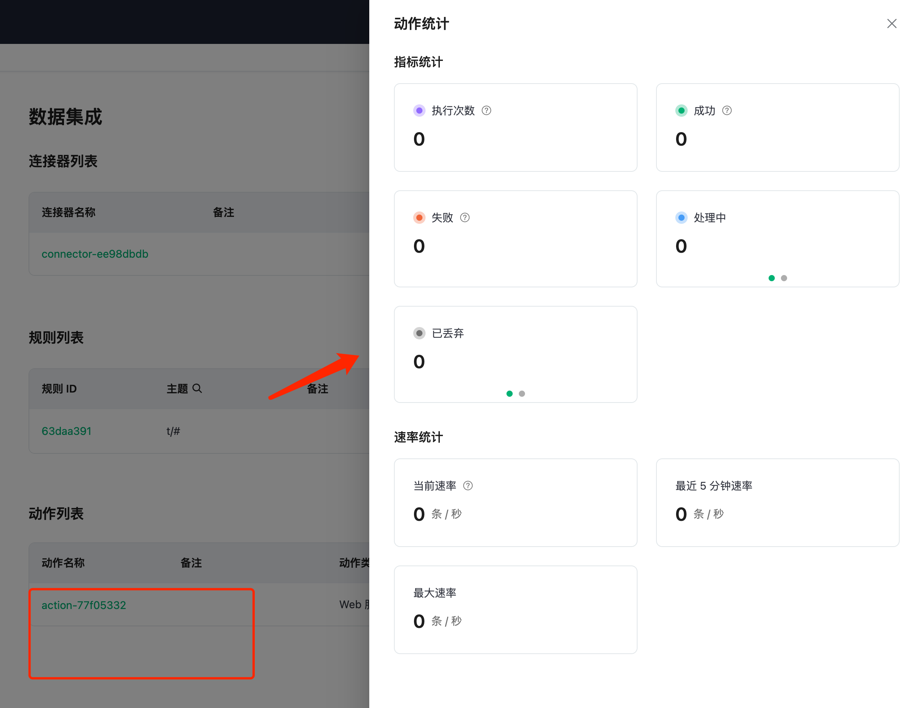
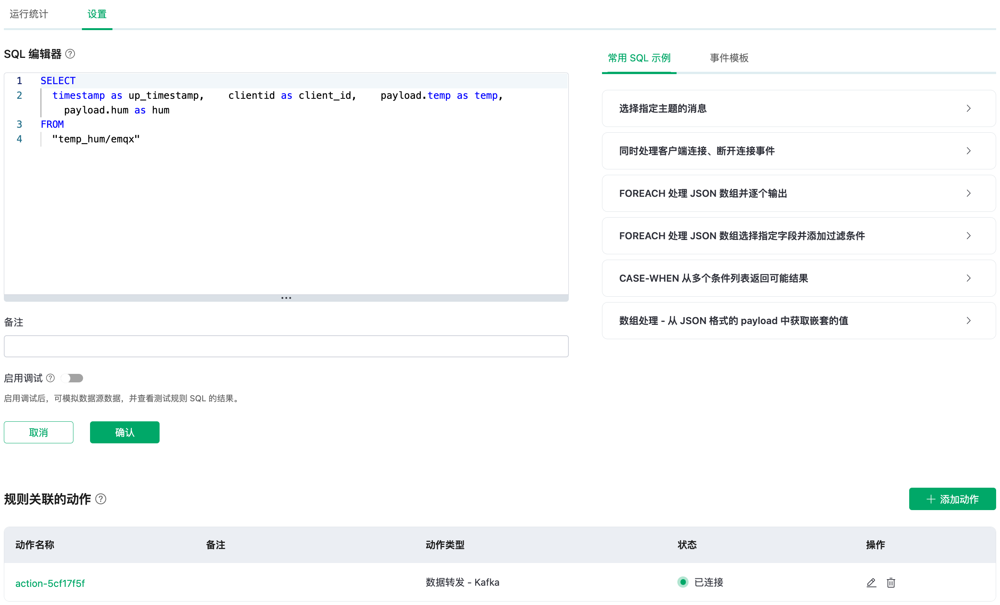

# 规则

规则是 EMQX Platform 内置基于 SQL 的数据处理组件，搭配[连接器](./connectors.md)使用无需编写代码即可实现一站式的 IoT 数据提取、过滤、转换、存储与处理，以加速应用集成和业务创新。

## 规则的组成
规则描述了 **数据来源**、**数据处理过程**、**处理结果去向** 三个方面：


- **数据来源**：规则的数据源可以是消息或事件，也可以是外部的数据系统。规则通过 SQL 的 FROM 子句指定数据的来源，SQL 的 WHERE 子句用于过滤数据。有关支持的各种类型数据源和可以在 WHERE 子句中引用的字段的更多信息，请参阅 [SQL 数据源和字段](https://docs.emqx.com/zh/enterprise/latest/data-integration/rule-sql-events-and-fields.html)。

- **数据处理过程**：规则通过 SQL 语句和函数来描述数据的处理过程。SQL 的 SELECT 子句以及 SQL 函数用于提取和转换数据；嵌入的 SQL 示例语句可用于实现高级转换，例如向输出消息添加时间戳。

  有关语法和内置 SQL 函数的详细解释，请参阅[规则 SQL 语法与示列](https://docs.emqx.com/zh/enterprise/latest/data-integration/rule-sql-syntax.html)和[内置 SQL 函数](https://docs.emqx.com/zh/enterprise/latest/data-integration/rule-sql-builtin-functions.html)。要了解更多关于 SQL 函数的信息，您还可以参考 [jq 函数](https://docs.emqx.com/zh/enterprise/latest/data-integration/rule-sql-jq.html)。

- **处理结果去向**：动作解决了“将处理后的数据发送到哪里”的问题。它们告诉 EMQX Platform 如何处理规则产生的数据。在根据指定的规则处理输入之后，可以定义一个或多个动作来处理 SQL 执行结果。规则引擎将依次执行相应的动作。目前，规则支持以下两种类型的动作：

  - 内置动作：目前，您可以通过[消息重新发布](./republish.md)将处理结果发布到另一个 MQTT 主题。 
  - 将处理结果存储在数据库中：通过预定义的[连接器](./connectors.md)将数据发送到各类目标服务。

### 规则 SQL 语句简介
SQL 语句用于指定规则的数据来源、定义数据处理过程等。下面给出了一个 SQL 语句的例子：

```sql
SELECT
    payload.data as d
FROM
    "t/#"
WHERE
    clientid = "foo"
```

在上述 SQL 语句里：

- 数据来源：主题为 t/# 的消息；
- 数据处理过程：如果发送消息的客户端 ID 为 foo，则从消息内容中选出 data 字段并赋值给新的变量 d。

::: tip
"." 语法要求数据必须是 JSON 或者 Map 类型，如果是其他数据类型，须要使用 SQL 函数做数据类型转换。
:::

关于规则的 SQL 语句格式和用法，详见 [SQL 手册](https://docs.emqx.com/zh/enterprise/latest/data-integration/rule-sql-syntax.html)。

## 创建规则

进入到您的部署，并从左侧导航菜单点击**数据集成**进入数据集成页面。当您首次进入数据集成的初始页面，您可以根据需要选择数据集成的类型，通过点击相应的图标创建一个用于连接到目标服务的连接器。具体的连接器创建步骤，参阅[创建连接器](./connectors.md)和各数据集成页面。

::: tip

您可以通过点击**新建连接器**回到数据集成初始页面。

:::

当您已经完成了连接器的创建，点击**规则列表**左上角的**新建规则**按钮，进入新建规则页面。您也可以通过点击连接器列表中的规则创建图标来创建新的规则。



对于**消息重新发布**类型，您无需创建连接器，可以在数据集成初始页面直接点击图标开始规则的创建过程。



您还可以在**调试**分类下点击**空动作**进入规则创建过程。空动作只配置规则，不关联任何动作，可以用来专门做规则的调试。具体内容参阅[空动作（调试）](./empty_action_debug.md)。

### 定义数据源

在**新建规则**页面上，为您的规则输入名称并添加备注以便未来管理。

在 **SQL 编辑器**中，您可以自定义语句以添加适合您业务需求的数据源。可以输入以下 SQL 语句用于演示：

```sql
SELECT
  timestamp as up_timestamp, clientid as client_id, payload.temp as temp, payload.hum as hum
FROM
  "temp_hum/emqx"
```

通过指定此 SQL 语句，规则从发布到 `temp_hum/emqx` 主题的消息中读取报告的时间戳、clientid 以及包含在消息 payload 中的温度和湿度。

### 测试 SQL 语句

点击**启用调试**开关来创建新的测试 SQL。填写适当的测试参数，并点击**测试**按钮。

在输出结果中，您可以看到预期的数据处理结果。



## 添加动作

创建规则后，点击**新建规则**步骤页面上的**下一步**按钮，进入**新建动作**步骤页面。在**新建动作**步骤页面上，从**连接器**下拉框中选择相关联的连接器。该页面将根据所选的关联连接器类型显示不同的动作配置选项。有关动作配置的详细示例，请参见[添加重新发布动作](#添加重新发布动作)和[添加将数据转发到目标服务](#添加将数据转发到目标服务动作)的动作。

规则可以关联多个动作。当您点击**确认**完成动作创建后，将出现**成功创建新规则**弹窗。如果您想添加另一个动作，可以点击**继续**以进行操作并选择另一个连接器。例如，一个动作可以将数据转发给 Kafka，而另一个动作将数据发送到 HTTP 服务。

### 添加重新发布动作

以下步骤演示了如何添加一个动作，将从主题 `t/#` 接收的原始消息重新发布到另一个主题 `a/1`。

1. 从**使用连接器**下拉框中选择`重新发布`。

2. 配置以下设置：
   - **主题**：在本示例中设置为目标主题 `a/1`；
   - **QoS**：在本示例中设置为重新发布的消息的 QoS 为`0`；
   - **Retain**：设置是否将此消息作为保留消息转发，本教程中保持默认设置 `false`；
   - **Payload**：输入 `${payload}`，表示重新发布的消息将与原始消息具有相同的 payload，不进行任何修改。
   - **MQTT 5.0 消息属性**：点击切换开关以根据需要配置消息属性，允许您为重新发布的消息添加丰富的消息元数据描述。
     - **有效载荷指示器**：指示消息格式。值设置为 `false` 时，消息是未确定的字节，设置为 `true` 时，意味着消息体中的有效载荷是 UTF-8 编码的字符数据。这将有助于 MQTT 客户端或 MQTT 服务器可以更加有效的解析消息内容，而不用特意去对于消息体进行格式或类型的判断。
     - **消息过期时间**：输入一个值（以秒为单位）以指定消息应在经过一段时间后过期，并且如果未传递给预期的接收方，则被视为无效。
     - **内容类型**：指定重新发布消息中的载荷内容的类型或格式（MIME 类型），例如，`text/plain` 表示文本文件，`audio/aac` 表示音频文件，而 `application/json` 表示是一条 JSON 格式的应用消息。
     - **响应主题**：输入要将响应消息发布到的特定 MQTT 主题。例如，如果您希望将响应发送到名为"response/my_device"的主题，您应输入：`response/my_device`。
     - **对比数据**：输入一个唯一标识符或数据，以将响应消息与原始请求消息相关联。您可以输入唯一的请求标识符、事务 ID 或在您的应用程序上下文中有意义的任何其他信息。

3. 点击**确认**完成动作创建。
4. 在**成功创建新规则**弹窗中，点击**返回规则列表**以完成规则创建。

### 添加将数据转发到目标服务动作

您还可以添加动作，通过关联的连接器将处理结果转发到目标服务。在**新建动作**步骤页面上，从**连接器**下拉列表中选择目标连接器。有关动作配置的详细信息，请参见[将 MQTT 数据发送到 HTTP 服务](./http_server.md)、[将 MQTT 数据传输到 Apache Kafka](./kafka.md)，或各数据集成页面。

## 测试规则

::: tip 注意

测试规则功能仅适用于专有版部署。

:::

规则引擎提供了规则测试功能，可以使用模拟数据或真实客户端触发规则，执行规则 SQL 以及规则中添加的所有动作，并获得每个步骤的执行结果。

通过测试规则，可以验证规则是否按预期工作，快速排查并解决存在的问题。这不仅加快了开发速度，还确保了规则在实际运行时能够如期运行，避免在真实环境中出现故障。

### 测试步骤

1. 点击**启用调试**开关，并将测试目标选择为**规则**。注意，开始测试之前需要先保存规则。

2. 点击**开始测试**按钮开始测试，浏览器将等待当前规则触发以生成测试结果。

3. 触发规则进行测试，支持以下 2 种方式：

   - **模拟数据**：点击**输入模拟数据**按钮，在弹出的窗口中选择与 SQL 匹配的**数据来源**，并确保它与规则中指定的来源（FROM 子句）保持一致。

     EMQX 为所有字段提供了默认值，例如**客户端 ID**、**用户名**、**主题**、**QoS**、**Payload** 等。可以修改为需要的值，点击**提交测试**按钮即可触发一次规则进行测试。

   - **真实设备**：保持当前页面打开，使用真实客户端或 MQTT 客户端工具连接到 EMQX，触发对应的事件，进行测试。

4. 查看测试结果：当规则被触发时，会将执行结果输出到控制台上，详细展示每个步骤的执行结果。

### 测试示例

以测试一个使用了默认规则 SQL 并添加了消息重发布动作的规则为例，您可以使用 [MQTTX](https://mqttx.app/zh/docs/get-started) 创建一个客户端，然后使用此客户端订阅主题 `a/1` 并发送一条 `t/1` 的消息。您将在对话框中看到此消息被重新发布到主题 `a/1`：



相应的，控制台测试界面上将显示整个规则的执行结果，显示内容如下：

- 左侧为规则执行记录，每次规则触发会产生一条记录，点击可以切换到对应的消息或事件详情。
- 右侧为选中规则记录下的动作列表，点击可以展开查看动作执行结果和日志。

当规则 SQL 或任意动作执行失败时，整个规则记录将标记为失败状态，可以选中记录查看对应动作的错误信息进行排查。



从上图可以看到，规则被触发了 4 次，其中 3 次规则执行完全成功，第 4 次由于 **HTTP 服务**动作执行失败，错误原因是服务不可用。

## 查看规则统计

您可以使用 [MQTTX](https://mqttx.app/) 连接到部署并模拟温湿度数据上报，发送消息到 `temp_hum/emqx` 主题以进行验证。

```json
{
  "temp": "27.5",
  "hum": "41.8"
}
```

在规则列表点击规则 ID，在运行统计页面可以查看到规则的统计以及此规则下所有动作的统计。



## 查看单个动作统计

您可以在动作列表点击动作 ID，在运行统计页面可以查看到此动作的指标统计和速率统计。

::: tip

目前只有专有版 v5 部署支持查看单个动作的指标。

:::



## 编辑规则

您可以直接点击规则列表上的编辑图标来编辑该规则，也可以通过点击规则 ID，然后选择**设置**页签来编辑该规则。在设置页面，你可以编辑规则的 SQL 模板，同时可以编辑、添加动作。



## 启用和停用规则

可以在规则列表上启用和停用规则。点击**是否启用**开关即可开启或停用规则。

## 删除规则
可以在规则列表删除规则。点击删除按钮，输入规则 ID 后可删除规则。

## 启用或停用动作

::: tip 注意

该功能仅适用于专有版部署。

:::

可以在动作列表上启用和停用动作。点击**是否启用**开关即可开启或停用动作。

## 编辑和删除动作

可以在动作列表点击**动作名称**或编辑按钮，重新编辑动作。点击**删除**按钮删除动作。
