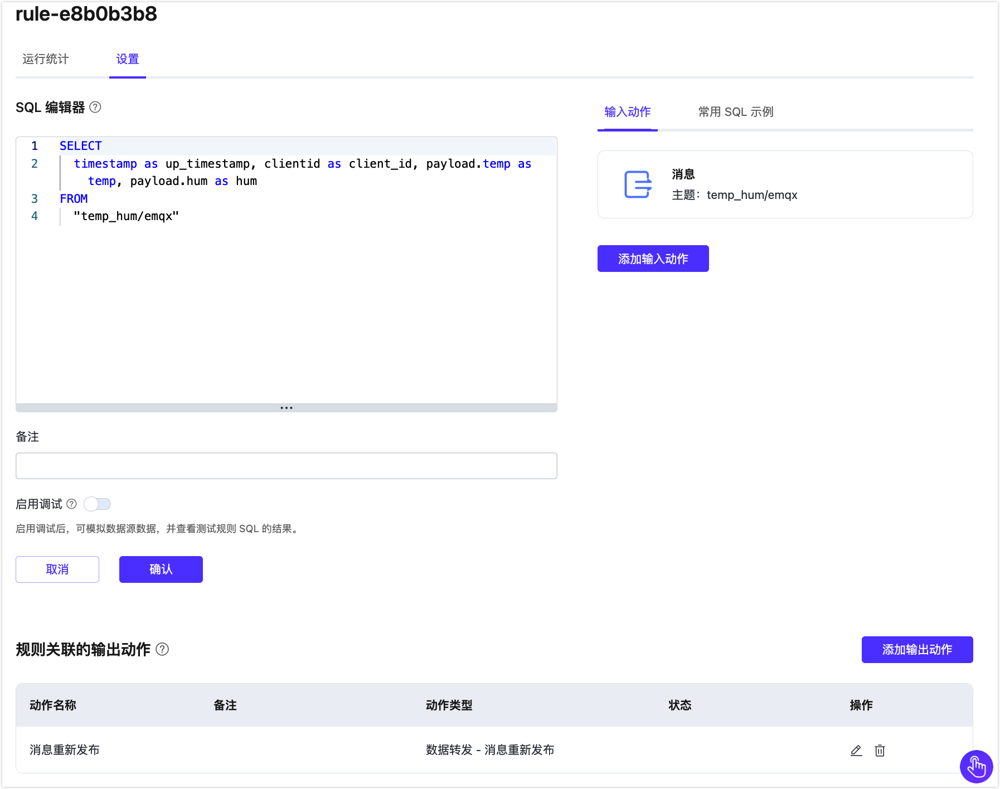

# 规则

规则是 EMQX Cloud 内置基于 SQL 的数据处理组件，搭配[连接器](./connectors.md)使用无需编写代码即可实现一站式的 IoT 数据提取、过滤、转换、存储与处理，以加速应用集成和业务创新。

## 规则的组成
规则描述了 **数据来源**、**数据处理过程**、**处理结果去向** 三个方面：

- **数据来源**：规则的数据源可以是消息或事件，也可以是外部的数据系统。规则通过 SQL 的 FROM 子句指定数据的来源；
- **数据处理过程**：规则通过 SQL 语句和函数来描述数据的处理过程。SQL 的 WHERE 子句用于过滤数据，SELECT 子句以及 SQL 函数用于提取和转换数据；
- **处理结果去向**：规则可以定义一个或多个动作来处理 SQL 的输出结果。如果 SQL 执行通过，规则将按顺序执行相应的动作，比如将处理结果存储到数据库、或者重新发布到另一个 MQTT 主题等。


### 规则 SQL 语句简介
SQL 语句用于指定规则的数据来源、定义数据处理过程等。下面给出了一个 SQL 语句的例子：

```sql
SELECT
    payload.data as d
FROM
    "t/#"
WHERE
    clientid = "foo"
```

在上述 SQL 语句里：

- 数据来源：主题为 t/# 的消息；
- 数据处理过程：如果发送消息的客户端 ID 为 foo，则从消息内容中选出 data 字段并赋值给新的变量 d。

::: tip
"." 语法要求数据必须是 JSON 或者 Map 类型，如果是其他数据类型，须要使用 SQL 函数做数据类型转换。
:::

我们使用类 SQL 语句来实现数据的筛选、过滤和处理，关于如何编写规则 SQL，可通过以下文档了解更多。

- [规则 SQL 语法与示列](https://docs.emqx.com/zh/enterprise/latest/data-integration/rule-sql-syntax.html)
- [SQL 数据源和字段](https://docs.emqx.com/zh/enterprise/latest/data-integration/rule-sql-events-and-fields.html)
- [内置 SQL 函数](https://docs.emqx.com/zh/enterprise/latest/data-integration/rule-sql-builtin-functions.html)
- [jq 函数](https://docs.emqx.com/zh/enterprise/latest/data-integration/rule-sql-jq.html)

### 动作
动作解决了"将处理过的数据发送到哪里"的问题。它告诉 EMQX Cloud 如何处理规则所产生的数据。目前规则支持以下两种动作：

- 内置动作：目前支持的内置动作为 [消息重新发布](./republish.md)。
- 关联连接器的动作：通过定义好的连接器将数据发送到各类目标服务中。

## 创建规则

1. 在数据集成页面的**规则列表**左上角点击**新建规则**创建一条新的规则。您也可以通过点击连接器列表中的创建规则按钮新建规则。


2. 在下面的规则语句中，我们从 temp_hum/emqx 主题中读取报告的时间 `up_timestamp`，`clientid`，`payload` 中的温度以及湿度。

```sql
SELECT
  timestamp as up_timestamp,    clientid as client_id,    payload.temp as temp,    payload.hum as hum
FROM
  "temp_hum/emqx"
```


3. 创建一个新的测试 SQL，点击**启用调试**切换按钮，填写相应的测试参数，最后点击**测试**按钮。


4. 在测试输出，我们可以看到预期的数据处理结果，规则完成之后，我们点击**下一步**并保存。


## 添加动作
接下来为规则添加动作。EMQX 会根据对应的不同的类型的连接器来显示不同的动作的配置项。

1. 控制台将预设一些默认值。如果需要，您可以改变它们。

2. 我们填写发送到 Kafka 的主题 `emqx`，分辨对消息的键和消息的值填入参数，您也可以根据自己业务进行修改，再点击**确认**来创建一个动作。

```
#消息的键
${client_id}

#消息的值
{"temp": ${temp}, "hum": ${hum}}
```

3. 一个规则可以关联多个动作。一个动作配置完成之后，还可以添加另一个动作，同时还可以改变目标连接器。例如，我们可以一个动作把数据转发给 Kafka，同时另一个动作把数据转发到 HTTP 服务。

4. 最后我们向 'temp_hum/emqx' 主题发送消息来做验证。
```json
{
  "temp": "27.5",
  "hum": "41.8"
}
```


## 对规则进行操作

### 查看规则统计
在规则列表点击规则 ID，在运行统计页面可以查看到规则的统计以及此规则下所有动作的统计。


### 编辑规则

点击规则列表上的编辑图标来编辑该规则。在编辑页面，你可以编辑规则的 SQL 模板，同时可以编辑、添加动作。


### 启用和停用规则
可以在规则列表上启用和停用规则。点击**是否启用**开关即可开启或停用规则。

### 删除规则
可以在规则列表删除规则。点击删除按钮，输入规则 ID 后可删除规则。

### 编辑和删除动作
可以在动作列表点击**动作名称**或编辑按钮，重新编辑动作。点击**删除**按钮删除动作。
