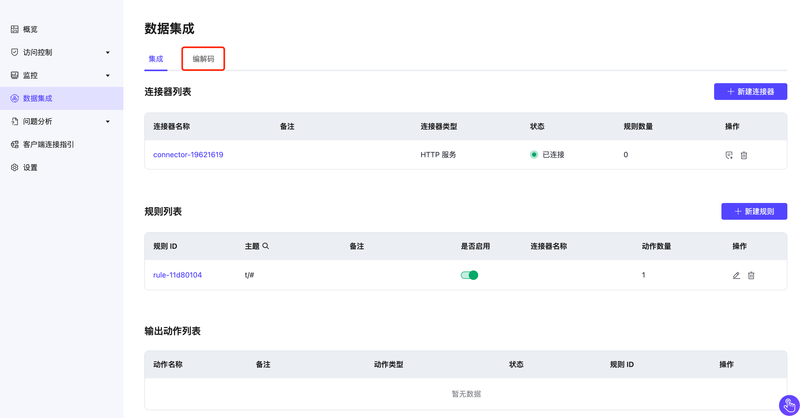
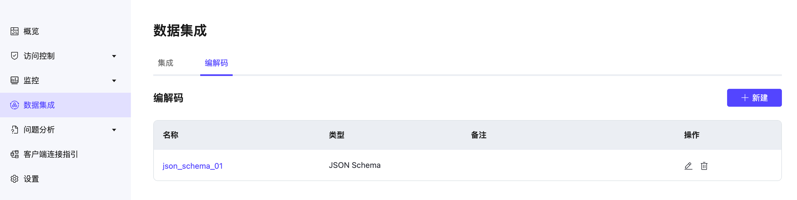

# 编解码

编解码（Schema Registry）提供了一个集中管理和验证主题消息数据的模式，以及通过网络对数据进行序列化和反序列化的能力。MQTT 主题的发布者和订阅者可以使用 Schema 来确保数据的一致性和兼容性。编解码是规则引擎的关键组成部分，可适配多种场景的设备接入和规则设计，有助于确保数据质量、遵守规范、提高应用程序开发效率和系统性能。

## 理解编解码

Schema 模式定义了数据的结构。它定义了允许的数据类型、格式和关系。模式是数据的蓝图，描述数据记录的结构、单个字段的数据类型、字段之间的关系以及适用于数据的任何约束或规则。

Schema 可用于各种数据处理系统，包括数据库、消息服务以及分布式事件和数据处理框架。它们有助于确保数据的一致性和准确性，并能被不同的系统和应用程序有效地处理和分析。促进了不同系统和组织之间的数据共享和互操作性。

用户可以在编解码中定义 Schema，用户在规则中使用定义好的 Schema，在通过数据集成将客户端数据转发到不同的数据服务中。同时也可以将应用或者数据服务中的数据通过 Schema 发送给客户端实现双向的数据流转。

//TODO PIC

编解码具有多种优势，包括数据验证、兼容性检查、版本控制和迭代演进。它还能简化数据管道的开发和维护，降低数据兼容性问题、数据损坏和数据丢失的风险。

## 创建和管理编解码

在数据集成中，首先需要创建一个[连接器](./connectors.md)或者创建一条[规则](rules.md)，在数据集成管理列表中可以看到编解码的管理页面选项。

支持创建 **Avro**, **Protobuf**, **JSON Schema** 格式的编解码规则，请查看[编解码文档](https://docs.emqx.com/zh/enterprise/latest/data-integration/schema-registry.html)了解详细的使用方法。
