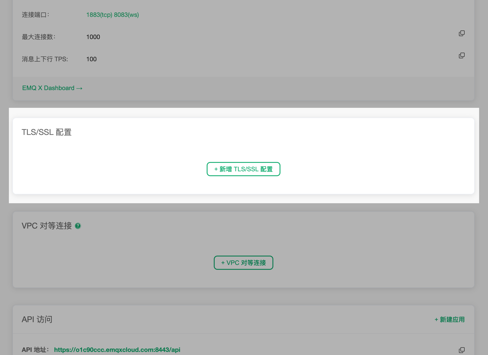

# 部署

在 EMQ X Cloud 中，部署是指一个 EMQ X 集群。

要管理您的部署，请导航至 [EMQ X Cloud 控制台](https://cloud.emqx.io/console/)

在控制台中，您可以查看您目前所创建的部署

点击您需要查看的部署，进入部署详情页面。

在部署页面，您将会看到以下内容。

### 连接详情

在这里，您能查看到有关于连接到 MQTT 集群的相关信息

- 部署名称：该部署的名称，可以通过点击右侧的编辑按钮进行修改
- 连接地址：即该部署的连接地址
- 连接端口：正式部署默认开启 1883(tcp), 8083(ws)，在配署 TLS/SSL 后，开启 8883(tls), 8084(wss)；免费试用只提供 8883(tls), 8084(wss) 
- 最大连接数：即支持的设备连接数上限
- 消息上下行 TPS：即每秒钟消息发送和接收条数的上限

点击面板下方的 EMQ X Dashboard，可以进入 Dashboard 管理设备与监控相关指标。更多关于 EMQ X Dashboard 的内容，可以前往指南 —— [EMQ X Dashboard](dashboard/README.md)

### TLS/SSL 配置

> 免费试用及共享部署不支持该功能

作为基于现代密码学公钥算法的安全协议，TLS/SSL 能在计算机通讯网络上保证传输安全。

EMQ X Cloud 支持单向认证和双向认证，两种认证方式。

更多关于 TLS/SSL 配置细节，可以前往指南 —— [配置 TLS/SSL](tls_ssl.md)

### VPC 对等连接

> 免费试用及共享部署不支持该功能

VPC 对等连接是两个 VPC 之间的网络连接，通过此连接，使两个 VPC 中的实例可以彼此通信，就像它们在同一网络中一样。

在正式部署中，只有配置了 VPC 对等连接，才能使用[消息存储](../messages/README.md)功能。

如何配置 VPC 对等连接，可以查看指南 —— [配置 VPC 对等连接](vpc_peering.md)

### API 访问

这里展示您所创建的 API 应用。您可以在这里创建、删除 API 应用。更多关于 API 的使用方式，可以前往指南 —— [REST API](../api.md) 

### 指标

在详情页的最上方，点击 `指标` 进入指标页面。

EMQ X Cloud 提供了消息、客户端、报文、交付四种增量指标。详情可以查看指南 —— [部署指标](metrics.md)

### 日志

在详情页的最上方，点击 `日志` 进入日志页面。

EMQ X Cloud 提供实时在线查看 EMQ X 日志功能。详情可以查看指南 —— [部署日志](logs.md)

### 告警

在详情页的最上方，点击 `告警` 进入告警页面。

EMQ X Cloud 提供了实时查看告警以及告警集成等功能。详情可以查看指南 —— [告警](monitor.md)
