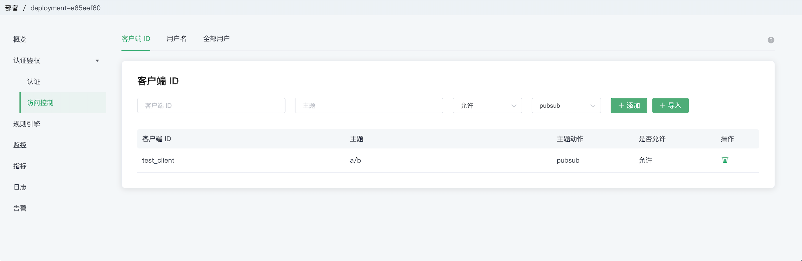
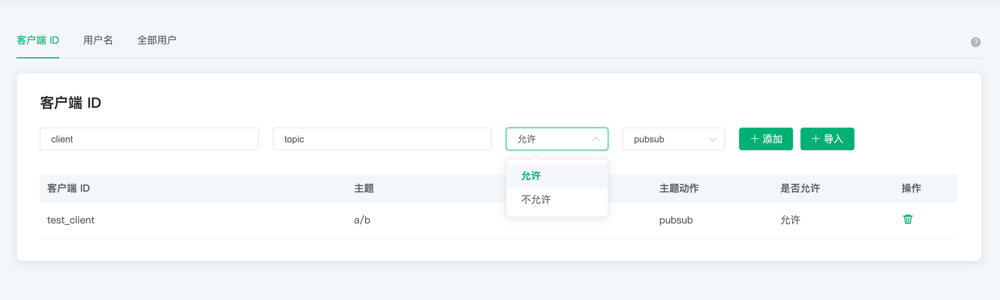
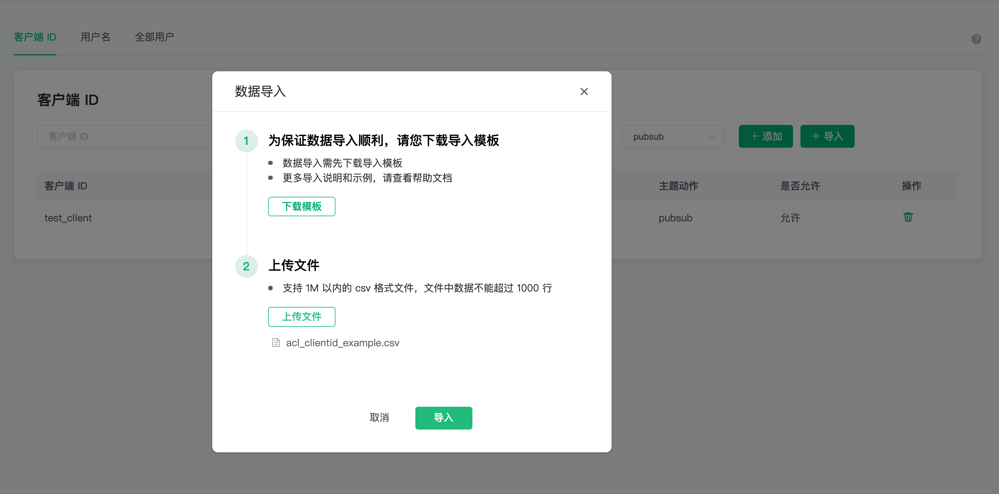
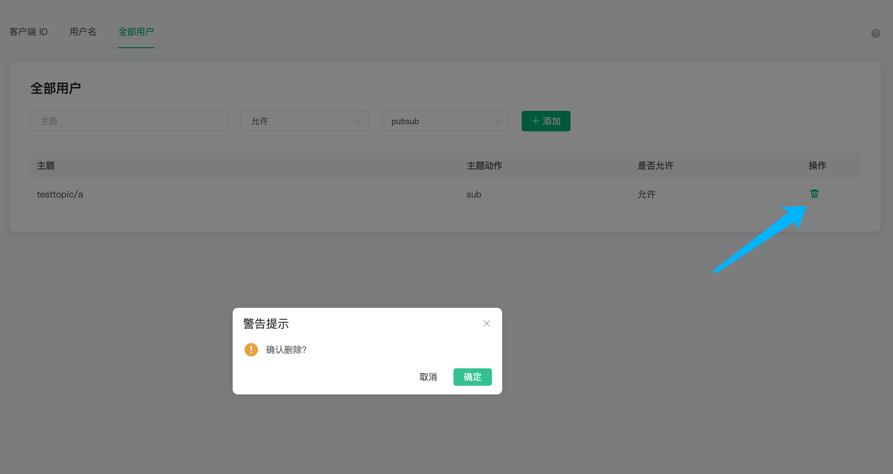

# 认证鉴权

身份认证是大多数应用的重要组成部分，MQTT 协议支持用户名密码认证，启用身份认证能有效阻止非法客户端的连接。EMQ X Cloud 中的认证指的是当一个客户端连接到 EMQ X  Cloud 的时候，通过服务器端的配置来控制客户端连接服务器的权限。

EMQ X Cloud 的认证支持包括两个层面：

1. MQTT 协议本身在 CONNECT 报文中指定用户名和密码

2. 在传输层上，TLS 可以保证使用客户端证书的客户端到服务器的身份验证，并确保服务器向客户端验证服务器证书。

本节主要是指 MQTT 协议本身的认证。关于传输层上 TLS 验证，可以参考指南——配置 [TLS/SSL](./tls_ssl.md)

## 访问控制（ACL）

鉴权是指对发布 (PUBLISH)/订阅 (SUBSCRIBE) 操作的 `权限控制`。

访问控制对三个粒度进行权限控制

1. 客户端 ID
2. 用户名
3. 全部用户：即对主题进行权限控制，不区分客户端 ID 和用户名

**特别说明**：访问控制默认采用**黑名单**模式，且 clientid/username + topic 唯一，即同一 clientid/username + topic 记录，仅最新一条记录有效

### 查看访问控制信息

在左侧`认证鉴权`的`访问控制`页面，可以查看访问控制信息，可以在上方切换三种粒度查看对应的访问控制信息

### 添加访问控制信息

依次填入客户端 ID，主题，选择是否允许，选择动作：sub/pub/pubsub，点击添加按钮，完成添加

`用户名`和`全部用户`的操作相同

### 批量导入访问控制信息

可以通过 CSV 文件批量导入访问控制信息

> 全部用户不支持

1. 点击导入按钮
2. 下载模板
3.    填写访问控制信息后上传文件
   
   `username` 示例模板文件如下图所示

   

   `clientid` 示例模板文件如下图所示

   

4.    点击导入按钮导入
      
   

导入字段说明

- clientid： 客户端 ID
- username：用户名
- topic：访问控制的主题
- action：动作（sub/pub/pubsub）
- access：是否允许（allow/deny）

### 删除访问控制信息

点击访问控制信息右侧的删除图标即可删除

