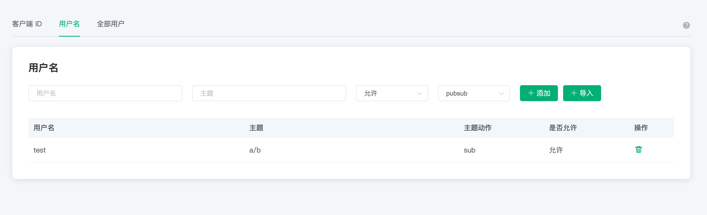
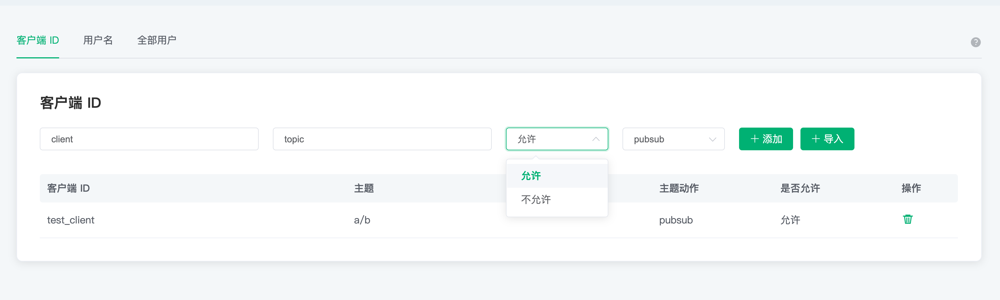
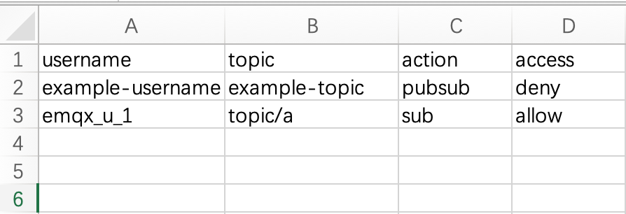
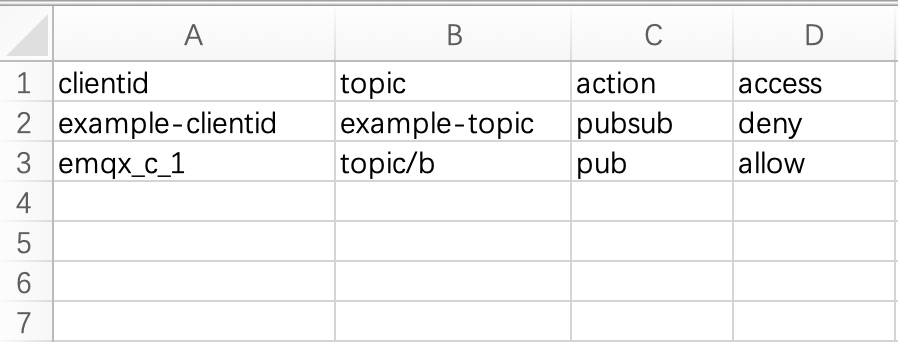
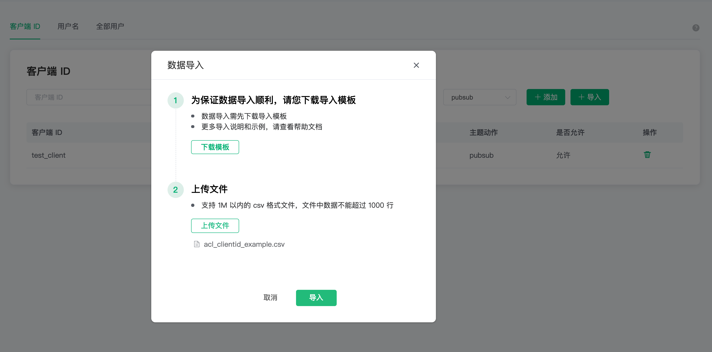
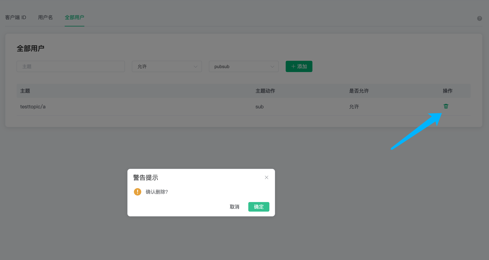

# 访问控制（ACL）

鉴权是指对发布 (PUBLISH)/订阅 (SUBSCRIBE) 操作的 `权限控制`。

访问控制对三个粒度进行权限控制

1. 客户端 ID
2. 用户名
3. 全部用户：即对主题进行权限控制，不区分客户端 ID 和用户名

:::tip TIP

- 访问控制默认采用**黑名单**模式，匹配顺序为: 全部用户 ACL  -> 用户名/客户端 ACL。如需切换到白名单模式，请提交[工单](../feature/tickets.md)。  
- clientid/username + topic 唯一，即同一 clientid/username + topic 记录，仅最新一条记录有效。

:::

## 查看访问控制信息

在左侧 `认证鉴权` 的 `访问控制` 页面，可以查看访问控制信息，可以在上方切换三种粒度查看对应的访问控制信息

## 添加访问控制信息

依次填入客户端 ID，主题，选择是否允许，选择动作：sub/pub/pubsub，点击添加按钮，完成添加

你可以在主题中使用以下占位符，请求时 EMQX Cloud将自动填充为客户端信息：

- %u：用户名
- %c：客户端 ID

`用户名` 和 `全部用户` 的操作相同

## 批量导入访问控制信息

可以通过 CSV 文件批量导入访问控制信息

> 全部用户不支持

1. 点击导入按钮
2. 下载模板
3. 填写访问控制信息后上传文件

   `username` 示例模板文件如下图所示

   

   `clientid` 示例模板文件如下图所示

   

4. 点击导入按钮导入

   

导入字段说明

- clientid： 客户端 ID
- username：用户名
- topic：访问控制的主题
- action：动作（sub/pub/pubsub）
- access：是否允许（allow/deny）

## 删除访问控制信息

点击访问控制信息右侧的删除图标即可删除

## 访问控制白名单模式 

- 使用默认访问控制：点击部署左侧菜单中的**认证鉴权**-> **访问控制**，在**全部用户**中添加一条授权信息，主题中输入#，主题动作选择发布与订阅，权限选择不允许，开启白名单模式。 
- 使用外部访问控制：如果您需要使用外部访问控制，请提交工单与我们联系。
- 开启白名单模式后，会默认禁止所有用户订阅和发布。需要为客户端设置授权信息，客户端才能进行订阅发布。 
