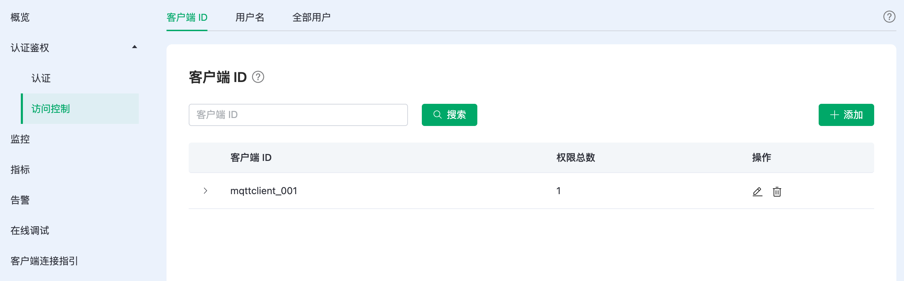
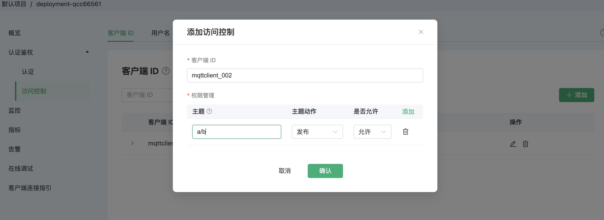
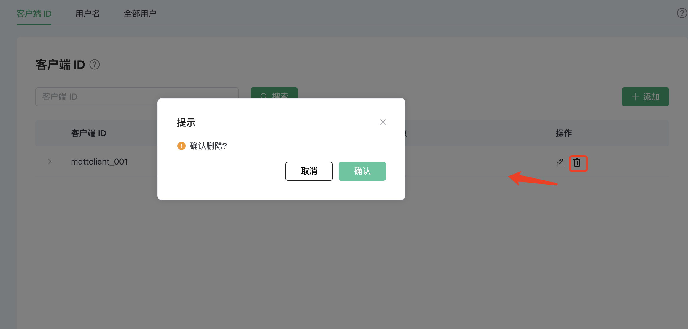

# Serverless 访问控制（ACL）

访问控制是指对发布 (PUBLISH)/订阅 (SUBSCRIBE) 操作的 `权限控制`。

访问控制对三个粒度进行权限控制

1. 客户端 ID
2. 用户名
3. 全部用户：即对主题进行权限控制，不区分客户端 ID 和用户名

:::tip TIP

- 访问控制默认采用**黑名单**模式，匹配顺序为: 全部用户 ACL  -> 用户名/客户端 ACL。 
- clientid/username + topic 唯一，即同一 clientid/username + topic 记录，仅最新一条记录有效。

:::

## 查看访问控制信息

在左侧 `认证鉴权` 的 `访问控制` 页面，可以查看访问控制信息，可以在上方切换三种粒度查看对应的访问控制信息

## 添加访问控制信息

依次填入客户端 ID，主题，选择是否允许，选择动作：sub/pub/pubsub，点击添加按钮，完成添加

你可以在主题中使用占位符，在匹配规则时将当前客户端信息等动态替换到主题中，支持的占位符如下：

- ${clientid}
- ${username}

占位符只能用于替换主题的整个字段，例如 `a/b/${username}/c/d`，但是不能用于替换字段的一部分，例如 `a/b${username}c/d`。

## 删除访问控制信息

点击访问控制信息右侧的删除图标即可删除

