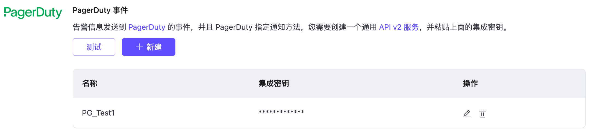

# 部署告警

EMQ X Cloud 提供完善的告警提醒、告警集成，允许用户以及运维人员根据这些告警及时做出相应的处理。EMQ X Cloud 提供如下告警事件：

## 告警事件

在这里您可以查看到部署产生的告警信息，EMQ X Cloud 提供如下告警事件：

| 类型             | 级别    | 信息                                           | 解决                                       |
| ---------------- | ------- | ---------------------------------------------- | ------------------------------------------ |
| 连接数过高       | warning | 部署连接数过高：{当前连接数}                   | 升级部署规格                               |
| 流量使用过高     | warning | 过去24小时内部署流量过高：{过去24小时流量总数} | 检查设备流量是否正常，正常则需升级部署规格 |
| vpc 对等连接异常 | error   | Vpc 对等连接状态异常：{状态}                   | 检查部署对等账户对等连接账户               |
| 证书过期告警     | warning | 部署证书将在 {num} 天后过期，请及时更新!       | 及时更新部署证书                           |

## 告警集成

EMQ X Cloud 目前提供 邮箱和 PagerDuty 事件告警集成。如您需要其他告警集成方式，可以向我们提工单或发送邮件。

### 发送至邮箱

您可以在告警集成，发送至邮箱中添加接受告警信息的邮箱，当部署产生告警时会第一时间向邮箱发送告警提醒。

### PagerDuty 集成
将告警信息发送到 PagerDuty 的事件，并且 PagerDuty 指定通知方法。

1. 在 PagerDuty 创建告警服务
  

2. 添加 api v2 集成，并复制集成秘钥
  

3. 在 EMQ X Cloud 上填写集成秘钥
  