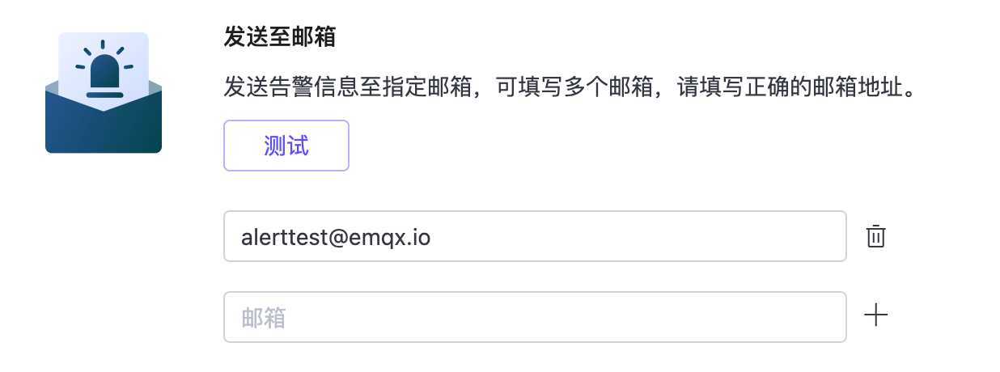

# 部署告警

EMQX Cloud 提供完善的告警提醒、告警集成，允许用户以及运维人员根据这些告警及时做出相应的处理。点击部署左侧菜单中的**告警**进入告警页面。在**告警列表**中可以查看到部署产生的告警信息，在**告警集成**中可以配置将告警发送到邮箱，或者通过集成 PagerDuty 或 Webhook 通知告警事件。

## 告警事件

以下表格列举了 EMQX Cloud 提供的部署告警事件以及相应的解决措施。

| 类型                      | 级别     | 信息                                                   | 解决                                            |
| ------------------------ | -------  | ----------------------------------------------------- | ----------------------------------------------- |
| 连接数过高                 | warning  | 部署连接数过高：{当前连接数}                              | 升级部署规格                                      |
| 流量使用过高                | warning | 过去24小时内部署流量过高：{过去24小时流量总数}               | 检查设备流量是否正常，正常则需升级部署规格             |
| 证书过期告警                | warning | 部署证书将在 {num} 天后过期，请及时更新!                    | 及时更新部署证书                                  |
| 客户端认证失败              | warning | 部署出现大量认证失败的客户端连接                            | 检查客户端认证配置是否正确                          |
| 客户端 ACL 认证失败         | warning | 部署出现大量 ACL 认证失败的客户端消息发布                    | 检查部署访问控制配置是否正确                         |
| 部署非标准 MQTT 协议连接     | warning | 部署出现大量非标准 MQTT 协议的客户端连接                    | 检查客户端连接使用的 MQTT 协议是否为标准 MQTT 协议     |
| 部署消息丢弃告警             | warning | 部署由于客户端长期离线或主题未被订阅导致大量消息丢弃           | 客户端设置 clean session 为 False 或客户端设置自动重连 |
| 部署 TPS 超过限制告警        | warning | 部署超过限制请及时调整客户端发送速率，否则您将无法发送新的消息   | 及时调整客户端发送速率，使发送速率小于部署限制的 TPS |
| vpc 对等连接异常            | error   | Vpc 对等连接状态异常：{状态}                               | 检查部署对等账户对等连接账户                         |
| 数据集成 xxx 资源异常        | error   | 部署数据集成 xxx 资源异常                                | 检查部署数据集成中 xxx 资源配置是否正确                |

## 告警集成

EMQX Cloud 目前提供邮箱， PagerDuty 和 Webhook 事件告警集成。如您需要其他告警集成方式，可以向我们提工单或发送邮件。

### 发送至邮箱

您可以在告警集成，发送至邮箱中添加接受告警信息的邮箱，当部署产生告警时会第一时间向邮箱发送告警提醒。

您可以使用测试功能查看告警邮箱是否配置正确，点击**测试**，选择一个邮箱发送测试邮件。

### PagerDuty 集成
将告警信息发送到 PagerDuty 的事件，并且 PagerDuty 指定通知方法。

1. 在 PagerDuty 创建告警服务。

     

2. 添加 api v2 集成，并复制集成秘钥。
     

3. 在告警集成页面，新建 PageDuty 事件，填写名称和集成秘钥。

     

您可以使用测试功能查看告警事件是否配置正确，点击**测试**，选择一个事件发送测试消息。

### Webhook 集成

关于 Webhook 集成告警的详细内容，参阅[Webhook 告警](./alerts_webhook.md)。