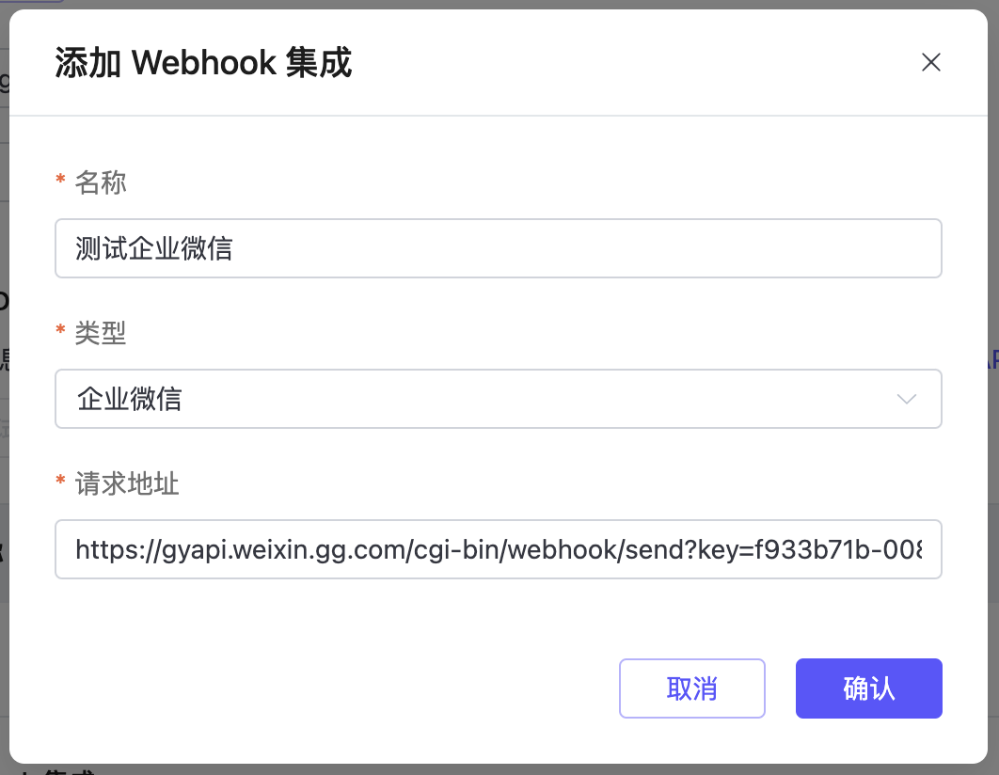
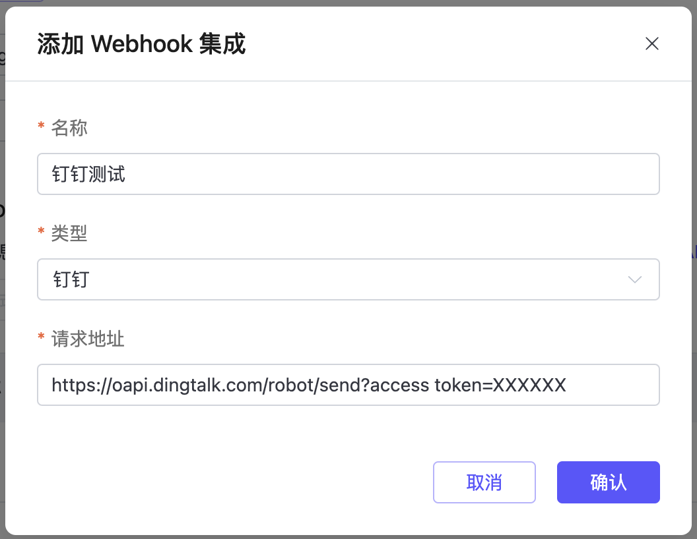

# 集成 Webhook 告警

EMQX Cloud 可以集成 Webhook，支持将告警发送到通信软件或是自己的服务中，同时可以通过消息检测的功能测试 Webhook 是否正确配置。

## 向企业微信发送告警消息

1. 在企业微信群中创建机器人(需要是群主身份才能创建), 选择 `添加群机器人` -> `新创建一个机器人` -> `添加机器人`。详细请参考 [群机器人配置说明](https://developer.work.weixin.qq.com/document/path/91770)。
 

2. 完成微信机器人的创建，复制链接。

3. 在 Webhook 告警中，选择企业微信，并填入告警名称和 Webhook 地址，完成配置。

4. 验证配置，可以通过测试功能，选择配置好的 Webhook 告警，即可发送默认消息检测是否配置成功。

## 向钉钉发送告警消息

1. 在钉钉中创建 Webhook 机器人，请参考[官方文档](https://open.dingtalk.com/document/robots/custom-robot-access)创建；
2. 复制机器人的 Webhook 地址，在告警配置中，选择钉钉，并填入告警名称和 Webhook 地址，完成配置；

3. 钉钉需要安全设置中定义`自定义关键词` ，建议将关键词设置为： `EMQ`或者`告警`。
4. 验证配置，可以通过测试功能，选择配置好的 Webhook 告警，即可发送默认消息检测是否配置成功。

## 向 Slack 发送告警消息
1. 在 Slack 创建 Webhook，获取 Webhook URL 地址。更多信息，请参见 [Sending messages using Incoming Webhooks](https://api.slack.com/messaging/webhooks?spm=a2c4g.11186623.0.0.2fa63db5J0PRQp)。
2. 复制 Webhook API 地址，在告警配置中，选择 Slack，并填入告警名称和 Webhook 地址，完成配置。

3. 验证配置，可以通过测试功能，选择配置好的 Webhook 告警，即可发送默认消息检测是否配置成功。

## 向自定义服务发送告警消息
除了向通讯软件中的机器人发送告警消息，我们还可以向自己的服务通过 Webhook 发送消息。

1. 首先需要搭建好服务能接收和处理请求，在新建对话框中选择 `通用 Webhook`。
2. 在新建对话框中填入 Webhook 服务的请求地址。同时也可以额外添加请求头的键和值。

3. 验证配置，可以通过测试功能，选择配置好的 Webhook 告警，即可发送默认消息检测是否配置成功。

