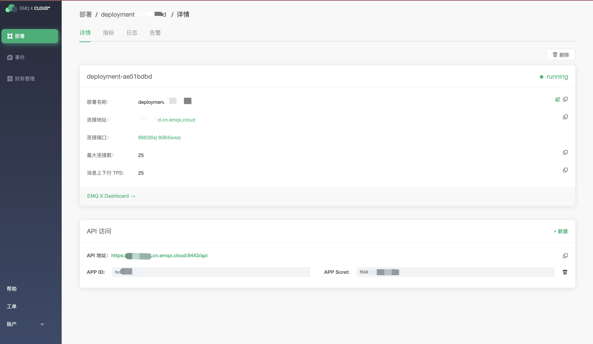

# API 访问

EMQ X Cloud 提供了 HTTP API 以实现与外部系统的集成，例如查询客户端信息、发布消息和创建规则等。


## 接口安全

EMQ X Cloud 的 HTTP API 使用 [Basic 认证](https://en.wikipedia.org/wiki/Basic_access_authentication) 方式，`id` 和 `password` 须分别填写 AppID 和 AppSecret。 您可以点击部署详情页面获取部署相关 API 地址以及  AppID 和 AppSecret




## 响应码

### HTTP 状态码 (status codes)

EMQ X 接口在调用成功时总是返回 200 OK，响应内容则以 JSON 格式返回。

可能的状态码如下：

| Status Code | Description                                              |
| ----------- | -------------------------------------------------------- |
| 200         | 成功，返回的 JSON 数据将提供更多信息                     |
| 400         | 客户端请求无效，例如请求体或参数错误                     |
| 401         | 客户端未通过服务端认证，使用无效的身份验证凭据可能会发生 |
| 404         | 找不到请求的路径或者请求的对象不存在                     |
| 500         | 服务端处理请求时发生内部错误                             |

### 返回码 (result codes)

EMQ X 接口的响应消息体为 JSON 格式，其中总是包含返回码 `code`。

可能的返回码如下：

| Return Code | Description                |
| ----------- | -------------------------- |
| 0           | 成功                       |
| 101         | RPC 错误                   |
| 102         | 未知错误                   |
| 103         | 用户名或密码错误           |
| 104         | 空用户名或密码             |
| 105         | 用户不存在                 |
| 106         | 管理员账户不可删除         |
| 107         | 关键请求参数缺失           |
| 108         | 请求参数错误               |
| 109         | 请求参数不是合法 JSON 格式 |
| 110         | 插件已开启                 |
| 111         | 插件已关闭                 |
| 112         | 客户端不在线               |
| 113         | 用户已存在                 |
| 114         | 旧密码错误                 |
| 115         | 不合法的主题               |


## API Endpoints

### Broker 基本信息

#### GET /api/v4/brokers/{node}

返回集群下所有节点的基本信息。

**Path Parameters:**

| Name | Type   | Required | Description                                               |
| ---- | ------ | -------- | --------------------------------------------------------- |
| node | String | False    | 节点名字，如 "emqx@127.0.0.1。 不指定时返回所有节点的信息 |

**Success Response Body (JSON):**

| Name             | Type                    | Description                                                  |
| ---------------- | ----------------------- | ------------------------------------------------------------ |
| code             | Integer                 | 0                                                            |
| data             | Object/Array of Objects | node 参数存在时返回指定节点信息， 不存在时返回所有节点的信息 |
| data.datetime    | String                  | 当前时间，格式为 "YYYY-MM-DD HH:mm:ss"                       |
| data.node        | String                  | 节点名称                                                     |
| data.node_status | String                  | 节点状态                                                     |
| data.otp_release | String                  | EMQ X 使用的 Erlang/OTP 版本                                 |
| data.sysdescr    | String                  | 软件描述                                                     |
| data.uptime      | String                  | EMQ X 运行时间，格式为 "H hours, m minutes, s seconds"       |
| data.version     | String                  | EMQ X 版本                                                   |

**Examples:**

获取所有节点的基本信息：

```bash
$ curl -i --basic -u admin:public -X GET "https://test.cn.emqx.cloud:8443/api/brokers"

{"data":[{"version":"develop","uptime":"4 hours, 21 minutes, 19 seconds","sysdescr":"EMQ X Broker","otp_release":"R21/10.3.5","node_status":"Running","node":"emqx@127.0.0.1","datetime":"2020-02-19 15:27:24"}],"code":0}
```

获取节点 emqx@127.0.0.1 的基本信息：

```bash
$ curl -i --basic -u admin:public -X GET "https://test.cn.emqx.cloud:8443/api/brokers/emqx@127.0.0.1"

{"data":{"version":"develop","uptime":"1 minutes, 51 seconds","sysdescr":"EMQ X Broker","otp_release":"R21/10.3.5","node_status":"Running","node":"emqx@127.0.0.1","datetime":"2020-02-20 14:11:31"},"code":0}
```