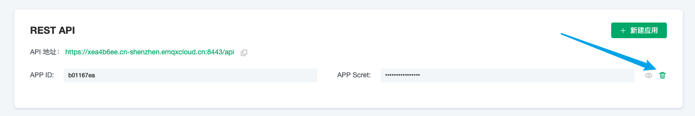

# API 访问设置

您可以通过 API 秘钥实现与外部系统的集成，例如查询客户端信息、发布消息和创建规则等。

您可以通过下面的方式进入 API 管理板块：

1. 登录 [EMQ X Cloud 控制台](https://cloud.emqx.io/console)
2. 点击进入对应的部署
3. 在页面的下方，查找 `API 访问` 模块

关于 API 的使用方式，可以前往指南 —— [REST API](../api.md)

## 创建 API 秘钥

点击 API 访问的 `+ 新建应用`，生成随机 APP ID 和 APP Secret

## 删除 API 秘钥

点击每个 APP 秘钥右边的删除按钮，进行删除

