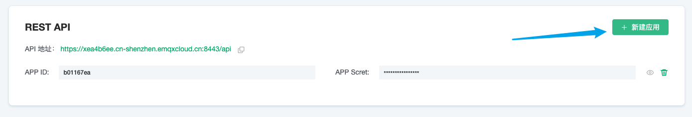

# API 应用

EMQ X 提供了 HTTP API 以实现与外部系统的集成，例如查询客户端信息、发布消息和创建规则等。

本节主要介绍 API 应用创建、删除。更多关于 API 的使用方式，可以前往指南 —— [REST API](../api.md)

### 创建 API 应用

1. 登录 [EMQ X Cloud 控制台](https://cloud.emqx.io/console/)

2. 点击所需连接的部署，您将进入部署详情页面

点击 `+新建应用`，会随机生成一个 `APP ID` 和 `APP Secret`

### 删除应用

点击每个应用右侧的删除图标，可以删除对应的 APP 信息。

