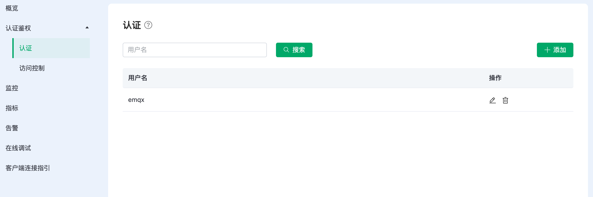
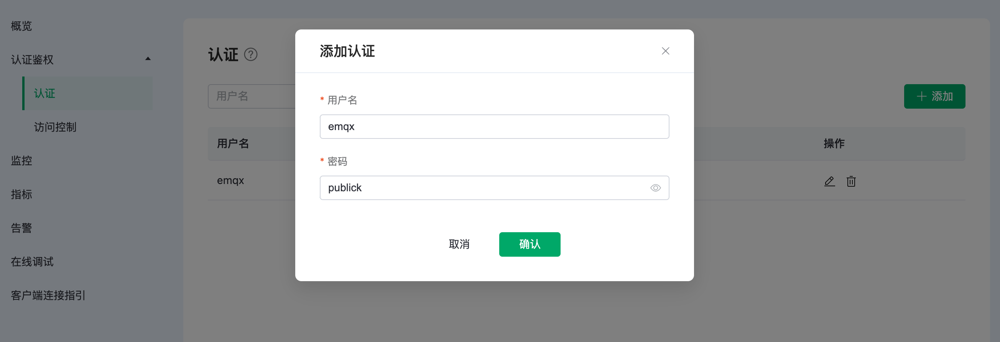
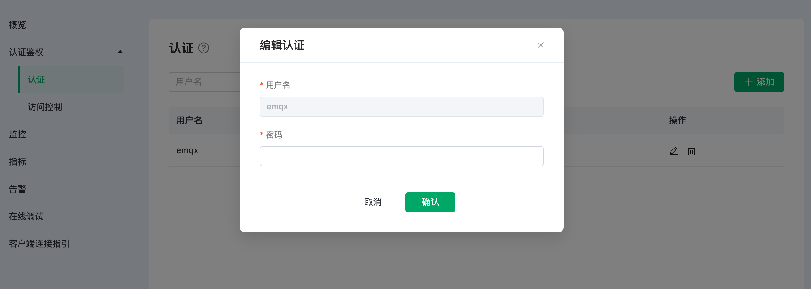
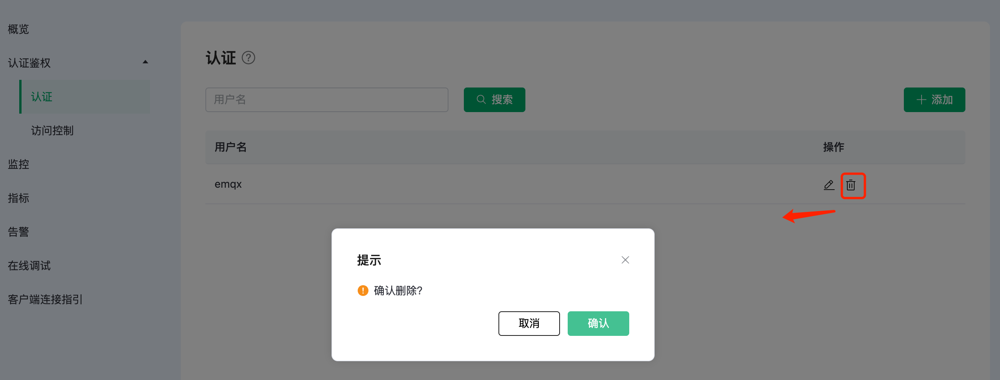

# Serverless 认证鉴权

身份认证是大多数应用的重要组成部分，MQTT 协议支持用户名密码认证，启用身份认证能有效阻止非法客户端的连接。EMQX Cloud 中的认证指的是当一个客户端连接到 EMQX  Cloud 的时候，通过服务器端的配置来控制客户端连接服务器的权限。

## 认证

### 查看认证信息

在左侧 `认证鉴权` 的 `认证` 页面，可以看到认证信息

### 添加认证信息

在页面上方的输入框中依次输入用户名和密码，添加添加按钮即可完成认证信息的添加

### 编辑认证信息

点击认证信息右侧的编辑按钮，可以修改用户名的密码

### 删除认证信息

点击认证信息右侧的删除按钮，可以对认证信息进行删除

