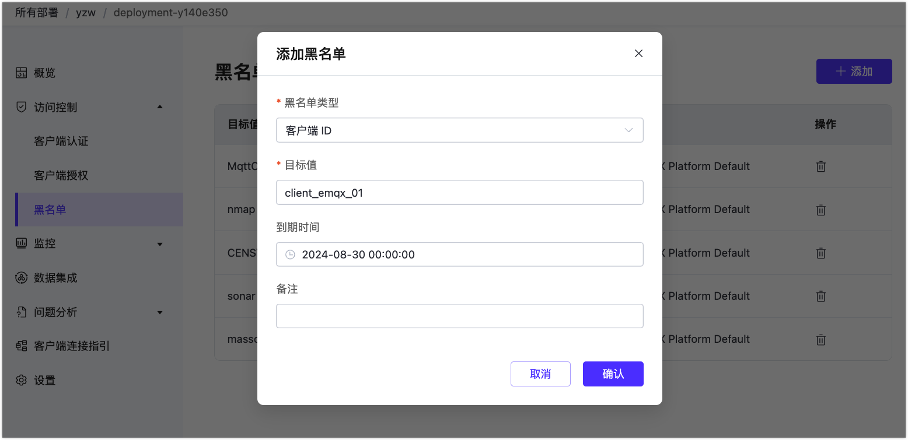

<!-- markdownlint-disable MD001 -->

# 黑名单

黑名单用于禁止匹配的客户端建立连接，该功能适用于对少量客户端做限制。黑名单的管控将在有效期到期后失效。

::: warning
黑名单功能只适用于专有版和 BYOC 的部署。
:::

在 Cloud 控制台的左侧菜单中选择 **认证鉴权** -> **黑名单**。点击**黑名单**页面右上角的**+ 添加**创建黑名单。在弹出的对话框中填写必填和选填信息。

**黑名单类型和目标值**

系统会根据以下不同类型识别被加入黑名单的客户端。根据所选的黑名单类型按要求设置目标值：

- 客户端 ID：可包含字母、数字和部分特殊字符（_、-、/、+、#、$、%、@、& 和 .），最长 128 个字符。
- 用户名 : 可包含字母、数字和部分特殊字符（_、-、/、+、#、$、%、@、& 和 .），最长 128 个字符。
- 客户端 IP ：支持 IPv4 的地址。

**到期时间**

到期时间最大值为 1 年，最小值为 5 分钟，且不能早于当前的时间点。

**备注**

可选择填写。