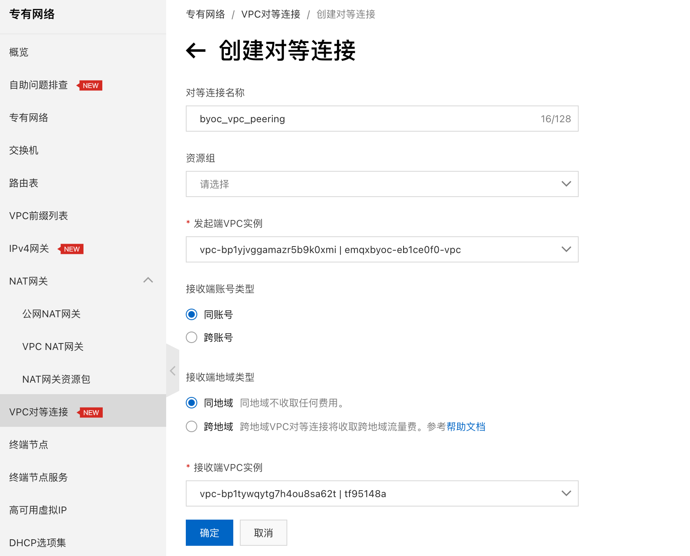
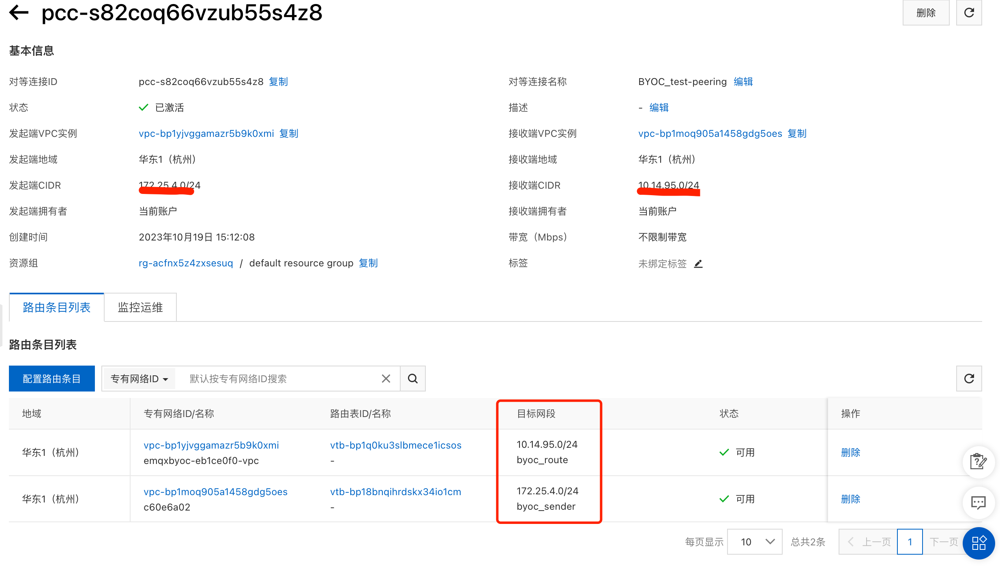
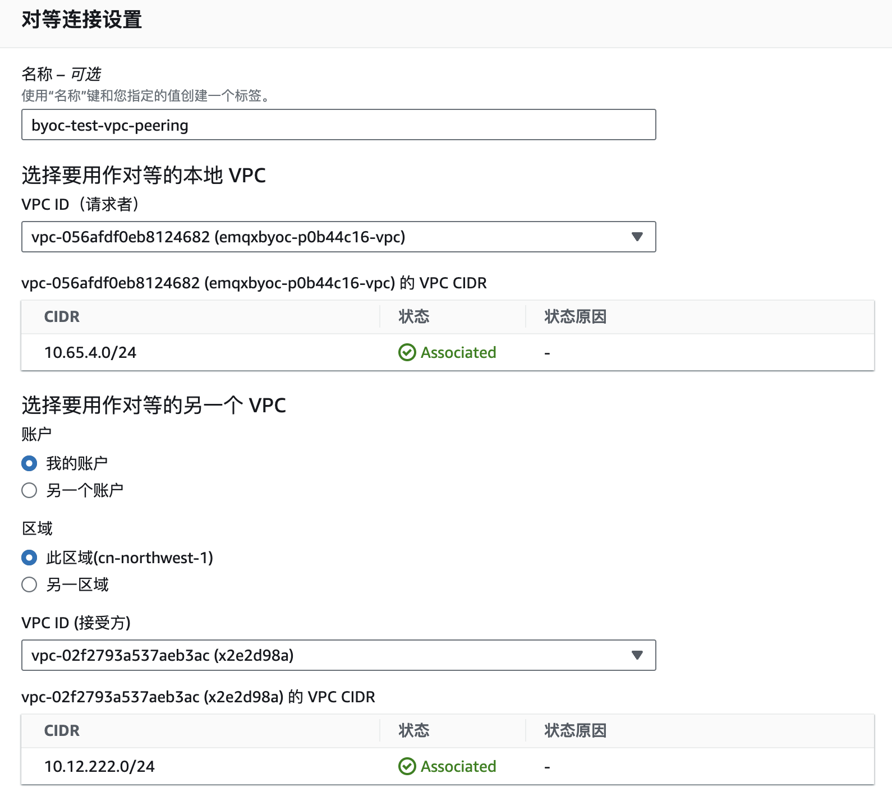
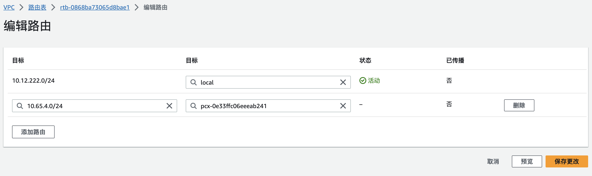

# 在 BYOC 中设置 VPC 对等连接

VPC 对等连接是两个 VPC 之间的网络连接。通过此连接，使两个 VPC 中的实例可以彼此通信，就像它们在同一网络中一样。如果您需要和 EMQX Cloud BYOC 部署下的 EMQX 集群通过内网进行数据交换，您需要对部署所在的 VPC 和您的其他 VPC 进行对等连接配置。本页介绍了当 BYOC 部署在阿里云和亚马逊云平台时，如何在云平台中创建对等连接并进行相关设置。

## 注意事项

1. EMQX Cloud BYOC 创建在用户的云账号中，支持在**同一区域内**或**跨区域**创建对等连接，**跨区域** VPC 对等连接产生的地域流量费用也由用户承担。
2. 在创建 BYOC 部署时候请留意相应的网段，并请保证和资源所在的 VPC **不在同一网段**。请合理规划您的 VPC 网段。
3. 数据集成创建资源前请先创建对等连接。

## 阿里云平台对等连接

本节介绍了如何在阿里云平台中创建对等连接、配置路由，并进行互用性验证。

### 创建对等连接

::: tip
以下内容中涉及到的名词解释:
- 发起端 VPC : BYOC 部署所在的 VPC。
- 接受端 VPC : 需要与 BYOC 部署进行数据交换的系统所在的 VPC。
:::

1. 登录阿里云控制台，在左侧**专有网络**的导航栏中点击 **VPC对等连接**。
    
    ::: tip
    
    初次使用 VPC 对等连接时，请在 VP 对等连接页面，点击开通 CDT 功能，然后在弹出的对话框单击确定开通.
    
    :::
    
    * 为此对等连接设置一个名称（可选）。
    
    * 在发起端 VPC 实例处，选择 BYOC 部署所在的 VPC，VPC 名称格式为 `emqxbyoc-XXXX-vpc`。
    
    * 接收端账号类型选择**同账号**。
    
    * 接收端地域类型根据情况选择**同地域**。
    
    * 在接收端 VPC 实例处，选择您要与 BYOC 部署进行数据交换的系统所在的 VPC。
    
    * 点击**确定**按钮。
    
      

2. 创建之后，在 VPC 对等连接页面，查看 VPC 对等连接的状态等信息。VPC 对等连接状态为已激活，表示可以正常使用。

### 配置路由
VPC 对等连接创建完成之后需要在建立对等连接的两个 VPC 的路由表中的配置到对端 VPC 的路由才能互通。

1. 在 VPC 对等连接页面，找到已创建的 VPC 对等连接，执行以下操作配置路由:
    * 专有网络: 选择 BYOC 部署所在的路由，VPC 名称格式为 `emqxbyoc-XXXX-vpc`。
    * 路由表：在下拉列表中选择该 VPC 实例所关联的路由表。
    * 填写路由条目名称。
    * 选择目标网段：如目标网段类型为 IPv4，输入接收端的 IPv4 CIDR 网段；如目标网段类型为 IPv6，输入接收端的IPv6 CIDR网段。
    * 系统自动显示下一条对等连接实例。
    * 完成后状态为可用既表示配置成功。
    
2. 继续配置接收端的路由：
    * 选择您要与 BYOC 部署进行数据交换的系统所在的 VPC 的实例。
    * 路由表：在下拉列表中选择该VPC实例所关联的路由表。
    * 填写路由条目名称。
    * 选择目标网段：如目标网段类型为IPv4，输入发起端的IPv4 CIDR网段；如目标网段类型为IPv6，输入发起端的IPv6 CIDR网段。
    * 系统自动显示下一条对等连接实例。
    * 完成后状态为可用既表示配置成功。
    
    
    
### 互通性验证
验证前，请确保发起端和接收端的 VPC 中已创建了ECS 实例，且 ECS 实例的安全组允许互通。您可以通过以下步骤验证两个 VPC 是否私网互通。

1. 登录发起端 VPC 的 ECS 实例。

2. 执行`ping`命令，`ping`接收端 ECS 实例的私网IP地址。如果能接收到回复报文，说明发起端至接收端网络已连通。

3. 登录接收端 VPC 的 ECS 实例。

4. 执行`ping`命令，`ping`发起端 ECS 实例的私网 IP 地址。如果能接收到回复报文，说明接收端至发起端网络已连通。

网络连通性正常后，您即可在两个私网互通的 VPC 中搭建并使用业务。

关于阿里云 VPC 对等连接更多内容请参考[阿里云文档](https://www.alibabacloud.com/help/zh/vpc/user-guide/overview-6?spm=a2c63.p38356.0.0.74aa51b37wnDE2)。

## 亚马逊云平台对等连接

本节介绍了如何在亚马逊云平台中创建对等连接并创建路由和安全组规则。

### 创建对等连接

1. 登录亚马逊云控制台，切换区域到 BYOC **部署所在区域**，进入**联网** -> **VPC** -> **对等连接**，点击右上方的**创建对等连接**。

    * 为此对等连接设置一个名称（可选）。
    * 在 VPC ID (请求者)处，选择 BYOC 部署所在的 VPC，VPC 名称格式为 `emqxbyoc-XXXX-vpc`。
    * 记录下请求者 **VPC CIDR 网段**，后面的步骤用将会用到此信息。
    * 在账户处选择**我的账户**。
    * 在区域处选择**此区域**。
    * 在 VPC ID (接受方)处，选择您要与 BYOC 部署进行数据交换的系统所在的 VPC。
    * 记录下接受方 **VPC CIDR 网段**，后面的步骤用将会用到此信息。

    

2. 点击创建后，需点击**操作**中的**接受请求**。请记录下以 `pcx-` 开头的**对等连接 ID**，后面的步骤用将会用到此信息。

### 创建路由和安全组规则

::: tip
以下内容中涉及到的名词解释:
- 请求者 VPC : BYOC 部署所在的 VPC。
- 接受方 VPC : 需要与 BYOC 部署进行数据交换的系统所在的 VPC。
:::

#### 请求者 VPC

1. 在亚马逊云控制台，进入**联网** -> **VPC** -> **路由表**，找到请求者 BYOC 的 VPC 路由表（名称通常是 `emqxbyoc-xxxx-private-route-table`），点击**编辑路由**。
2. 点击**添加路由**，将上一步记录下的接受方 **VPC CIDR 网段**填入左侧目标框，将以 `pcx-` 开头的**对等连接 ID** 填入右侧目标框。

    

3. 找到**联网** -> **VPC** -> **安全组**，找到绑定在请求者 VPC 上的安全组，在入站规则中添加接受方 **VPC CIDR 网段**，允许其所有 TCP 流量。

#### 接收方 VPC

1. 在亚马逊云控制台，进入**联网** -> **VPC** -> **路由表**，找到接收方的 VPC 路由表，点击**编辑路由**。
2. 点击**添加路由**，将上一步记录下的请求者 BYOC **VPC CIDR 网段**填入左侧目标框，将以 `pcx-` 开头的**对等连接 ID** 填入右侧目标框。
3. 找到**联网** -> **VPC** -> **安全组**，找到绑定在接收方 VPC 上的安全组，在入站规则中添加请求者 BYOC **VPC CIDR 网段**，允许其所有 TCP 流量。
