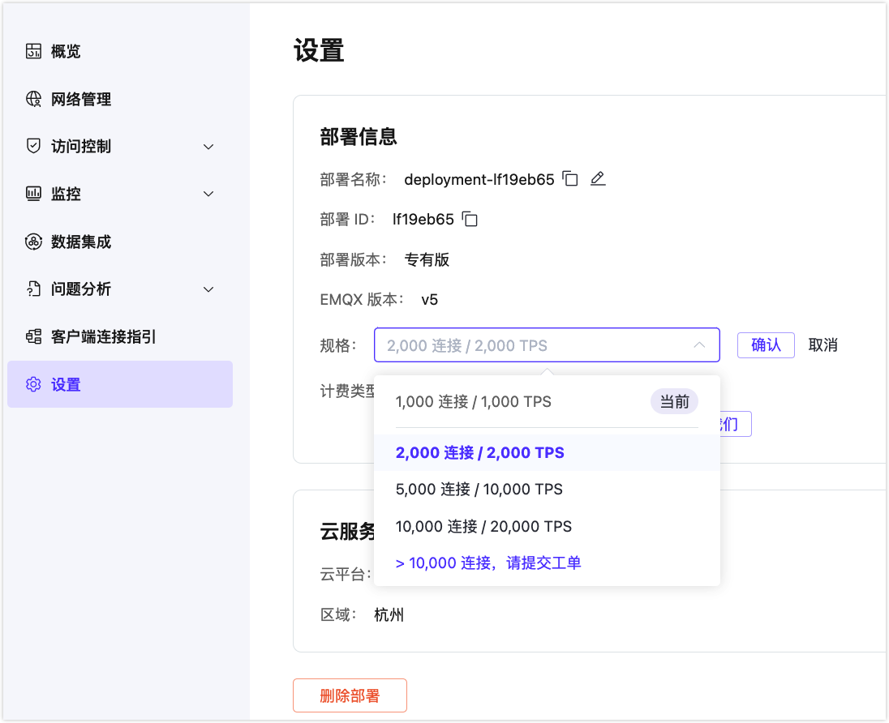

# 调整部署规格

EMQX Platform 允许用户通过调整部署规格来为专有版/旗舰版部署扩容或缩容，以处理更多或更少的 MQTT 连接或每秒消息，具体取决于部署的需求。

::: tip

Serverless 和 BYOC 部署不支持调整规格。

:::

本页面提供了在 EMQX Platform 控制台中调整部署规格的指南。设置了访问权限和限制，以确保安全和受控的扩缩容操作。

## 功能概述

调整规格功能允许具有适当权限的用户：

- 通过 EMQX Platform 控制台伸缩其运行中的部署。
- 直接执行调整规格操作，并设有限制以防止频繁更改。
- 如有必要，回滚规格调整。

### 功能可用性

此功能仅对特定的部署类型和状态可用。有关可用性，请参见下表：

| 部署类型                                   | 调整规格选项可用性 | 操作                                           |
| ------------------------------------------ | ------------------ | ---------------------------------------------- |
| Serverless / BYOC                          | 不可用             | 不显示调整规格选项。                           |
| 非试用的运行中专有版部署（按小时计费方式） | 可用               | 可以在控制台中直接调整规格，无需提交支持工单。 |
| 运行中的专有版部署（年度预付费方式）       | 有限               | 显示**调整规格**按钮，提示提交工单。           |
| 运行中的旗舰版部署                         | 有限               | 显示**调整规格**按钮，提示提交工单。           |

### 权限

仅具有根账号用户、管理员或项目管理员权限的用户可以访问部署的调整规格选项。

## 调整专有版部署规格

在开始之前，请确保您的部署处于运行状态。

1. 进入您的部署并从左侧菜单中点击**设置**。

2. 找到**规格**，然后点击**调整规格**。

3. 从下拉菜单中选择所需的规格选项，然后点击下拉菜单旁的**确认**按钮。

   - 对于 `>10,000 连接` 选项，您需要提交工单。您将被重定向到[工单](../feature/tickets.md)页面，并被提示填写工单。

4. 为防止意外操作，系统将弹出一个**调整规格**的对话框。点击**确认**以启动请求。

   

一旦确认，请求将发送到后端，您将被重定向到**部署概览**页面。系统会通知您扩容或缩容过程已启动。当扩容或缩容过程完成时，您将收到提示。

## 调整规格的限制

为防止滥用，调整规格限制为**每 12 小时内仅限一次操作**。如果您在此期间尝试发起另一项调整规格操作，将会收到错误消息通知您限制。

## 调整规格的回滚

如果在扩缩容更改中出现任何问题，可以通过 EMQX 支持获得回滚选项。此功能允许您在扩缩容后出现问题时恢复到先前的规格。如果需要回滚协助，请[提交工单](../feature/tickets.md#create-a-ticket)。