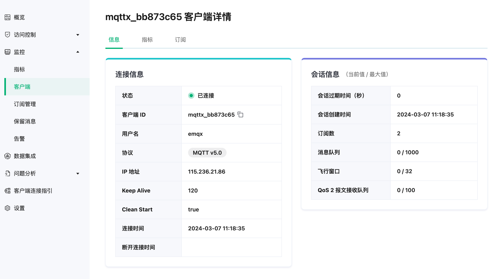

# 客户端

客户端页面列出了每个客户端的身份信息和连接状态。点击部署左侧菜单的**监控** -> **客户端**进入客户端页面。

## 客户端列表
在客户端列表中，用户可查看当前接入服务器或会话尚未过期的的客户端列表及客户端的基本信息，列表将展示各客户端 ID 及用户名，客户端的 IP 地址，连接设置的心跳时长，Clean Start，以及设定的会话过期时间。

默认状态下页面过滤条件字段只显示客户端 ID、用户名，点击搜索栏右侧箭头按钮可展示所有可用于过滤的条件字段。您可以使用客户端 ID 和用户名进行模糊搜索以对连接列表进行过滤，也可以使用连接状态或连接的时间范围对列表进行过滤，或者精确输入连接客户端的 IP 过滤目标 IP 地址的客户端，点击刷新按钮可重置所有过滤条件并重新加载连接列表。

## 客户端详情

在客户端列表页面，选择一个客户端，点击客户端 ID 可进入客户端详情页面。在客户端详情页面中，除了已经在列表页面中显示的基本连接信息外，还提供了一些更详细的信息供用户查看。

**信息**显示了如连接使用的协议版本、结束连接后是否清除会话等信息，如果是状态为已断开的连接，还将显示上次断开连接的时间；连接信息的右侧展示了该连接的会话信息，包括会话过期间隔、会话创建时间、进程堆栈、订阅数、消息队列长度、飞行窗口长度和 QoS2 报文接收队列长度。

**指标**显示了消息数量、报文和流量收发三个类别展示了当前连接的统计指标，用户可根据需要进行查看。

**订阅**显示了当前连接已订阅的主题，用户可点击添加订阅按钮，进行较为简单的订阅操作，或在订阅列表中点击取消订阅按钮，取消当前订阅的某个主题。

