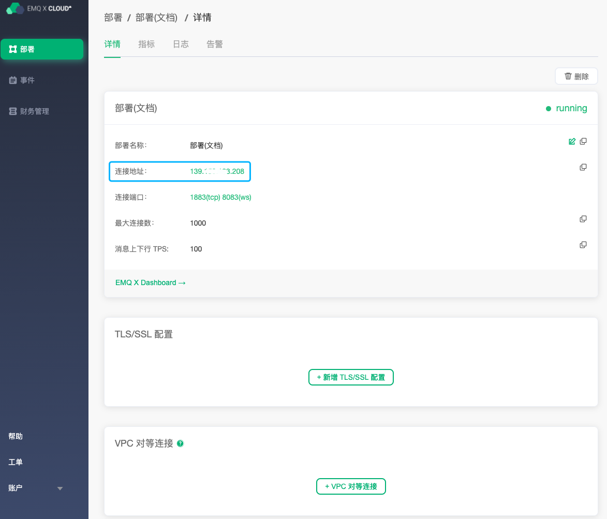
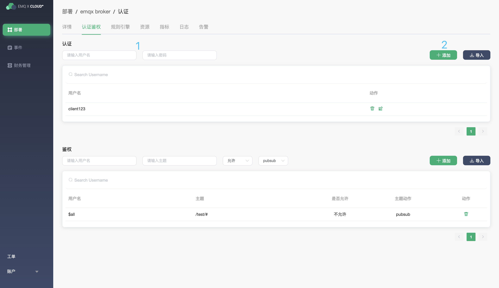
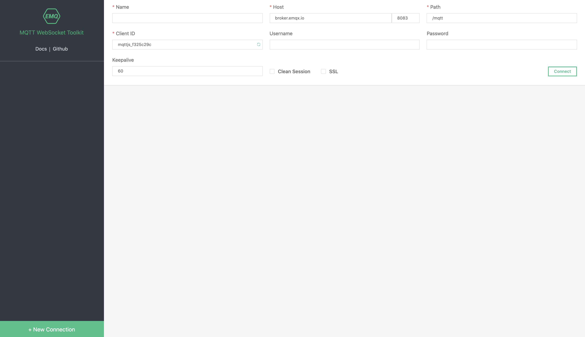
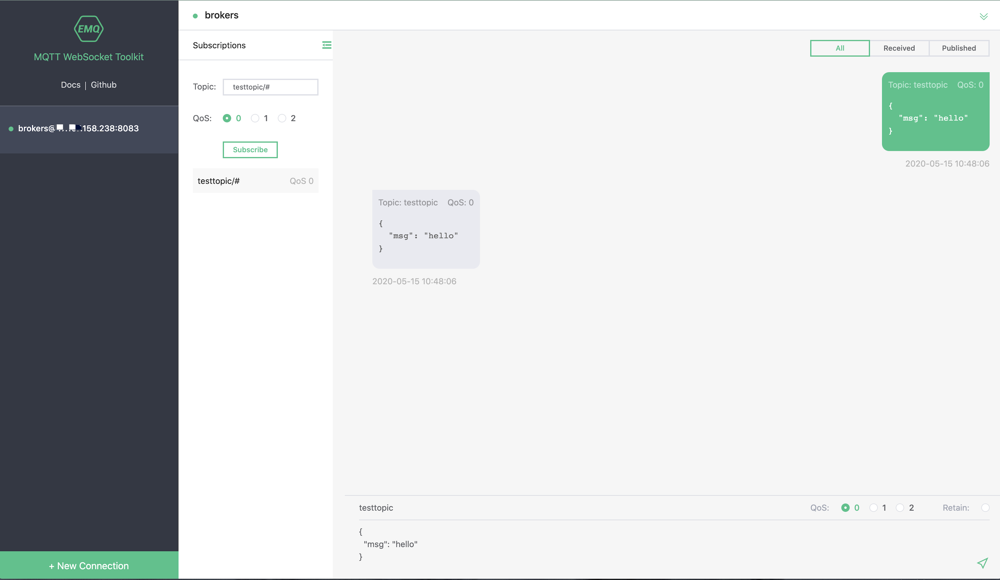
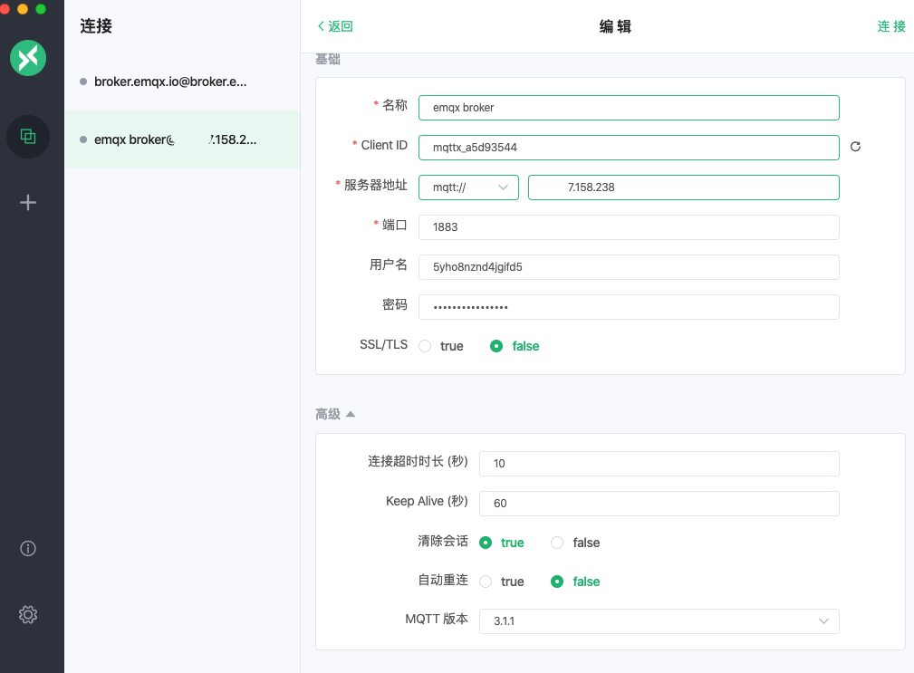
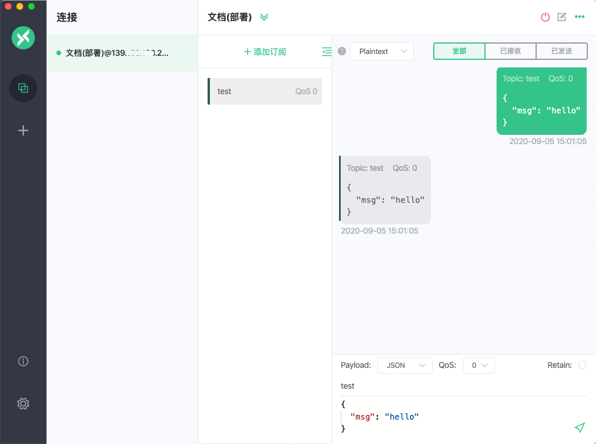

# 部署连接指南

在连接部署之前您需要保证部署状态为 `running `，同时免费试用部署默认提供 tls/ssl 支持。

### 获取部署连接地址

1. 登录 [EMQ X Cloud 控制台](https://cloud.emqx.io/console/)

2. 点击所需连接的部署，您将进入部署详情页面

3. 在详情页面点击连接右侧复制按钮，复制连接地址，以及端口

   > 注意：EMQ X Cloud 免费试用仅支持 TLS/SSL 连接

### 添加客户端认证信息

EMQ X Cloud 创建的部署默认开启客户端认证，所以在连接之前您需要在**认证鉴权**页面添加客户端认证信息

1. 登录 [EMQ X Cloud 控制台](https://cloud.emqx.io/console/)
2. 点击所需连接的部署，您将进入部署详情页面
3. 点击部署详情页面中的 **EMQ X Dashboard** 地址，您将进入到 EMQ X Dashboard
4. 点击EMQ X Dashboard 左侧菜单`认证鉴权`，在认证中填入`用户名`、`密码`，然后点击添加按钮
5. 在列表中查看添加信息

### MQTT 客户端连接

您可以使用 [EMQ X Tools](<http://tools.emqx.io/>) 或者 [MQTTX](<https://mqttx.app/>) 连接和测试

> 注意:  我们使用 EMQ X Tools / MQTTX 工具来简化连接过程,  但是您可以自由使用任何您喜欢的工具或方法来完成连接测试

####  EMQ X Tools 模拟客户端连接

1. 点击新增连接

2. 输入部署连接信息，以及客户端用户名和密码， 点击连接

   

3. 发布和订阅测试

   

####  MQTTX 模拟客户端连接

1. 点击右侧新增连接按钮

2. 输入部署连接信息，以及客户端用户名和密码， 点击连接

   

3. 发布和订阅测试

   

