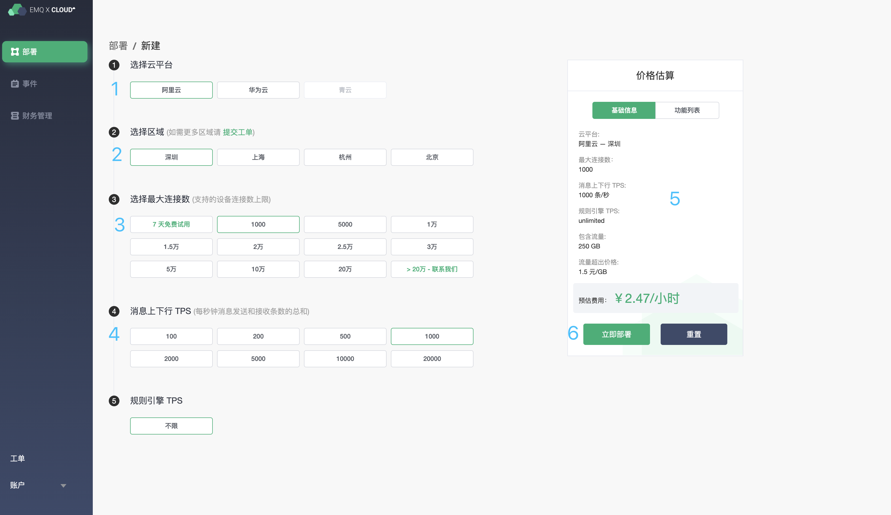
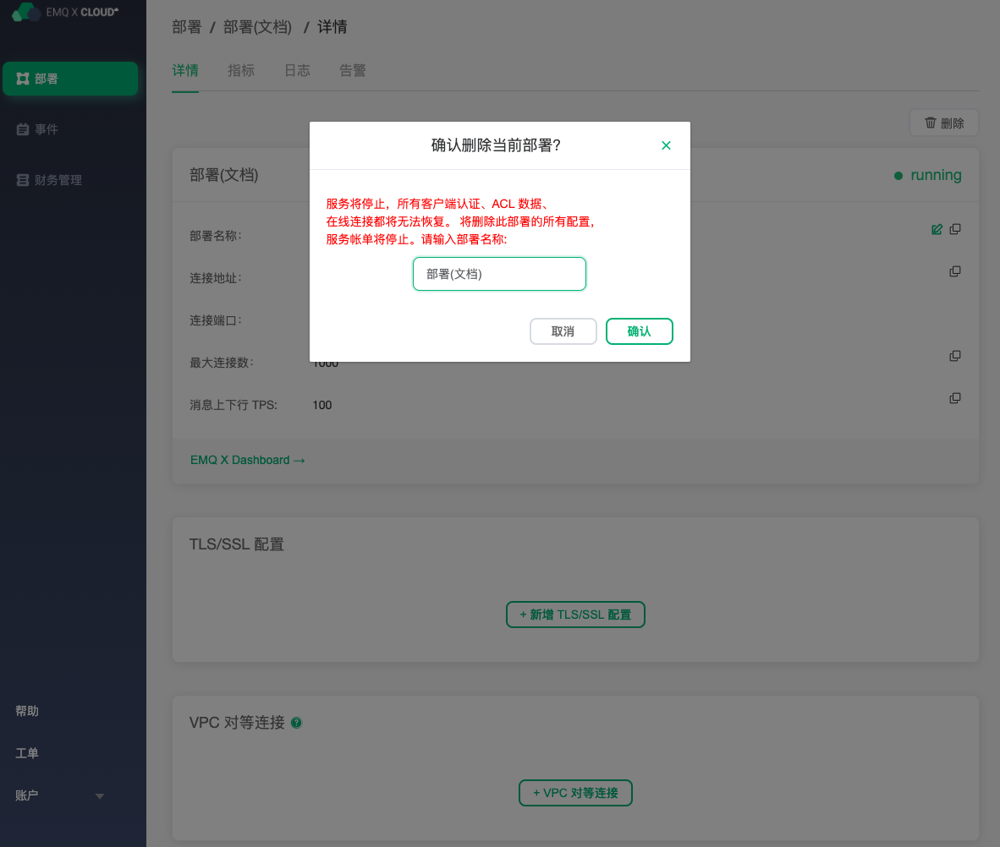

# 创建和删除部署

要管理您的部署，请导航至 [EMQ X Cloud 控制台](<https://cloud.emqx.io/console/)

### 创建部署

创建正式部署之前，您需要保证账户余额不小于所创建部署 24  小时所需费用。您可以在[付款概览页面](https://cloud.emqx.io/console/billing/payments) 完成余额充值。

1. 进入控制台,点击右上角新建按钮， 您将进入部署创建页面。

2. 依据您实际情况依次选择云平台、区域、最大连接数、消息上下行 TPS。

   > 注意: 请慎重选择最大连接数以及消息上下行 TPS， 这将影响到您后面实际使用

3. 在右侧基础信息栏核对部署信息。
4. 点击立即部署 并同意 EMQ X Cloud 服务条款。你将跳转到控制台部署页面。
5. 等待部署运行状态为 `running` 
6. 开始 [连接和测试部署](./connections.md)

### 删除部署

删除部署之前，您需要确保部署运行状态为 `running` 。

1. 进入控制台，点击您所需要删除的部署，您将进入部署详情页面

2. 点击删除按钮，并在弹出框中输入部署名称

   > 注意:  删除部署将会清除 Users and ACL、规则引擎等数据并断开在线连接，同时我们将会停止部署计费。

3. 点击确认，完成部署删除

