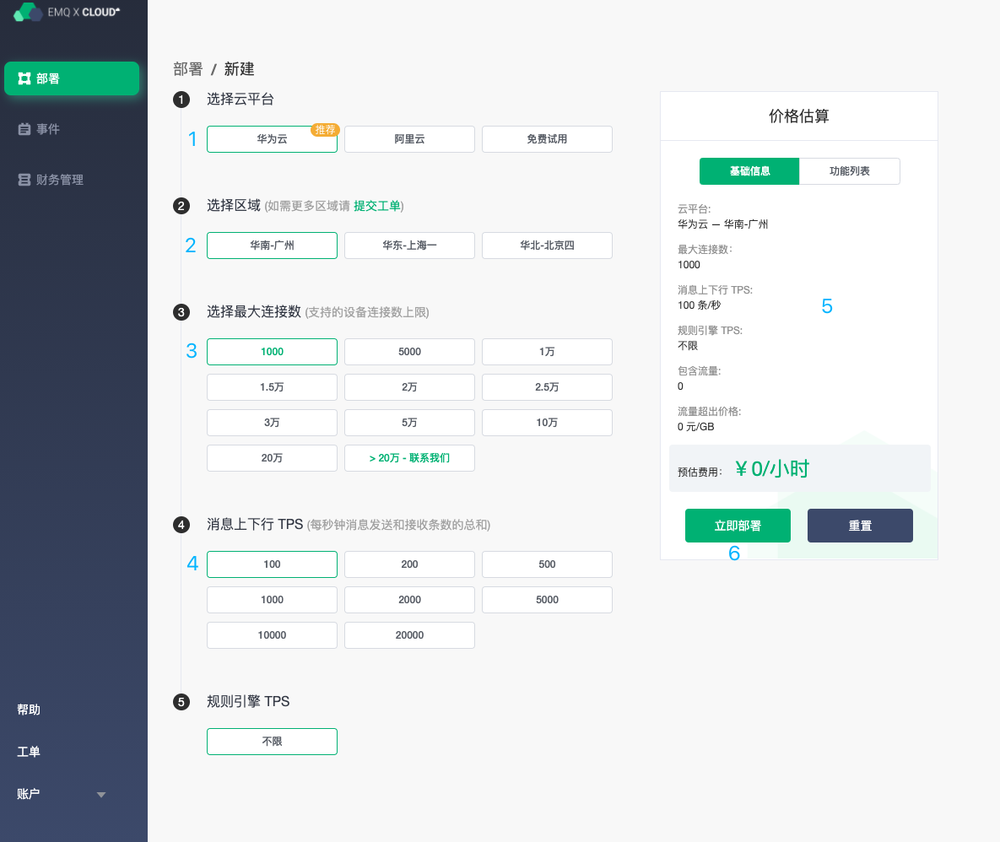

# 创建一个新的部署
在本教程中，您将学习如何创建新的 EMQ X Cloud 部署。要了解如何删除现有 EMQ X Cloud 部署，请参阅 [删除部署](./delete_deployment.md)。

## 限制

* 在创建部署前，您账户余额不能少于所创建部署 **24** 小时所需总费用。您可以前往 [价格估算](https://cloud.emqx.io/console/deployments/0?oper=new) 查看所选部署规格每小时费用 * 24，同时您可以在 [付款概览页面 ](https://cloud.emqx.io/console/billing/overview)完成账户余额充值。

  > 部署规格为 1000 线、100 tps 每小时价格为 2.26 元，则您账户余额应该大于 **55** 元(2.26 * 24)

## 创建部署

1. 登录账户，导航到 EMQ X Cloud [控制台](https://cloud.emqx.io/console/)。
2. 点击右上角**新建按钮**进入部署价格估算页面。
3. 依据您的需求选择相应规格的部署。
   * 选择云平台：EMQ X Cloud 暂支持华为云、阿里云，如您有其他云服务提供商需求，您可以提交[工单](../contact.md)或通过邮件（cloud@emqx.io）和我们联系。
   * 选择区域：EMQ X Cloud 暂支持华为云（广州，上海，北京）阿里云（深圳，上海，杭州，北京），如您有其他区域需求，您可以提交 [工单](../contact.md) 或通过邮件（cloud@emqx.io）和我们联系。
   * 选择最大连接数：客户端最大允许接入数，您后续可以通过 [升降部署规格](./upgrade_deployment.md) 实现增加和减少最大连接数。
   * 消息上下行 TPS：部署每秒钟发送和接收消息条数的总和，您后续可以通过 [升降部署规格](./upgrade_deployment.md) 实现增加和减少消息上下行 TPS。
4. 在右侧 **基础信息** 栏核对部署信息。
5. 点击 **立即部署** 并同意 EMQ X Cloud 服务条款。您将跳转到控制台部署详情页面。
6. 等待 5 ~ 10 分钟直至部署运行状态为 **running** 。
7. 您可以前往 [连接到部署](../connect_to_deployments/README.md) 查看更多方法连接部署。

