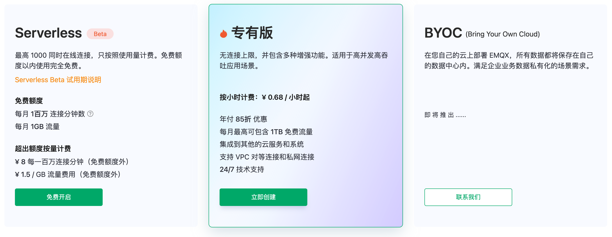

# 创建一个新的部署

在本教程中，您将学习如何创建新的 EMQX Cloud 部署。要了解如何停止/删除现有 EMQX Cloud 部署，请参阅 [停止/删除部署](./stop_delete_deployment.md)。

## 创建部署

1. 登录账户，导航到 EMQX Cloud [控制台](https://cloud.emqx.com/console/)。
2. 点击右上角**新建按钮**进入部署价格估算页面。
3. 依据您的需求选择相应的版本

   

4. 依据您的需求选择相应规格配置。

   
   * 选择云平台：EMQX Cloud 暂时支持华为云、阿里云、腾讯云，如您有其他云服务提供商需求，您可以提交 [工单](../feature/tickets.md) 或通过邮件（cloud@emqx.io）和我们联系。
   * 选择区域：EMQX Cloud 暂时支持华为云（广州，上海，北京），阿里云（深圳，上海，杭州，北京），腾讯云（广州，上海，北京）如您有其他区域需求，您可以提交 [工单](../feature/tickets.md) 或通过邮件（cloud@emqx.io）和我们联系。
   * 选择最大连接数：客户端最大允许接入数，您后续可以通过升降部署规格实现增加和减少最大连接数。
   * 消息上下行 TPS：部署每秒钟发送和接收消息条数的总和，您后续可以通过升降部署规格实现增加和减少消息上下行 TPS。
5. 在 **确认** 页核对部署信息。

   

6. 点击 **立即部署** 并同意 EMQX Cloud 服务条款。您将跳转到控制台部署详情页面。
7. 等待 5 ~ 10 分钟直至部署运行状态为**运行中**。
8. 您可以前往 [连接到部署](../connect_to_deployments/overview.md) 查看更多方法连接部署。
