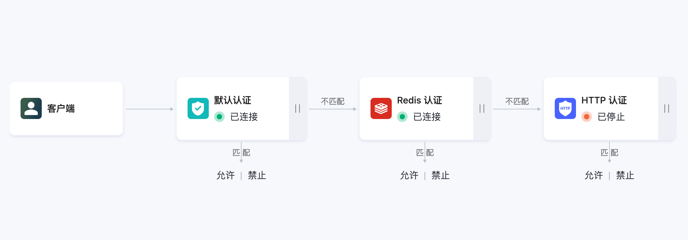

# 扩展认证

扩展认证帮助用户使用自己服务进行认证，支持外部数据库如 MySQL， Redis 作为数据源，或者连接到 HTTP 服务做认证鉴权。

## 扩展认证数据源

[HTTP 认证](./http_auth.md)

[MySQL 认证](./mysql_auth.md)

[PostgreSQL 认证](./pgsql_auth.md)

[Redis 认证](./redis_auth.md)

[JWT 认证](./jwt_auth.md)

::: tip
最多支持创建 2 个扩展认证数据源。
:::

## 认证排序

添加了扩展认证数据源之后，用户可以对认证数据源做排序。在扩展认证页面，点击**认证排序**，进入排序页面。部署将按照从左到右的顺序进行认证，默认的认证链顺序为默认认证 -> 扩展认证。
- 认证成功，终止认证链并允许客户端接入
- 认证失败，终止认证链并禁止客户端接入
- 当前数据源未能匹配，将进入下一个认证源进行认证
自定义认证链：可拖动认证数据源的图标，左右排列进行认证顺序的编排。

