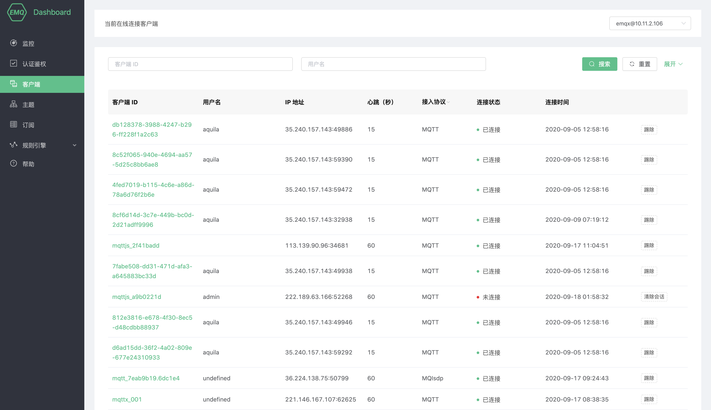
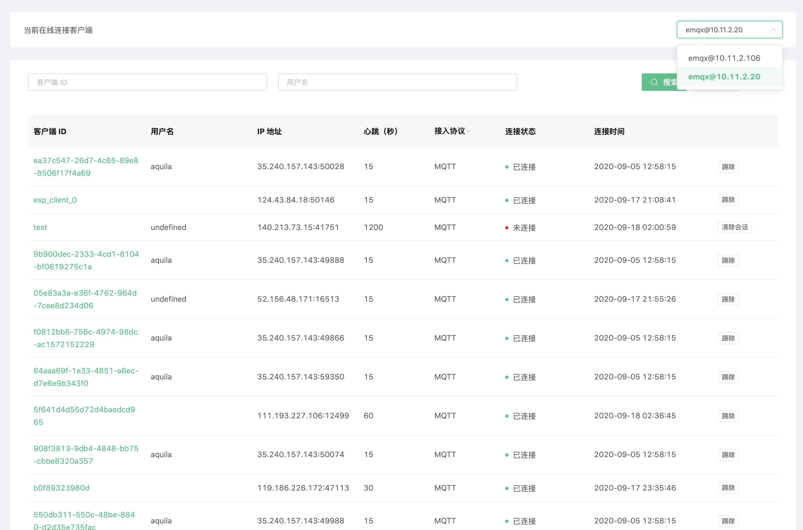
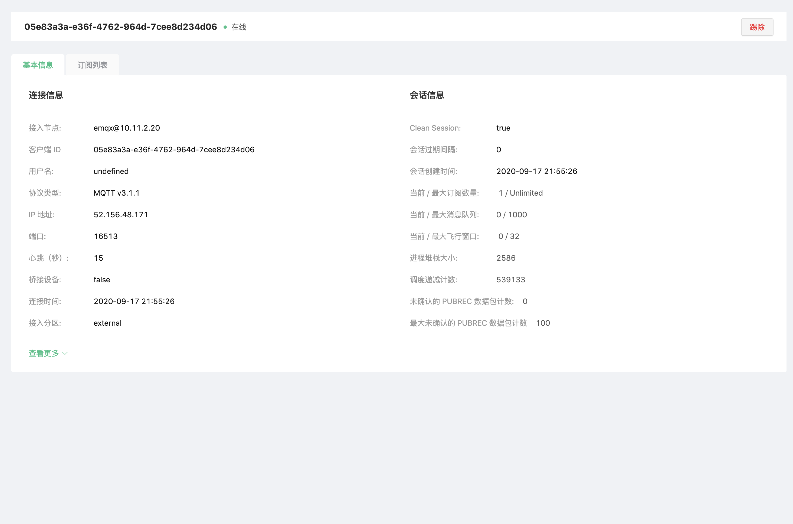
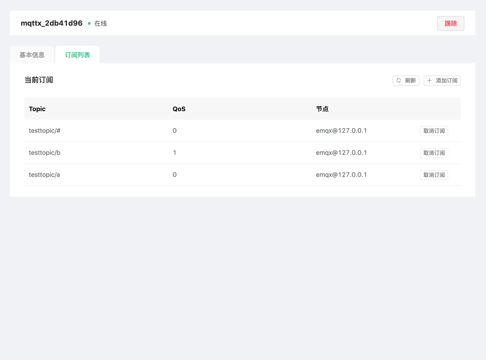
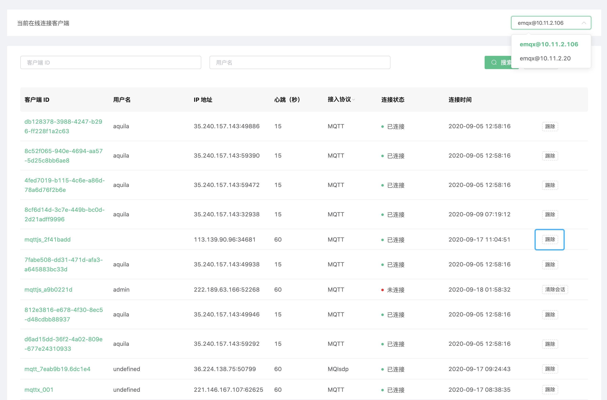

# 客户端

在 EMQ X 中通过 MQTT 等协议与 EMQ X 服务器进行通信的设备统称客户端，您可以在这里查看客户端连接信息、订阅列表等信息，并能在界面上踢出客户端。

## 客户端列表

客户端列表页面显示当前连接客户端列表，点击右上角下拉列表可以看到不同节点上客户端在线情况。列表中几个重要信息如下：

- 客户端 ID、用户名：分别是 MQTT Client ID 与 MQTT Username，点击绿色**客户端 ID**可以查看客户端详情与订阅列表信息；
- IP 地址：客户端 IP + 端口信息；
- 连接状态：客户端在线状态，如果客户端已断开连接，但启用了**保留会话（Clean Session**）且会话未过期，此处将显示显示为**未连接**；
- 断开连接/清除会话：对于在线的客户端，将断开其连接并清除会话，如果客户端不在线，点击清除会话将清除客户端订阅关系等会话信息。

## 查看客户端基本详情

点击绿色**客户端 ID**可以查看客户端详情，**基本信息**包含所选客户端连接信息与会话信息，包含消息流量、消息统计等关键业务信息。

### 查看客户端订阅列表

点击绿色**客户端 ID**可以查看客户端订阅列表信息，**订阅列表**包含所选客户端如下订阅信息：

- 取消订阅：点击取消按钮将删除设备与主题的订阅关系，对于设备该操作是无感的；
- 添加订阅：为所选客户端代理订阅指定主题。

## 剔除客户端

在客户端列表右侧您可以点击**剔除**按钮，踢除指定客户端。剔除客户端有以下注意事项：

* 踢除客户端操作会将连接与会话一并终结。
* 剔除客户端后，客户端如果存在重连机制，依旧还能继续连入 EMQ X 集群

