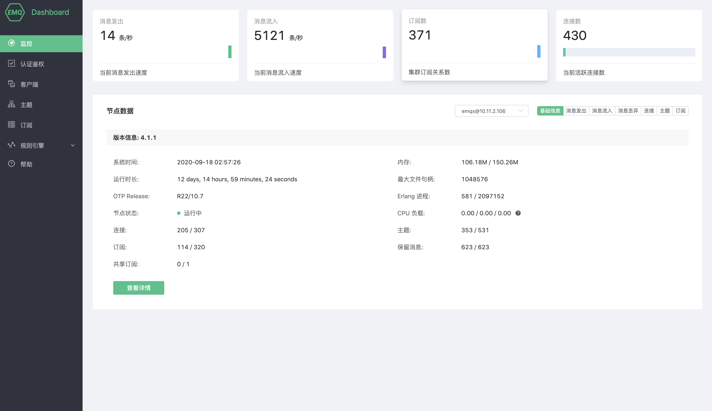
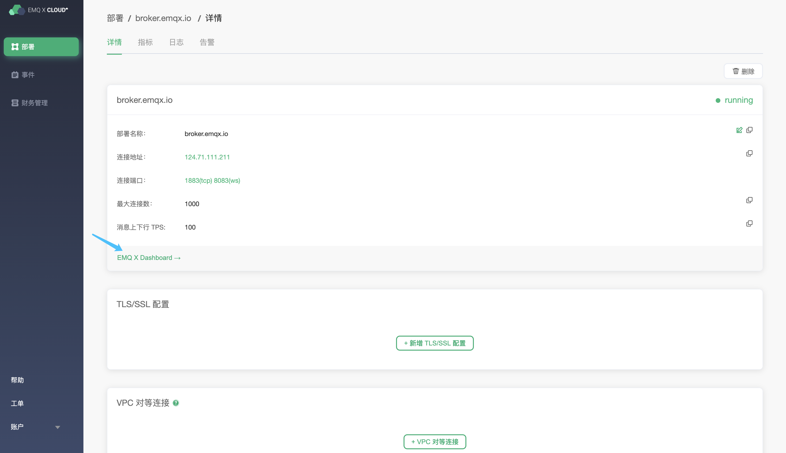

# 简介

EMQ X Cloud 提供了 Dashboard 以方便用户管理设备与监控相关指标。通过 Dashboard，您可以查看服务器基本信息、负载情况和统计数据，可以查看某个客户端的连接状态等信息甚至断开其连接。

## 从部署详情进入 EMQ X Dashboard

您可以通过下面的步骤进入 EMQ X Dashboard：

1. 登录 [EMQ X Cloud 控制台](https://cloud.emqx.cn/console/)
2. 点击所需连接的部署，您将进入部署详情页面
3. 点击页面中 **EMQ X Dashboard** 按钮，您将进入到 EMQ X Dashboard

## [监控](./monitor.md)

您可以在**监控**页面可查看 EMQ X 当前集群的运行指标。

## [认证鉴权](./users_and_acl.md)

通过添加客户端 username 和 password 实现 MQTT 客户端认证鉴权

## [客户端](./client.md)

查看和管理当前连接到 EMQ X 客户端

## [主题](./topic.md)

查看当前 EMQ X 集群主题信息

## [订阅](./subscribe.md)

查看当前 EMQ X 集群客户端订阅信息

