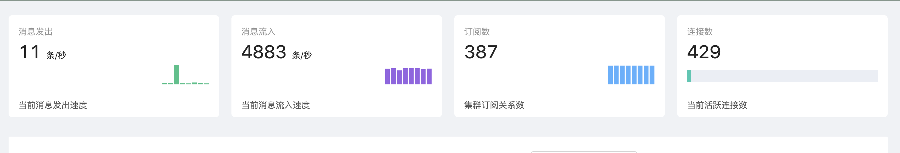
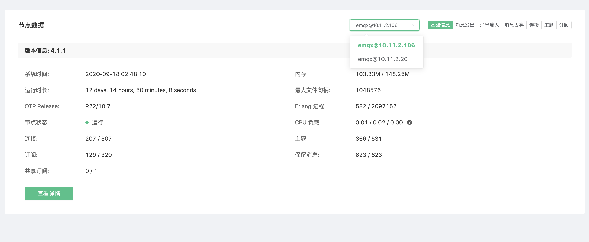
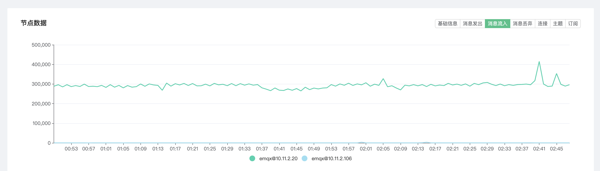
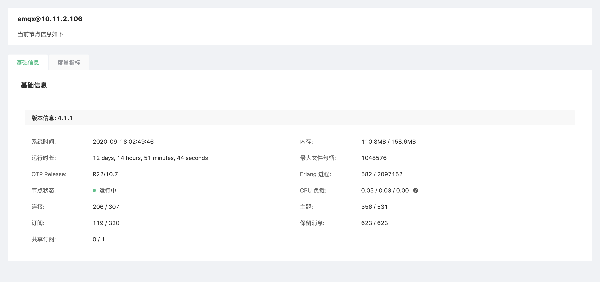

# 监控

监控可查看部署当前集群的运行指标，允许用户以及运维人员根据这些指标来了解当前服务状态。

## 集群运行指标

页面顶部四个指标卡片，包含集群的 `消息发出速率`、`消息流入速率`，`订阅数` 和 `当前连接数`。

## 节点数据

点击节点下拉列表可以切换查看节点的基本信息包括 EMQ X 版本信息、运行时间、资源占用、连接和订阅等数据。 部分信息释义如下：

* 内存: Erlang 虚拟机使用的当前内存/最大内存，其中最大内存由 EMQ X 视资源使用情况自动向系统申请，并非 EMQ X 所在节点服务器物理内存**用户无需干预**。
* 最大文件句柄：允许当前会话/进程打开文件句柄数，该值过小会限制 EMQ X 并发性能，在远小于 License 授权最大连接数时，请参照测试调优或联系 EMQ 技术人员进行修改；
* Erlang 进程、连接、主题、订阅、保留消息、共享订阅：该四个值通过 / 分割为两组，分别是当前值与最大值。

## 指标数据

点击**节点数据**区域右侧按钮组可以切换查看近期集群运行指标数据图表，图表数值均为抽样周期内实际数值。

## 节点详细信息

点击节点数据下方**查看详情**按钮可以跳转至节点详情，查看当前节点的**基础信息**、**监听器**及连接情况，**度量指标**等信息。

