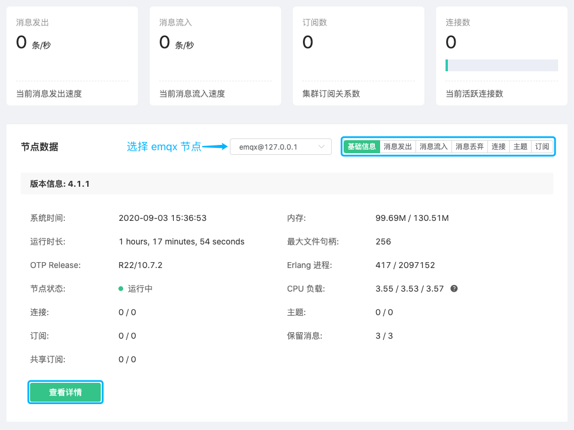
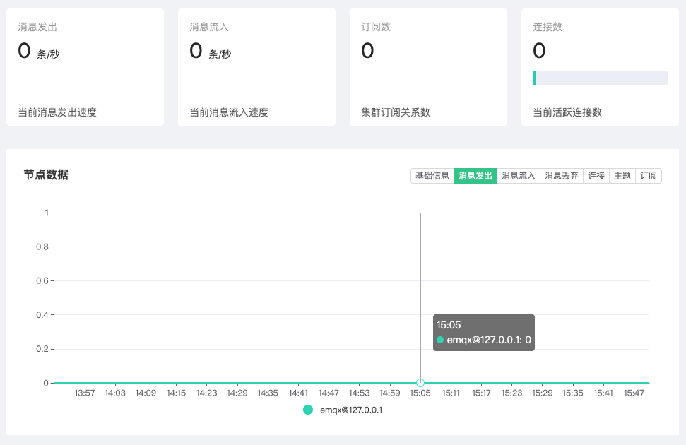
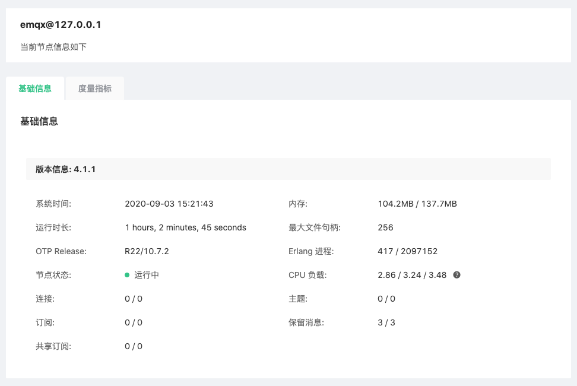

# 监控

监控可查看部署当前集群的运行指标

1. 登录 [EMQ X Cloud 控制台](https://cloud.emqx.io/console/)

2. 点击所需连接的部署，您将进入部署详情页面

3. 点击部署详情页面中的 EMQ X Dashboard 地址，您将进入到 Dashboard

4. 点击 Dashboard 左侧菜单`监控`

  
  
   

### 集群运行指标

   页面顶部四个指标卡片，包含**集群**的消息发出、消息流入速率，订阅数和当前连接数。

### 节点数据

点击节点下拉列表可以切换查看节点的基本信息包括 EMQ X 版本信息、运行时间、资源占用、连接和订阅等数据。   

### 历史数据

点击**节点数据**区域右侧按钮组可以切换查看近期集群运行数据图表，图表数值均为抽样周期内实际数值

 

### 节点详细信息

点击节点数据下方 **查看详情** 按钮可以跳转至节点详情，查看当前节点的**基础信息**、**监听器**及连接情况，**度量指标**等信息。  

