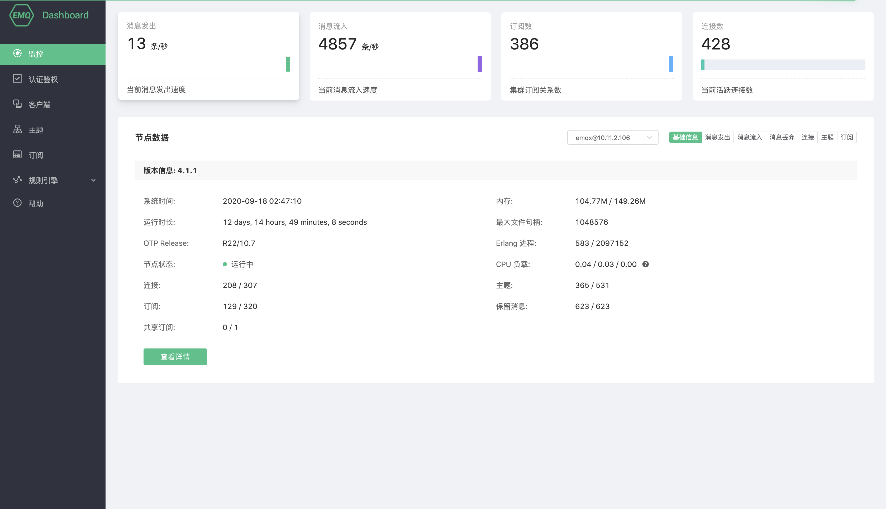
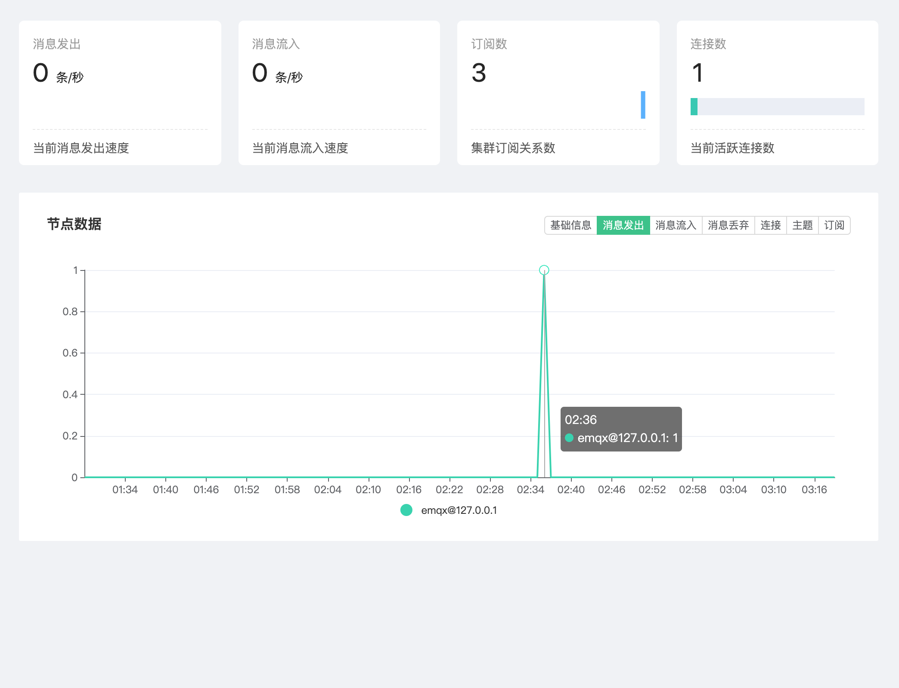
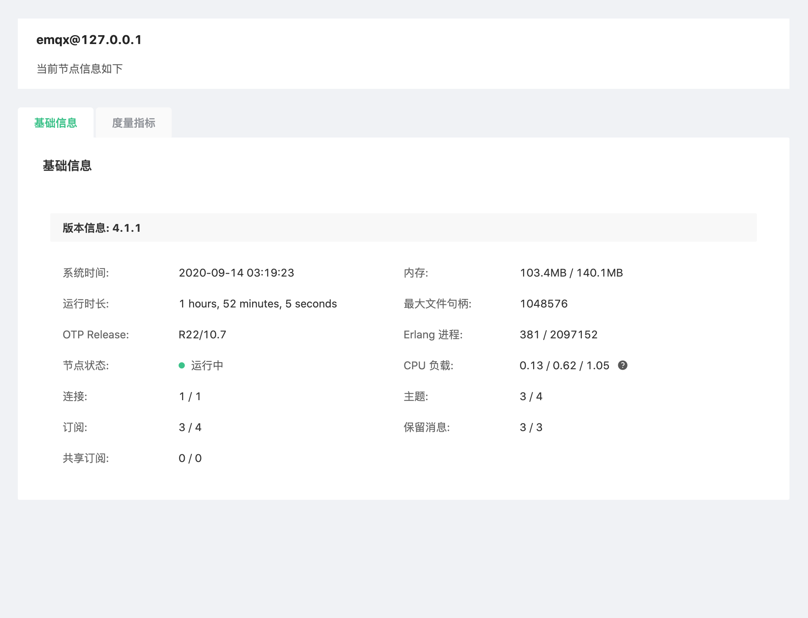

# 监控

监控可查看部署当前集群的运行指标

### 集群运行指标

页面顶部四个指标卡片，包含集群的 `消息发出速率`、`消息流入速率`，`订阅数` 和 `当前连接数`。

### 节点数据

点击节点下拉列表可以切换查看节点的基本信息包括 `EMQ X 版本信息`、`运行时间`、`资源占用`、`连接` 和 `订阅` 等数据。

### 历史数据

点击节点数据区域右侧按钮组可以切换查看近期集群运行数据图表，图表数值均为抽样周期内实际数值

### 节点详细信息

点击节点数据下方 `查看详情` 按钮可以跳转至节点详情，查看当前节点的 `基础信息`、`监听器`及`连接情况`，`度量指标` 等信息。

