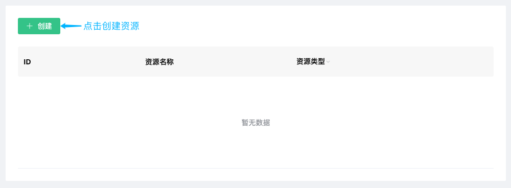
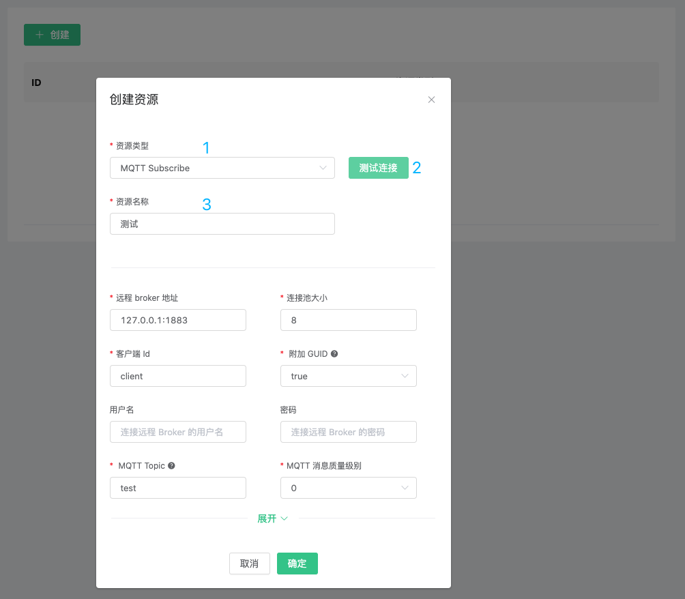
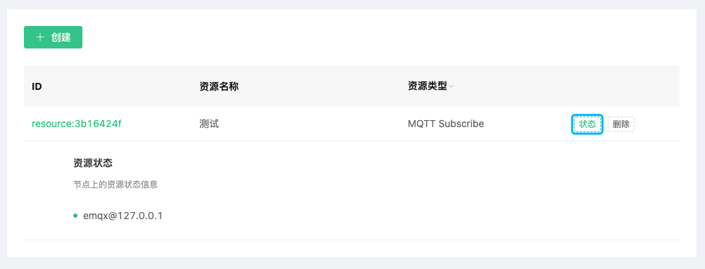
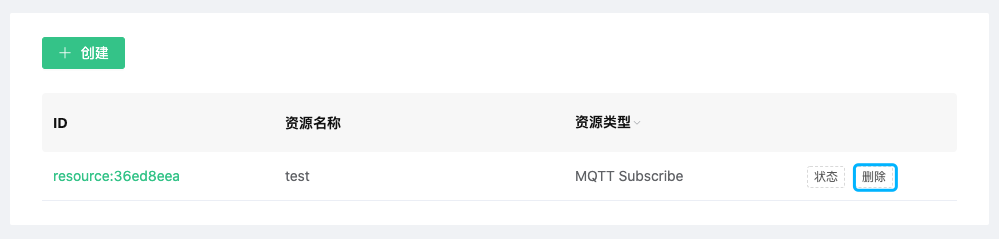

# 资源

EMQ X Cloud 资源用于规则引擎响应动作， 在此之前您需要确保部署状态为 `running`

### 创建资源

1. 登录 [EMQ X Cloud 控制台](https://cloud.emqx.io/console/)

2. 点击所需连接的部署，您将进入部署详情页面

3. 点击页面中 EMQ X Dashboard 按钮，您将进入到 Dashboard

4. 点击 Dashboard 左侧菜单`规则引擎` → `资源`，在资源列表页面点击资源`创建`按钮

   

5. 选择相应资源类型，并填写相应资源配置信息

   

6. 点击测试，如果没有报错则点击确认，否则请仔细检查资源配置信息

### 查看资源状态

1. 登录 [EMQ X Cloud 控制台](https://cloud.emqx.io/console/)

2. 点击所需连接的部署，您将进入部署详情页面

3. 点击页面中 EMQ X Dashboard 按钮，您将进入到 Dashboard

4. 点击 Dashboard 左侧菜单`规则引擎` → `资源`，在资源列表页面点击资源状态图标

   

### 删除资源

1. 登录 [EMQ X Cloud 控制台](https://cloud.emqx.io/console/)

2. 点击所需连接的部署，您将进入部署详情页面

3. 点击页面中 EMQ X Dashboard 按钮，您将进入到 Dashboard

4. 点击 Dashboard 左侧菜单`规则引擎` → `资源`，在资源列表页面点击资源`删除`按钮

   