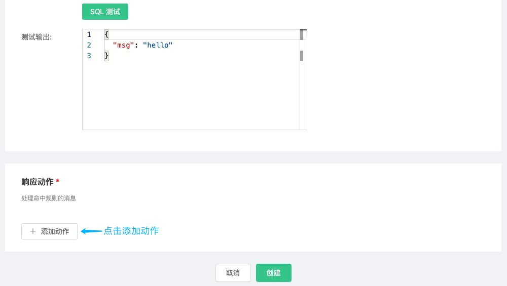
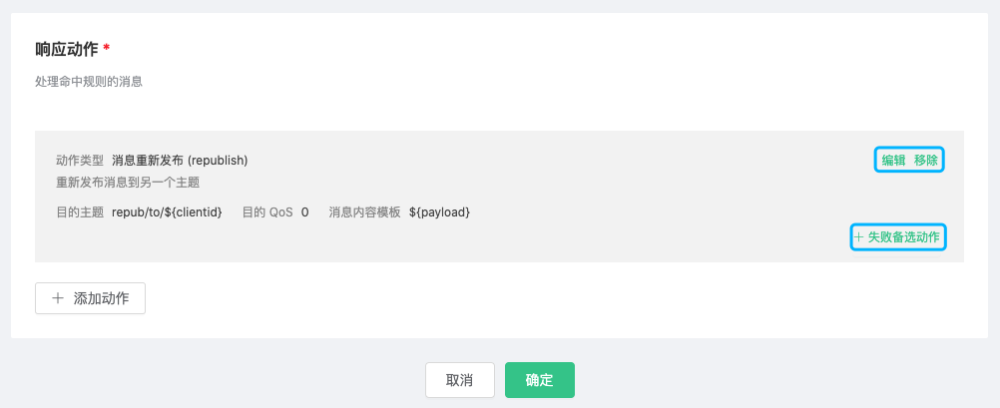

# 规则引擎
EMQ X Cloud 规则引擎用于配置 EMQ X 消息流与设备事件的处理、响应规则。规则引擎不仅提供了清晰、灵活的 "配置式" 的业务集成方案，简化了业务开发流程，提升用户易用性，降低业务系统与 EMQ X 的耦合度。

> 注意: 如果您刚接触 EMQ X 规则引擎，您可以前往 [EMQ X 规则引擎](<https://docs.emqx.io/broker/latest/cn/rule/rule-engine.html>) 了解更多规则引擎使用方法。

### 创建您的第一条规则引擎

在创建规则引擎之前您需要确保部署状态为 `running `

1. 登录 [EMQ X Cloud 控制台](https://cloud.emqx.io/console/)

2. 点击所需连接的部署，您将进入部署详情页面

3. 点击部署详情页面中的 dashboard 地址，您将进入到 dashboard

4. 点击 dashboard 左侧菜单`规则引擎` → `规则`，在规则列表页面点击创建按钮

   

5. 新建一条测试 SQL，点击 `SQL 测试` 后面的开关，并填写相应的测试参数，最后点击 `SQL 测试`按钮

   

6. 添加动作

   > 注意： 添加动作之前，您需要保证已添加 [VPC 对等连接](), 并已经[创建资源](./)

   

   在弹出的动作配置对话框中，选择相应的动作类型，并填写相应动作的配置信息

   

### 查看规则监控状态

1. 登录 [EMQ X Cloud 控制台](https://cloud.emqx.io/console/)

2. 点击所需连接的部署，您将进入部署详情页面

3. 点击部署详情页面中的 dashboard 地址，您将进入到 dashboard

4. 点击 dashboard 左侧菜单`规则引擎` → `规则`，在规则列表页面点击规则监控图标

   

### 编辑规则

1. 登录 [EMQ X Cloud 控制台](https://cloud.emqx.io/console/)

2. 点击所需连接的部署，您将进入部署详情页面

3. 点击部署详情页面中的 dashboard 地址，您将进入到 dashboard

4. 点击 dashboard 左侧菜单`规则引擎` → `规则`，在规则列表页面点击规则`编辑`按钮

   

   编辑规则时，也可对规则中添加的动作进行编辑

   

5. 更改规则状态

   

### 删除规则

1. 登录 [EMQ X Cloud 控制台](https://cloud.emqx.io/console/)

2. 点击所需连接的部署，您将进入部署详情页面

3. 点击部署详情页面中的 dashboard 地址，您将进入到 dashboard

4. 点击 dashboard 左侧菜单`规则引擎` → `规则`，在规则列表页面点击规则`删除`按钮

   
