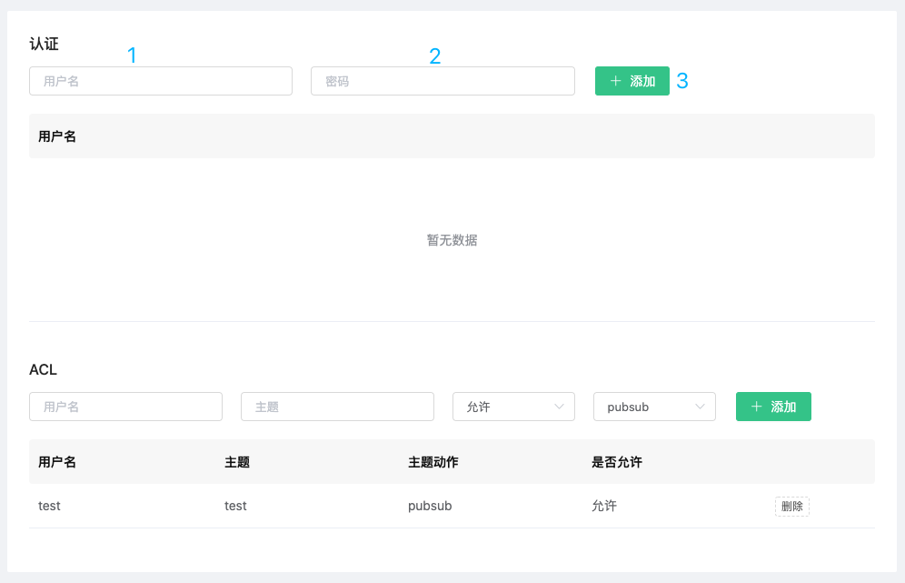
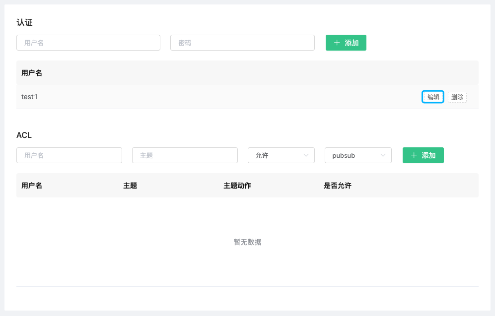
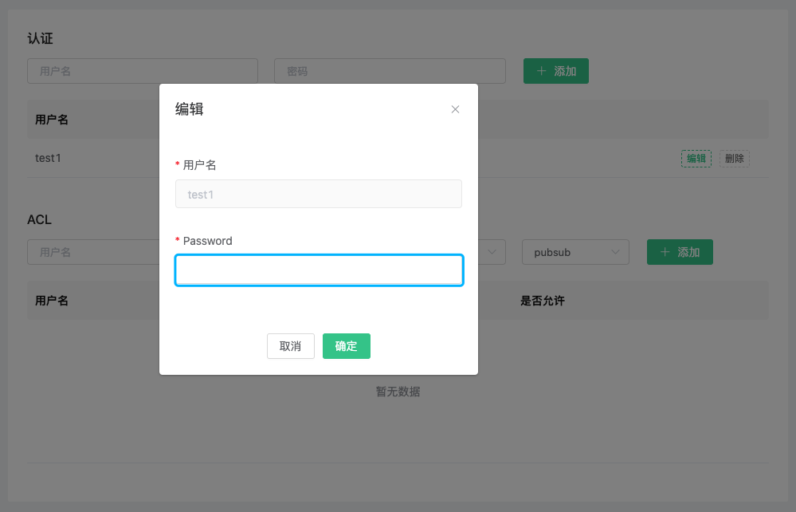
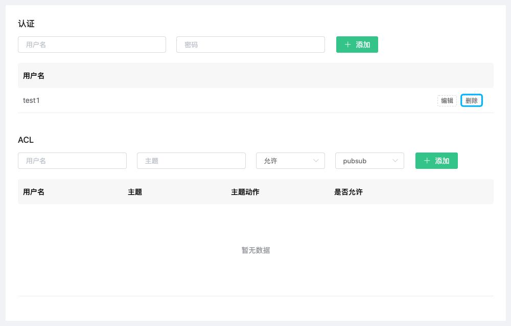
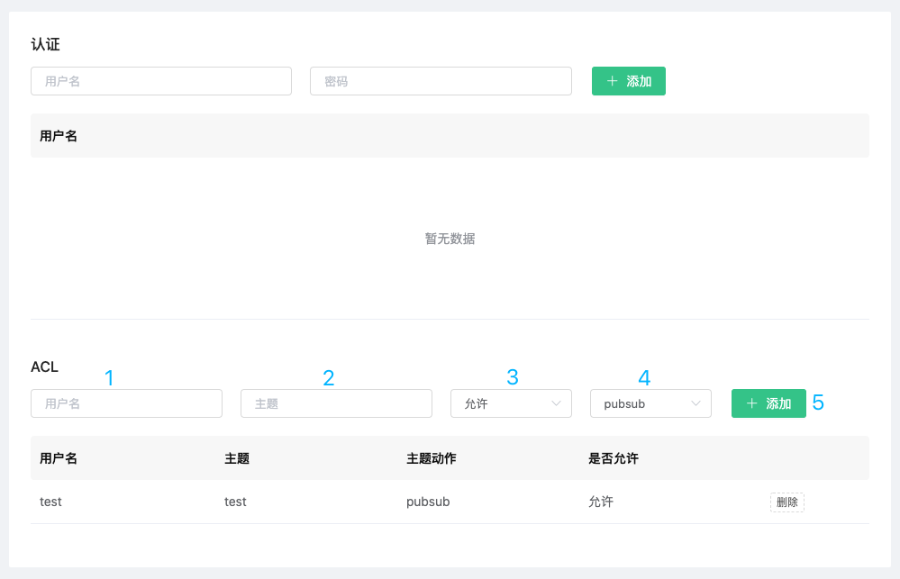
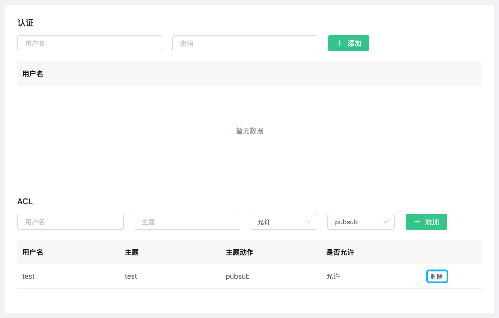

# 认证和鉴权

EMQ X Cloud 完整支持 MQTT 各项安全规范，内置的安全功能无需编程开箱即用，可以快速排除项目中的安全隐患。在使用Users and ACL 时，您需要确保部署状态为 `running`

## 认证

EMQ X Cloud 客户端支持 `username` ,`password` 认证。

### 添加客户端认证信息

1. 登录 [EMQ X Cloud 控制台](https://cloud.emqx.io/console/)

2. 点击所需连接的部署，您将进入部署详情页面

3. 点击部署详情页面中的 dashboard 地址，您将进入到 dashboard

4. 点击 dashboard 左侧菜单`认证鉴权`，在认证中填入`用户名`、`密码`，然后点击添加按钮

   

### 编辑客户端认证信息

1. 登录 [EMQ X Cloud 控制台](https://cloud.emqx.io/console/)

2. 点击所需连接的部署，您将进入部署详情页面

3. 点击部署详情页面中的 dashboard 地址，您将进入到 dashboard

4. 点击 dashboard 左侧菜单`认证鉴权`，点击认证信息中的`编辑`按钮

   

   可对认证信息的密码进行更改

   

### 删除客户端认证信息

1. 登录 [EMQ X Cloud 控制台](https://cloud.emqx.io/console/)

2. 点击所需连接的部署，您将进入部署详情页面

3. 点击部署详情页面中的 dashboard 地址，您将进入到 dashboard

4. 点击 dashboard 左侧菜单`认证鉴权`，点击认证信息中的`删除`按钮

   

## 发布订阅 ACL

EMQ X Cloud 发布订阅 ACL 支持 `username`, `topic` 模式。

### 添加 ACL 信息

1. 登录 [EMQ X Cloud 控制台](https://cloud.emqx.io/console/)

2. 点击所需连接的部署，您将进入部署详情页面

3. 点击部署详情页面中的 dashboard 地址，您将进入到 dashboard

4. 点击 dashboard 左侧菜单`认证鉴权`，在 ACL 中填入`用户名`、`主题`，并选择是否允许以及主题动作，然后点击添加按钮

   

### 删除 ACL 信息

1. 登录 [EMQ X Cloud 控制台](https://cloud.emqx.io/console/)

2. 点击所需连接的部署，您将进入部署详情页面

3. 点击部署详情页面中的 dashboard 地址，您将进入到 dashboard

4. 点击 dashboard 左侧菜单`认证鉴权`，点击 ACL 信息中的`删除`按钮

   
