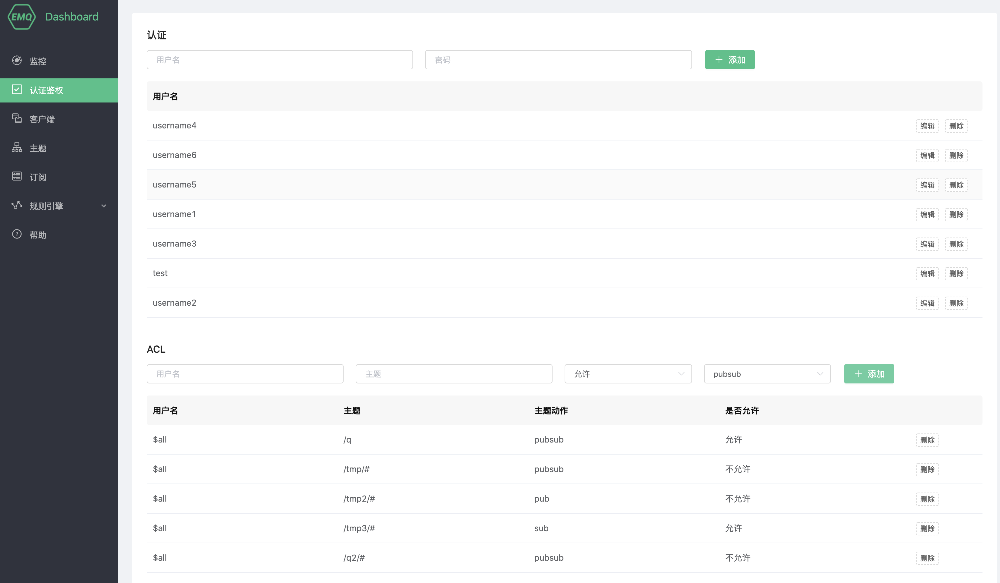
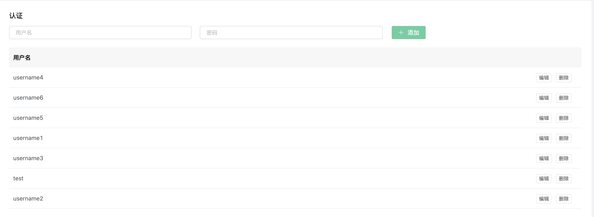
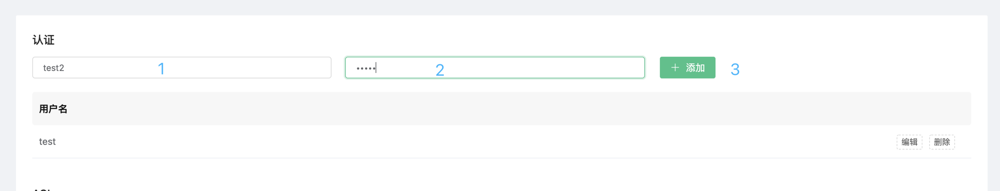
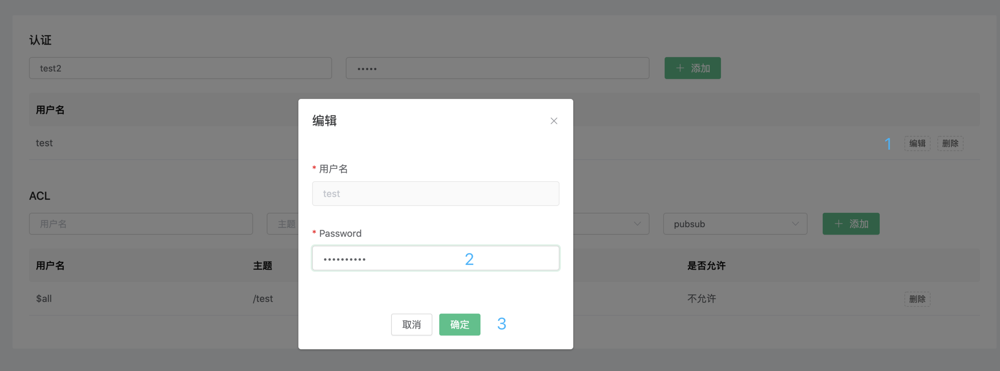
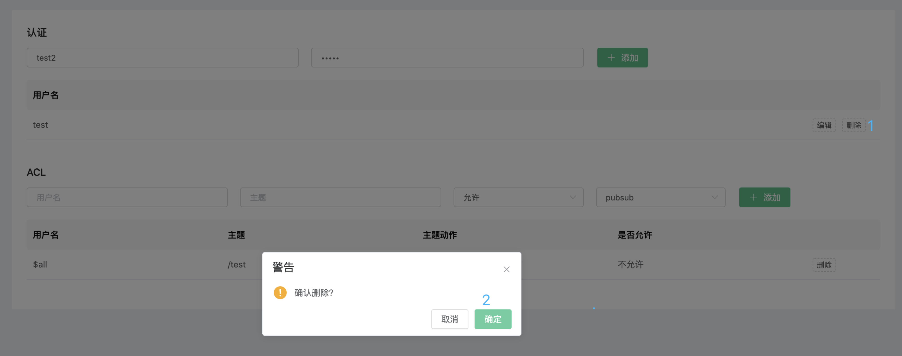
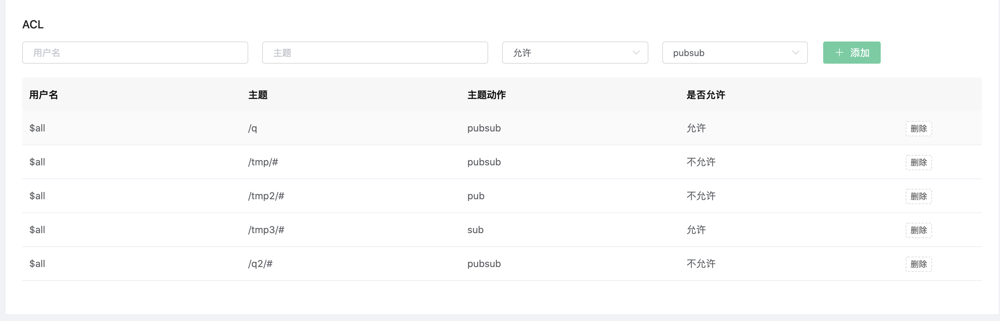
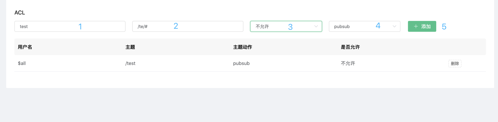
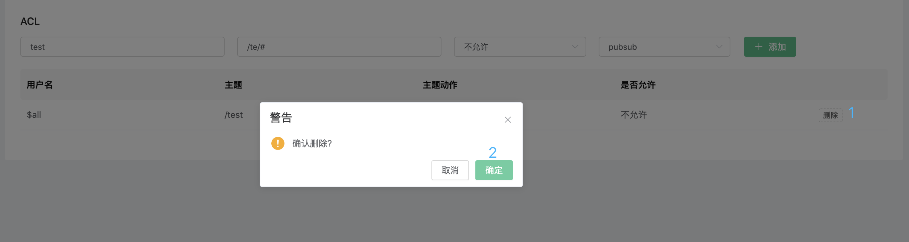

# 认证和鉴权

身份认证是大多数应用的重要组成部分，MQTT 协议支持用户名密码认证，启用身份认证能有效阻止非法客户端的连接。EMQ X 中的认证指的是当一个客户端连接到 EMQ X 的时候，通过服务器端的配置来控制客户端连接服务器的权限。

EMQ X 的认证支持包括两个层面：

1. MQTT 协议本身在 CONNECT 报文中指定用户名和密码

2. 在传输层上，TLS 可以保证使用客户端证书的客户端到服务器的身份验证，并确保服务器向客户端验证服务器证书。

本节主要是指 MQTT 协议本身的认证。关于传输层上 TLS 验证，可以参考指南——[配置 TLS/SSL]()

## 认证

### 查看客户端认证信息

在 `Dashboard` 的 `认证鉴权` 页中，您可以查看到该部署的所有认证信息。

### 添加客户端认证信息

在页面的上方输入框，依次输入客户端用户名、密码，然后点击添加按钮完成添加。

### 编辑客户端认证信息

您可以点击每条认证信息右侧的 `编辑` 按钮，可以对客户端认证密码进行修改。

### 删除认证信息

对于不需要的认证信息，您可以点击右侧的 `删除` 按钮进行删除。

## 鉴权(ACL)

鉴权是指对发布 (PUBLISH)/订阅 (SUBSCRIBE) 操作的 `权限控制`。

### 查看鉴权信息

在 `Dashboard` 的 `认证鉴权` 页中，您可以查看到该部署的所有鉴权信息。

### 添加 ACL

再输入框中依次输入客户端：用户名、主题、规则（允许/不允许）、主题动作（pub/sub/pubsub）完成部署 ACL 规则创建

### 删除 ACL 

对于不需要的 ACL 信息，您可以点击右侧的 `删除` 按钮进行删除。

