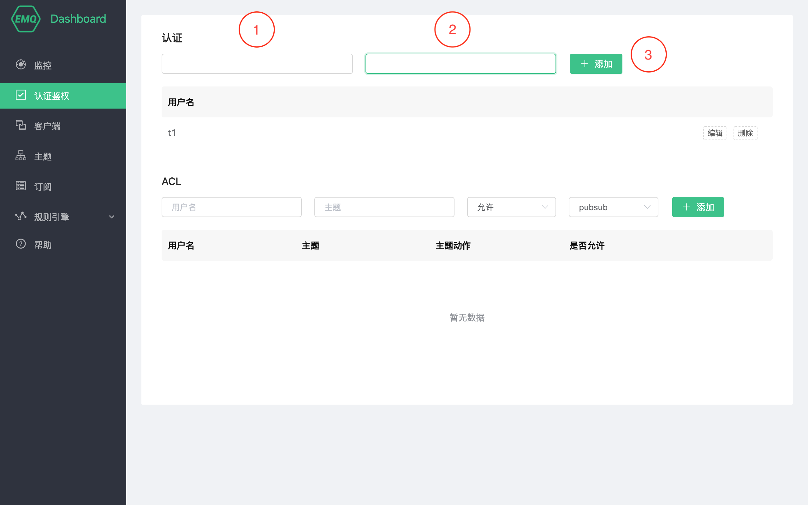
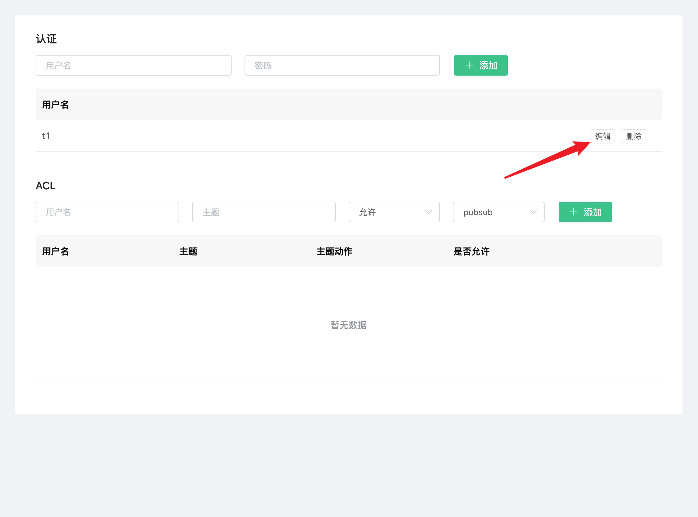
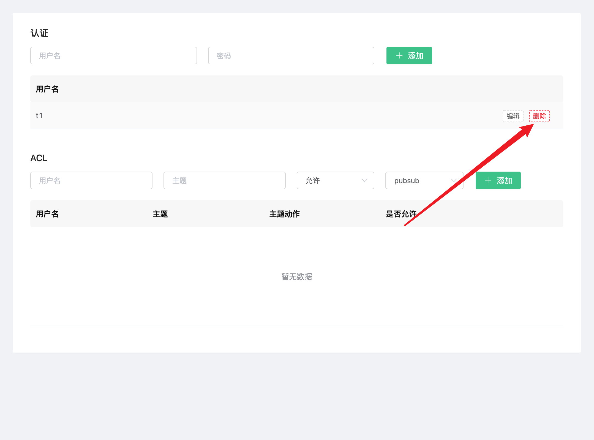
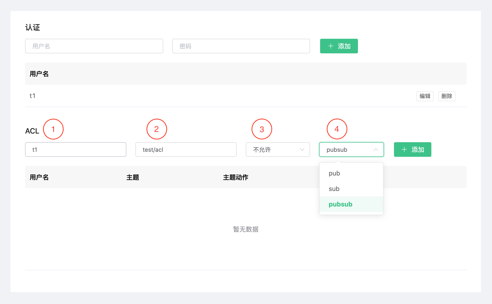
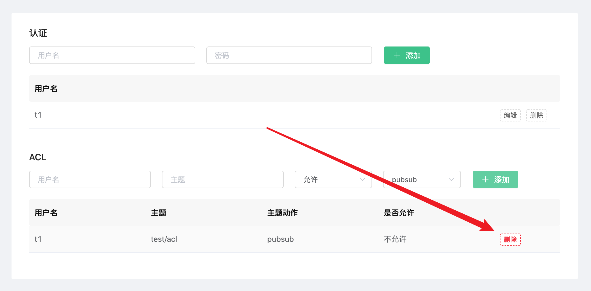

# 认证和鉴权

身份认证是大多数应用的重要组成部分，MQTT 协议支持用户名密码认证，启用身份认证能有效阻止非法客户端的连接。

EMQ X 中的认证指的是当一个客户端连接到 EMQ X 的时候，通过服务器端的配置来控制客户端连接服务器的权限。

EMQ X 的认证支持包括两个层面：

1. MQTT 协议本身在 CONNECT 报文中指定用户名和密码

2. 在传输层上，TLS 可以保证使用客户端证书的客户端到服务器的身份验证，并确保服务器向客户端验证服务器证书。

本节主要是指 MQTT 协议本身的认证。关于传输层上 TLS 验证，可以参考指南——[配置 TLS/SSL]()

> 注意：
>
> 在使用 `认证鉴权` 时，您需要确保部署状态为 `running`

## 认证

### 客户端认证列表

在 `Dashboard` 的 `认证鉴权` 页中，您可以查看到该部署的所有认证用户。

### 添加认证信息

在页面的上方，依次填入用户名、密码，然后点击添加按钮完成添加。

### 编辑认证信息

您可以点击每条认证信息右侧的 `编辑` 按钮对认证信息进行修改。

### 删除认证信息

对于不需要的认证信息，您可以点击右侧的 `删除` 按钮进行删除。

## 鉴权 ACL

鉴权是指对发布 (PUBLISH)/订阅 (SUBSCRIBE) 操作的 `权限控制`。例如拒绝用户名为 Anna 向 open/elsa/door 发布消息。

### 添加 ACL

每条 ACL 信息包含 4 个部分。

1. 指定的用户名。`#` 号表示所有用户
2. 指定的主题。`#` 号表示所有主题
3. 是否允许。
4. 指定的动作。允许（或不允许）`发布(pub)`、`订阅(sub)`、`发布和订阅(pubsub)`

依次填入后，点击添加按钮完成添加。

### 删除 ACL 

对于不需要的 ACL 信息，您可以点击右侧的 `删除` 按钮进行删除。

