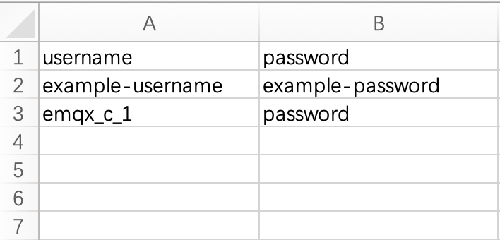

# 默认认证

EMQX 支持通过用户名密码进行身份验证。当客户端尝试连接时，需按要求提供身份凭证信息，EMQX 会在内置数据库中发起查询，并将返回得到的密码与客户端提供的信息进行匹配，匹配成功后，EMQX 将接受该客户端的连接请求。

## 查看认证信息

点击部署左侧菜单中的**访问控制**-> **客户端认证**，可以看到认证信息。

## 添加认证信息

在客户端认证页面上选择 **+ 添加**，在输入框中依次输入用户名和密码，点击**确认**按钮即可完成认证信息的添加。

## 批量导入认证信息

您可以通过 CSV 文件批量导入认证信息。

1. 点击**导入**按钮。

2. 下载模板。模板示例文件如下图所示：

   

3. 填写认证信息后上传文件。

4. 点击**导入**。

## 编辑认证信息

点击认证信息右侧的编辑图标，可以修改用户名的密码。

## 删除认证信息

点击认证信息右侧的删除图标，可以对认证信息进行删除。
