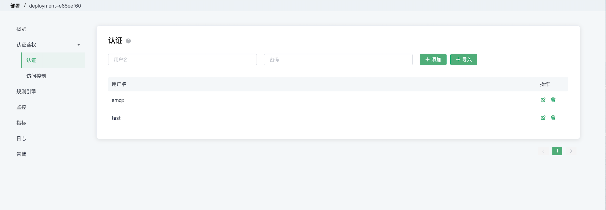

# 认证 TODO

身份认证是大多数应用的重要组成部分，MQTT 协议支持用户名密码认证，启用身份认证能有效阻止非法客户端的连接。EMQX Cloud 中的认证指的是当一个客户端连接到 EMQX  Cloud 的时候，通过服务器端的配置来控制客户端连接服务器的权限。

EMQX Cloud 的认证支持包括两个层面：

1. MQTT 协议本身在 CONNECT 报文中指定用户名和密码

2. 在传输层上，TLS 可以保证使用客户端证书的客户端到服务器的身份验证，并确保服务器向客户端验证服务器证书。

本节主要是指 MQTT 协议本身的认证。关于传输层上 TLS 验证，可以参考指南——配置 [TLS/SSL](./tls_ssl.md)

## 认证

### 查看认证信息

在左侧 `认证鉴权` 的 `认证` 页面，可以看到认证信息

### 添加认证信息

在页面上方的输入框中依次输入用户名和密码，添加添加按钮即可完成认证信息的添加

### 批量添加认证信息

可以通过 CSV 文件批量导入认证信息

1. 点击导入按钮
2. 下载模板
3. 填写认证信息后上传文件
   
   模板示例文件如下图所示

   

4. 点击导入按钮导入

   

### 编辑认证信息

点击认证信息右侧的编辑按钮，可以修改用户名的密码

### 删除认证信息

点击认证信息右侧的删除按钮，可以对认证信息进行删除

