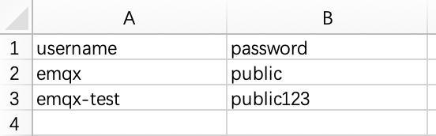

# 认证 <!--TODO-->

EMQX 支持通过密码进行身份验证。启用密码认证后，当客户端尝试连接时，需按要求提供身份凭证信息，EMQX 会在数据库中发起查询，并将返回得到的密码与客户端提供的信息进行匹配，匹配成功后，EMQX 将接受该客户端的连接请求。

EMQX Cloud 的认证支持包括两个层面：

1. MQTT 协议本身在 CONNECT 报文中指定用户名和密码。

2. 在传输层上，TLS 可以保证使用客户端证书的客户端到服务器的身份验证，并确保服务器向客户端验证服务器证书。

本页主要是指 MQTT 协议本身的认证，介绍了如何在控制台中管理认证信息，通过控制台配置即可快速实现对客户端的认证 。关于传输层上 TLS 验证，可以参考[配置 TLS/SSL](./tls_ssl.md)。

## 查看认证信息

点击部署左侧菜单中的**访问控制**-> **认证**，可以看到认证信息。

## 添加认证信息

在页面上方的输入框中依次输入用户名和密码，点击**添加**按钮即可完成认证信息的添加。

## 批量添加认证信息

您可以通过 CSV 文件批量导入认证信息。

1. 点击**导入**按钮。

2. 下载模板。模板示例文件如下图所示：

   

3. 填写认证信息后上传文件。

4. 点击**导入**。

   

## 编辑认证信息

点击认证信息右侧的编辑图标，可以修改用户名的密码。

## 删除认证信息

点击认证信息右侧的删除图标，可以对认证信息进行删除。

