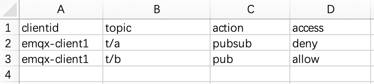
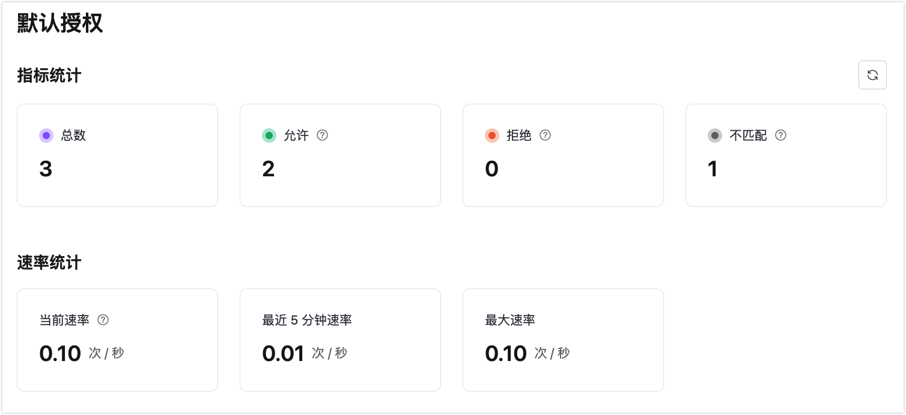

# 默认授权

默认授权是基于内置的数据库，为用户提供了一种低成本、开箱即用的授权方式。

## 查看授权信息

点击部署左侧菜单中的**访问控制**-> **客户端授权**，可以看到授权信息。授权信息通过**客户端 ID**, **用户名**，**全部用户**（主题）的三个维度来查看授权条目信息。

## 开启授权白名单模式

开启白名单模式后，会默认禁止所有用户订阅和发布。需要为客户端设置授权信息，客户端才能进行订阅发布。

点击部署左侧菜单中的**访问控制**-> **客户端授权**，在**全部用户**标签下添加一条授权信息，**主题**中输入 `#`，**主题动作**选择`发布 & 订阅`，**权限**选择`不允许`，点击**确认**开启白名单模式。

## 添加授权信息

在客户端授权页面上选择 **+ 添加**，新增授权会根据当前所处的分类来新建授权信息。

### 新增客户端 ID 授权
在**客户端 ID** 标签下创建指定相关客户端 ID 的授权规则。

- **客户端 ID**：适用此条规则的客户端。
- **主题**：配置该条规则对应的主题。
- **动作**：配置该条规则对应的操作。可选值：`发布`、`订阅`、`发布 & 订阅`。
- **权限**：是否允许当前客户端操作请求；可选值：`允许`、`不允许`。

### 新增用户名授权
在**用户名**标签下创建指定相关用户名授权规则。

- **用户名**：适用此条规则的用户名。
- **主题**：配置该条规则对应的主题。
- **动作**：配置该条规则对应的操作。可选值：`发布`、`订阅`、`发布 & 订阅`。
- **权限**：是否允许当前用户操作请求；可选值：`允许`、`不允许`。

### 新增主题授权
在**全部用户**标签下创建指定主题授权规则。

- **主题**：配置该条规则对应的主题。
- **动作**：配置该条规则对应的操作。可选值：`发布`、`订阅`、`发布 & 订阅。`
- **权限**：是否允许当前主题操作请求；可选值：`允许`、`不允许`。

### 占位符
可以在主题中使用占位符，在匹配规则时将当前客户端信息等动态替换到主题中，支持的占位符如下：
- ${clientid}
- ${username}

占位符只能用于替换主题的整个字段，例如 `a/b/${username}/c/d`，但是不能用于替换字段的一部分，例如 `a/b${username}c/d`。

## 批量导入授权信息

您可以通过 CSV 文件批量导入授权信息。

1. 点击**导入**按钮。

2. 下载模板。模板示例文件(client ID 授权模板为例)如下图所示：

   

3. 填写授权信息后上传文件。

4. 点击**导入**。

## 编辑授权信息

点击授权信息右侧的编辑图标，可以修改当前授权信息。

## 删除授权信息

点击授权信息右侧的删除图标，可以对授权信息进行删除。

## 查看授权统计

点击页面右上方的**授权统计**图标可以查看授权的指标统计和速率统计。

