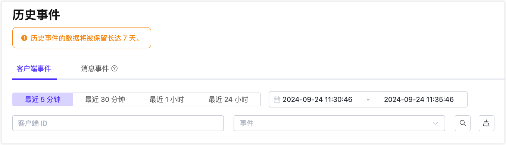
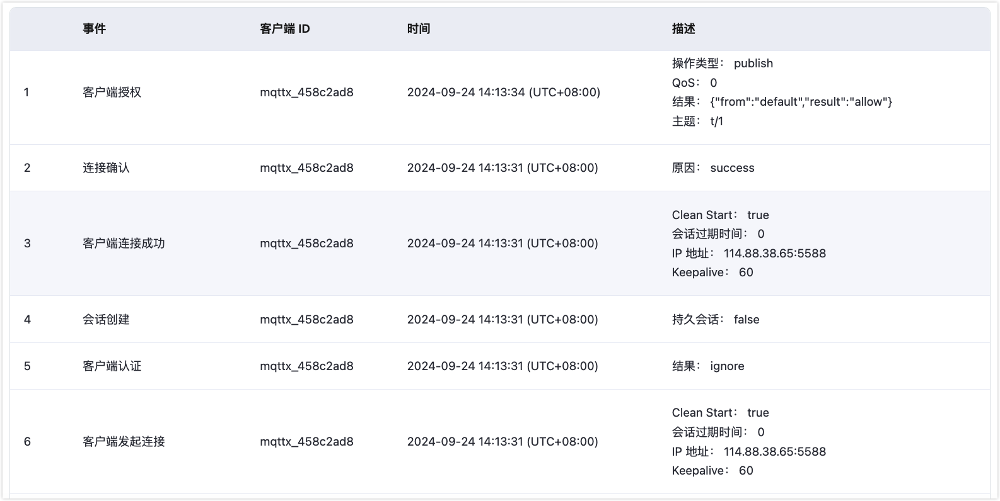

# 历史事件

::: tip 提示

历史事件功能仅适用于旗舰版部署。在开始之前，请确保您创建了有效的部署。

:::

历史事件是 EMQX Platform 提供的一项服务，用于记录客户端或消息事件，为 MQTT 连接提供深入的数据洞察。本文介绍如何使用历史事件功能。

## 优势

历史事件服务提供以下优势：

- **故障排除**：用户可以查看过去的事件，例如“断开连接”、“会话过期”、“消息丢失”等，从而帮助他们排查问题并获取潜在原因的洞察。
- **合规与监管**：在许多行业（如医疗或制造业）中，存在保持系统活动详细记录的监管要求。历史事件通过提供全面的审计跟踪，确保符合这些规定。
- **设备行为分析**：历史事件可以帮助分析物联网系统中设备的行为。通过检查时间戳和事件详情，开发者可以找出优化或改进的薄弱环节。

## 查看事件

进入您的旗舰版部署。在左侧导航菜单中点击**问题分析** -> **历史事件**。在历史事件页面，您可以在不同的标签页中分别查看客户端事件和消息事件。您可以按特定时间段过滤事件，并根据客户端 ID 和事件类型搜索事件。

 

在事件列表的**描述**列中，您可以查看事件的详细信息。

### 事件类型列表

以下表格列出了可以记录的事件类型及其触发时间。

| **事件**       | **触发时间**                                        |
| -------------- | --------------------------------------------------- |
| 客户端连接     | 当 EMQX Platform 接收到来自客户端的连接包时。       |
| 客户端已连接   | 当客户端身份验证完成并成功连接到 EMQX Platform 时。 |
| 客户端断开连接 | 客户端的连接层准备关闭时。                          |
| 客户端订阅     | 接收到订阅消息后。                                  |
| 客户端取消订阅 | 接收到取消订阅包后。                                |
| 客户端连接确认 | 当 EMQX Platform 准备发出连接响应消息时。           |
| 会话创建       | 当 `客户端已连接` 完成并创建新会话时。              |
| 会话接管       | 会话因接管而终止后。                                |
| 会话已订阅     | 订阅操作完成后。                                    |
| 会话已取消订阅 | 取消订阅操作完成后。                                |
| 会话恢复       | 当执行 `客户端已连接` 并成功恢复旧会话信息时。      |
| 会话被丢弃     | 会话因丢弃而终止后。                                |
| 会话终止       | 会话因其他原因终止后。                              |
| 消息丢失       | 当消息队列满或消息过期时，消息被丢失。              |