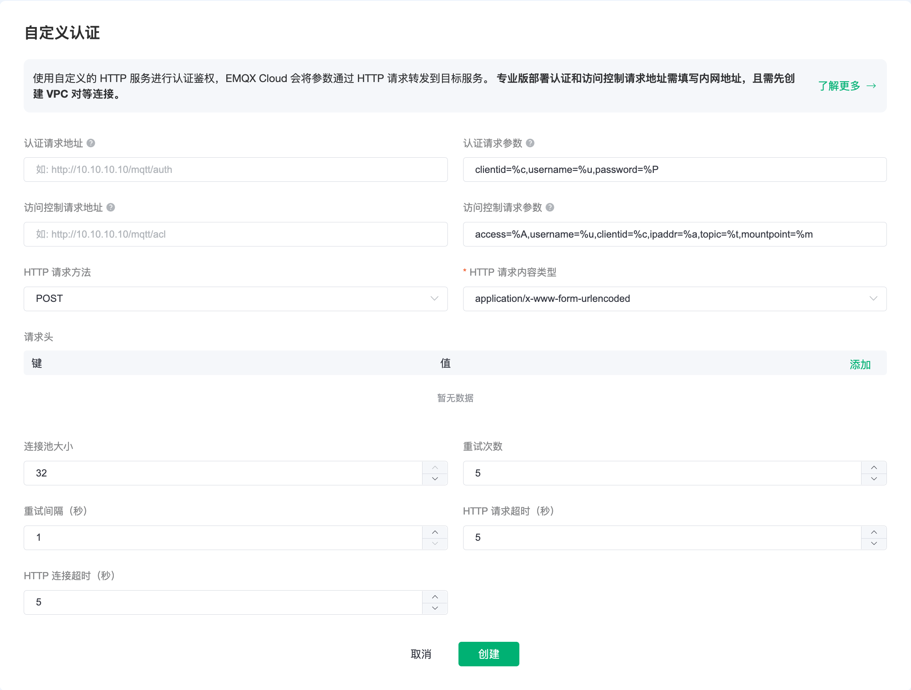

# HTTP 自定义认证

EMQ X Cloud 除了支持默认的认证和健全方式之外，还可以让用户连接到自己的服务，通过返回来判断终端的登录权限,能够实现复杂的认证鉴权逻辑和复杂的 ACL 校验逻辑。自定义认证目前可以支持权限的认证以及访问控制的认证。

## HTTP 认证原理
EMQ X Cloud 在设备连接事件中使用当前客户端相关信息作为参数，向用户自定义的认证服务发起请求查询权限，通过返回的 HTTP 响应状态码 (HTTP statusCode) 来处理认证请求。

 - 认证失败：API 返回 4xx 状态码
 - 认证成功：API 返回 200 状态码
 - 忽略认证：API 返回 200 状态码且消息体 ignore

## 权限认证

在 部署中点击 `认证鉴权` - `自定义认证`，点击起始页面的配置认证，即可新建认证。

进行身份认证时，EMQ X Cloud 将使用当前客户端信息填充并发起用户配置的认证查询请求，查询出该客户端在 HTTP 服务器端的认证数据。

在表单页配置权限认证的必填参数，包括认证请求地址、认证请求参数、HTTP 请求方法和请求内容的类型。其余的参数如果没有特殊要求使用默认值即可。

>  - 如果当前部署为基础版，请求地址请填写公网服务验证地址
>  - 如果当前部署为专业版，请求地址请填写内网IP服务验证地址

### 请求参数占位符

你可以在认证请求中使用以下占位符，请求时 EMQ X 将自动填充为客户端信息：

 - %u：用户名
 - %c：Client ID
 - %a：客户端 IP 地址
 - %r：客户端接入协议
 - %P：明文密码
 - %p：客户端端口
 - %C：TLS 证书公用名（证书的域名或子域名），仅当 TLS 连接时有效
 - %d：TLS 证书 subject，仅当 TLS 连接时有效

### 请求方法

HTTP 请求方法为 GET 时，请求参数将以 URL 查询字符串的形式传递；请求方法为 POST 时则将请求参数以普通表单形式提交（content-type 为 x-www-form-urlencoded 或 json）。

> 推荐使用 POST 方法，使用 GET 方法时明文密码可能会随 URL 被记录到传输过程中的服务器日志中。

## 访问控制认证

进行发布、订阅认证时，EMQ X Cloud 将使用当前客户端信息填充并发起用户配置的 ACL 授权查询请求，查询出该客户端在 HTTP 服务器端的授权数据。

在表单页配置权限认证的必填参数，包括访问控制请求地址、访问控制请求参数、HTTP 请求方法和请求内容的类型。其余的参数如果没有特殊要求使用默认值即可。

### 请求参数占位符

你可以在认证请求中使用以下占位符，请求时 EMQ X 将自动填充为客户端信息：

 - %A：操作类型，'1' 订阅；'2' 发布
 - %u：客户端用户名
 - %c：Client ID
 - %a：客户端 IP 地址
 - %r：客户端接入协议
 - %m：Mountpoint
 - %t：主题

### 请求方法

HTTP 请求方法为 GET 时，请求参数将以 URL 查询字符串的形式传递；请求方法为 POST 时则将请求参数以普通表单形式提交（content-type 为 x-www-form-urlencoded 或 json）。

