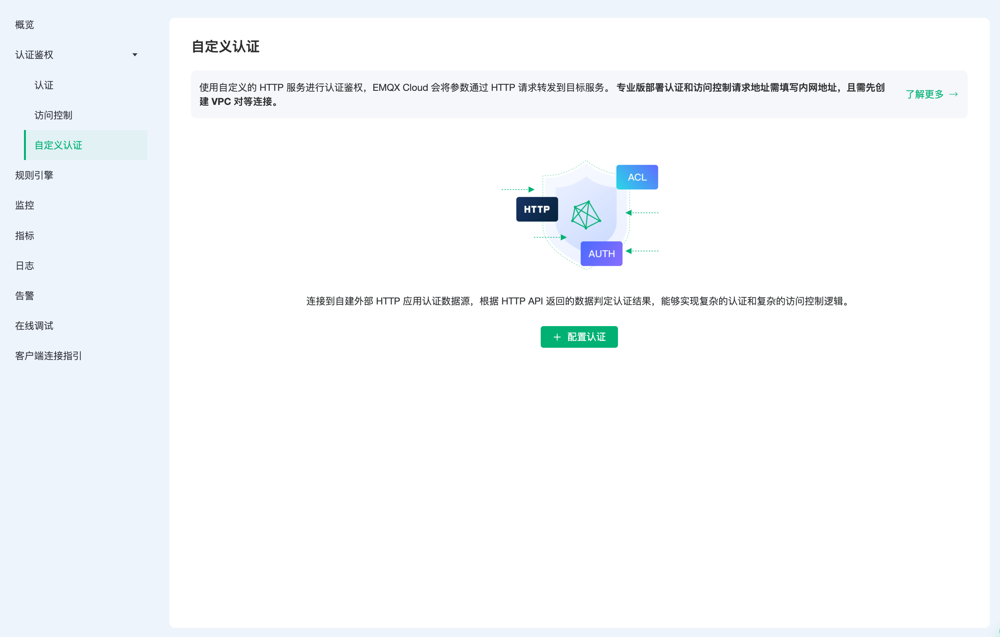

# HTTP 自定义认证

EMQX Cloud 除了支持默认的认证和鉴权方式之外，还可以让用户连接到自己的服务，通过返回来判断终端的登录权限,能够实现复杂的认证鉴权逻辑和复杂的 ACL 校验逻辑。自定义认证目前可以支持权限的认证以及访问控制的认证。

您可以查看[教程视频](https://player.bilibili.com/player.html?aid=552145995&bvid=BV15i4y1C7km&cid=546961807&page=1)进一步了解。

## HTTP 认证原理

EMQX Cloud 在设备连接事件中使用当前客户端相关信息作为参数，向用户自定义的认证服务发起请求查询权限，通过返回的 HTTP 响应状态码 (HTTP statusCode) 来处理认证请求。

- 认证成功：API 返回 200 状态码
- 认证失败：API 返回 非 200 状态码
- 忽略认证：API 返回 200 状态码且消息体 ignore

## 认证链

若同时启用默认认证模块，EMQX Cloud 将按照[默认认证](https://docs.emqx.com/zh/cloud/latest/deployments/auth.html#%E8%AE%A4%E8%AF%81) -> HTTP 认证的顺序进行链式认证：

- 一旦认证成功，终止认证链并允许客户端接入
- 一旦认证失败，终止认证链并禁止客户端接入

## ACL 鉴权链

若同时启用默认 ACL 模块，EMQX Cloud 将按照[默认认证数据库 ACL](https://docs.emqx.com/zh/cloud/latest/deployments/acl.html) ->  HTTP ACL ->  系统默认设置(允许所有订阅/发布) 的顺序进行链式鉴权：

- 一旦通过鉴权，终止链并允许客户端通过验证
- 一旦鉴权失败，终止链并禁止客户端通过验证
- 直到最后一个 ACL 模块仍未通过鉴权，根据系统默认设置来验证，即 **允许所有订阅/发布**

> 同时只启用一个 ACL 插件可以提高客户端 ACL 检查性能。

## 权限认证

在 部署中点击 `认证鉴权` - `自定义认证`，点击起始页面的配置认证，即可新建认证。

进行身份认证时，EMQX Cloud 将使用当前客户端信息填充并发起用户配置的认证查询请求，查询出该客户端在 HTTP 服务器端的认证数据。

在表单页配置权限认证的必填参数，包括认证请求地址、认证请求参数、HTTP 请求方法和请求内容的类型。其余的参数如果没有特殊要求使用默认值即可。

::: tip
* 如果当前部署为基础版，服务器地址填写公网地址。
* 如果当前部署为专业版，需创建 [VPC 对等连接](https://docs.emqx.com/zh/cloud/latest/deployments/vpc_peering.html)，服务器地址填写内网地址。
* 如果当前部署为 BYOC 版，需在您的公有云控制台中创建 VPC 对等连接，具体请参考 [创建 BYOC 部署 - VPC 对等连接配置](../create/byoc.md#vpc-对等连接配置) 章节。服务器地址填写内网地址。
* 若提示 Init resource failure! 请检查服务器地址是否无误、安全组是否开启。
:::

### 请求参数占位符

你可以在认证请求中使用以下占位符，请求时 EMQX 将自动填充为客户端信息：

 - %u：用户名
 - %c：Client ID
 - %a：客户端 IP 地址
 - %r：客户端接入协议
 - %P：明文密码
 - %p：客户端端口

### 请求方法

HTTP 请求方法为 GET 时，请求参数将以 URL 查询字符串的形式传递；请求方法为 POST 时则将请求参数以普通表单形式提交（content-type 为 x-www-form-urlencoded 或 json）。

> 推荐使用 POST 方法，使用 GET 方法时明文密码可能会随 URL 被记录到传输过程中的服务器日志中。

## 访问控制认证

进行发布、订阅认证时，EMQX Cloud 将使用当前客户端信息填充并发起用户配置的 ACL 授权查询请求，查询出该客户端在 HTTP 服务器端的授权数据。

在表单页配置权限认证的必填参数，包括访问控制请求地址、访问控制请求参数、HTTP 请求方法和请求内容的类型。其余的参数如果没有特殊要求使用默认值即可。

### 请求参数占位符

你可以在认证请求中使用以下占位符，请求时 EMQX 将自动填充为客户端信息：

 - %A：操作类型，'1' 订阅；'2' 发布
 - %u：客户端用户名
 - %c：Client ID
 - %a：客户端 IP 地址
 - %r：客户端接入协议
 - %t：主题

### 请求方法

HTTP 请求方法为 GET 时，请求参数将以 URL 查询字符串的形式传递；请求方法为 POST 时则将请求参数以普通表单形式提交（content-type 为 x-www-form-urlencoded 或 json）。

