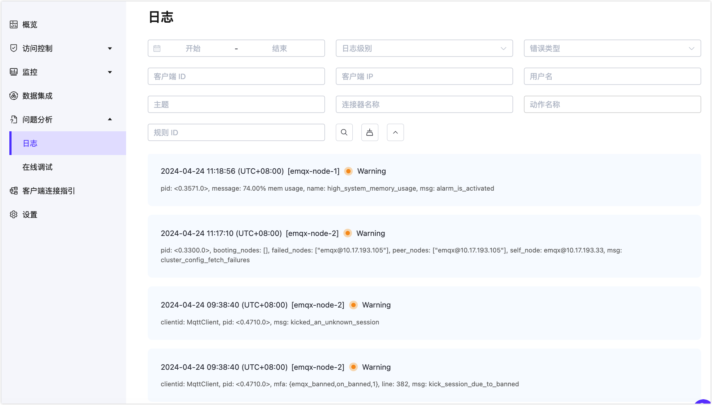

# 部署日志

EMQ X Cloud 提供实时在线查看 EMQ X 日志功能

## 查看部署日志

点击日志页面将跳转到部署日志页面，在这里可以查看部署日志相关消息。点击右上角选择不同节点，查看不同节点日志信息。

## 日志分析

| 日志                                                                                                               | 级别     | 原因                                                   | 处理                                          |
| ----------------------------------------------------------------------------------------------------------------- | ------- | ------------------------------------------------------ | -------------------------------------------- |
| Client xxx (Username: 'xxx') login failed for not_authorized                                                      | warning | 客户端认证失败                                           | 检查客户端认证配置是否正确                        |
| Cannot publish message to xxx due to Not authorized.                                                              | warning | 客户端 ACL 认证失败                                      | 检查部署访问控制配置是否正确                      |
| Parse failed for function_clause, [{emqx_frame,parse_utf8_string                                                  | warning | 非标准 MQTT 协议连接                                     | 检查客户端连接使用的 MQTT 协议是否为标准 MQTT 协议 |
| Dropped msg due to queue is full: Message(Id=xxx, QoS=1, Topic=xxx                                                | warning | 部署由于客户端长期离线或主题未被订阅导致大量 QoS 1 消息丢弃    | 检查发布消息的主题是否有被订阅和订阅的客户端是否在线 |
| Cannot publish messages to /acp_player/heartbeat due to Quota exceeded.                                           | warning | 部署超过限制请及时调整客户端发送速率                        | 及时调整客户端发送速率，使发送速率小于部署限制的 TPS |
| Take action <<"data_to_mysql_xxx">> failed, continue next action, reason: {error,{data_to_mysql,disconnected}     | error   | 部署规则引擎 MySQL 资源异常                               | 检查部署规则引擎中 MySQL 资源                   |
| cluster_call error found, ResL: [{{emqx_web_hook_actions,on_resource_create}                                      | error   | 部署规则引擎 Webhook 资源异常                             | 检查部署规则引擎中 Webhook 资源                 |
| HTTP request failed with status code: 401                                                                         | error   | 规则引擎 Webhook 资源出现状态为 401 的错误                 | 检查部署规则引擎中 Webhook 资源配置的认证是否正确可用 |
| cluster_call error found, ResL: [{{emqx_bridge_kafka_actions,on_resource_create},{error,connect_kafka_server_fail | error   | 部署规则引擎 Kafka 资源异常                               | 部署规则引擎 Kafka 资源异常                      | 
| cluster_call error found, ResL: [{{emqx_bridge_kafka_actions,on_resource_create},{error,connect_kafka_server_fail | error   | 部署由于 SQL 模板配置错误导致数据插入失败                    | 检查部署规则引擎中规则的 SQL 编写是否正确          |