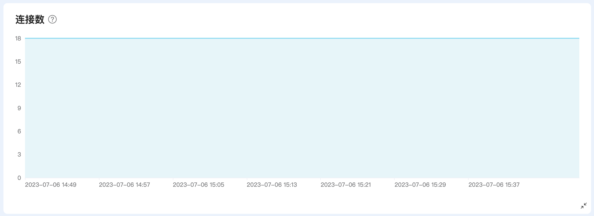
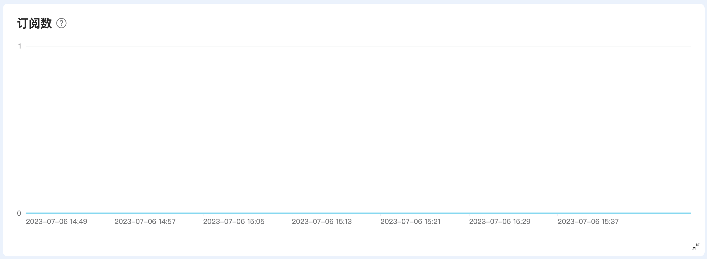
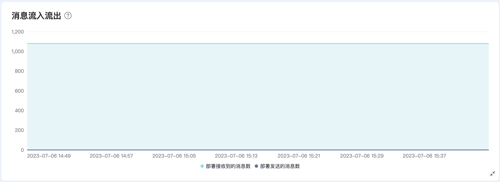
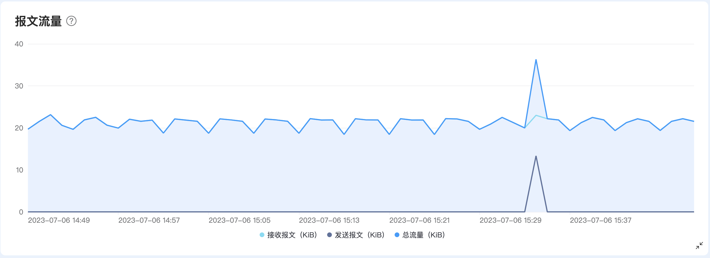
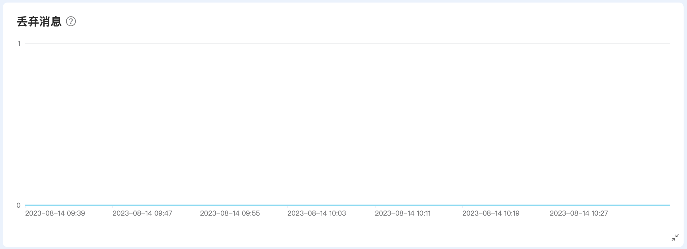
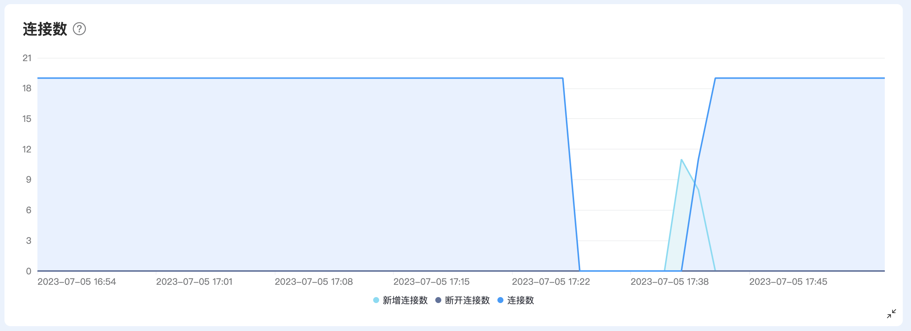
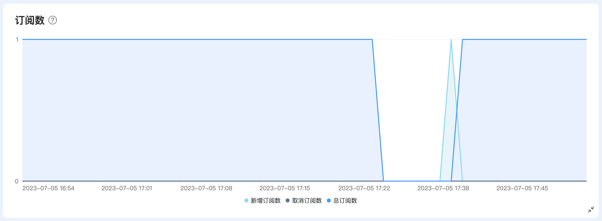
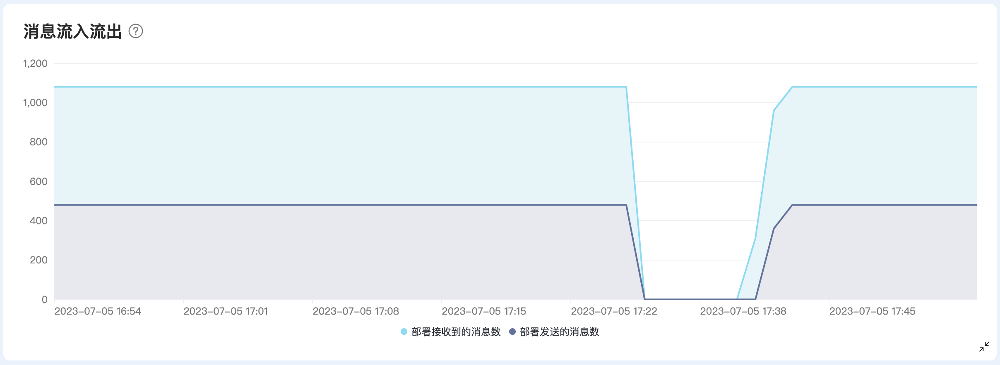
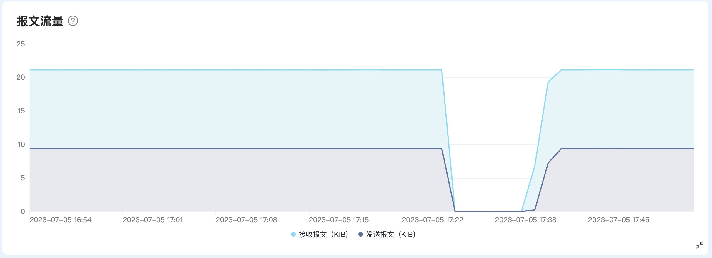
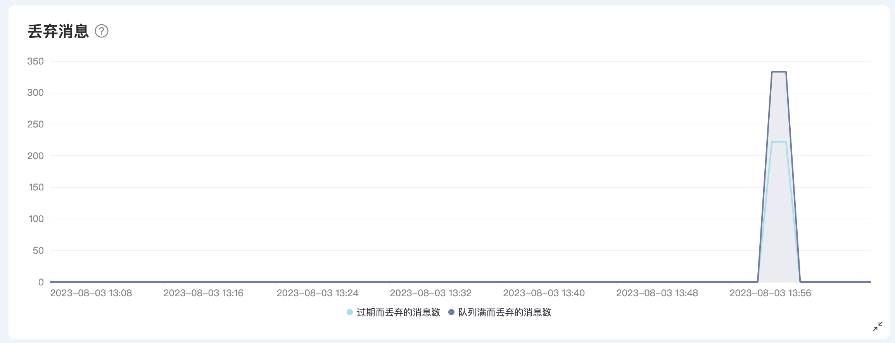

<!-- markdownlint-disable MD001 -->

# 部署指标

指标提供了在一段时间范围内部署的关键数据状态和变化。您可以在部署详情页，点击左侧导航目录中的的**指标**进入页面查看。

## Serverless 指标
Serverless 部署的指标页面提供了连接数、流入流出消息、报文流量、订阅数和丢弃消息这 5 种指标，可以查看每类指标对应的展示图表，某个时间点的详细信息。

### 连接数
连接数图表展示了在选择时间段内，连接到部署的客户端的数量。这里连接的客户端数也包含了保留会话的离线客户端。[保留会话](https://www.emqx.com/zh/blog/mqtt-session)，即客户端断开连接时，会话仍然保持并保存离线消息，直到会话超时注销。

### 订阅数
订阅数图表展示在选择的时间段内部署的总订阅数。

### 消息流入流出
消息流入流出图表展示在选择的时间段内，部署接收到的消息数、发送出去的消息数和未被订阅的消息数。
- 部署接收到的消息为从设备或应用端发送到部署的消息数。
- 部署发送的消息为从部署发送到设备或应用端的消息。

### 报文流量

报文流量图表展示在选择的时间段内，部署接收到的消息以及发送出去的消息报文流量，包含以下3种数据：
- 总流量：接收和发送消息的报文总量。
- 接受报文流量：从设备或应用端发送到部署的消息的报文总量。
- 发送报文流量：从部署发送到设备或应用端的消息的报文总量。

### 丢弃消息

丢弃消息图表显示在所选时间段内发送阶段丢弃的消息。消息被丢弃的原因可能是报文太大、消息队列已满或消息过期。

## 专有版 / BYOC 指标

专有版和 BYOC 部署的指标页面提供了连接数、流入流出消息、报文流量、订阅数和丢弃消息这 5 种指标。您可以查看每类指标对应的展示图表，以及在某个时间点的详细信息。对于有一些指标，标明了 API 中对应的指标名称，如果您需要了解和查看更多的指标，可以通过 [API - 指标](../api/metrics.md) 获取更多的指标信息。

::: tip
如果表格中没有对应的 API 指标名称，则表明改指标不能从 API 中获取。
:::

### 连接数

连接数图表展示了在选择的时间段内，连接到部署的客户端数量。这里连接的客户端数也包含了保留会话的离线客户端。[保留会话](https://www.emqx.com/zh/blog/mqtt-session)，即客户端断开连接时，会话仍然保持并保存离线消息，直到会话超时注销。图表提供 3 种指标：

|对应的 API 指标            | 描述                                     |
| ----------------- | :--------------------------------------- |
| - | 连接数 |
| client.connected |当前时刻新增的客户端数              |
| client.disconnected     | 当前时刻断开的客户端数      |

### 订阅数

订阅数图表提供3种指标，展示在选择的时间段内部署的订阅数情况。

|对应的 API 指标            | 描述                                     |
| ----------------- | :--------------------------------------- |
| - | 总订阅数|
| client.subscribe | 当前时刻新增订阅的数量  |
| client.unsubscribe    | 当前时刻取消订阅的数量  |

### 消息流入流出
消息流入流出图表提供3种指标，展示了在选择的时间段内部署接收到的消息数，发送出去的消息数和未被订阅的消息数。

|对应的 API 指标            | 描述                                     |
| ----------------- | :--------------------------------------- |
| messages.received | 从设备或应用端发送到部署的消息数   |
| messages.sent     | 从部署发送到设备或应用端的消息   |
| messages.dropped.no_subscribers | 没有订阅而丢弃的消息数  |

### 报文流量
报文流量图表提供2种指标，展示在选择时间段内，部署接收到的消息以及发送出去的消息报文流量。

|对应的 API 指标            | 描述                                     |
| ----------------- | :--------------------------------------- |
| bytes.received | 从设备或应用端发送到部署的消息的报文总量（in KiB）  |
| bytes.sent     | 从部署发送到设备或应用端的消息的报文总量（in KiB）  |

### 丢弃消息
丢弃消息图表展示在选择的时间段内，在发送时因消息过期而被丢弃的消息数和消息队列满了而被丢弃的消息数。
|对应的 API 指标            | 描述                                     |
| ----------------- | :--------------------------------------- |
| delivery.dropped.expired | 因过期而被丢弃的消息  |
| delivery.dropped.queue_full    | 因队列满而被丢弃的消息 |

