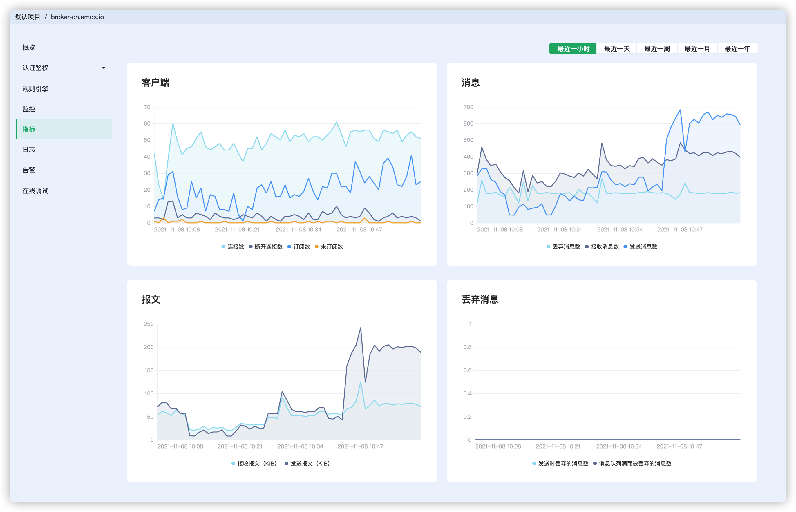

# 部署指标

EMQ X Cloud 提供了消息、客户端、报文、交付四种增量指标，可以查看每种指标对应的展示图表，某个时间点的详细信息。

## 消息

展示在时间段内，消息的收发的增量情况。提供以下 3 种指标：

| 指标              | 意义                                     |
| ----------------- | :--------------------------------------- |
| messages_dropped  | EMQ X 内部转发到订阅进程前丢弃的消息总数 |
| messages_received | 接收来自客户端的消息数量                 |
| messages_sent     | 发送给客户端的消息数量                   |

## 客户端

展示在时间段内，与客户端交互的增量情况。它提供以下 4 种指标：

| 指标                | 意义               |
| ------------------- | :----------------- |
| client_connected    | 客户端成功连接次数 |
| client_disconnected | 客户端断开连接次数 |
| client_subscribe    | 客户端订阅次数     |
| client_unsubscribe  | 客户端取消订阅次数 |

## 报文

展示在时间段内，收发的字节数的增量情况。提供以下 2 种指标：

| 指标               | 意义             |
| ------------------ | :--------------- |
| send_kibibytes     | 发送报文的千字节 |
| received_kibibytes | 接受报文的千字节 |

## 交付

展示在时间段内，丢弃的消息数量增量情况，提供以下 1 种指标：

| 指标             | 意义                 |
| ---------------- | :------------------- |
| delivery_dropped | 发送时丢弃的消息总数 |

