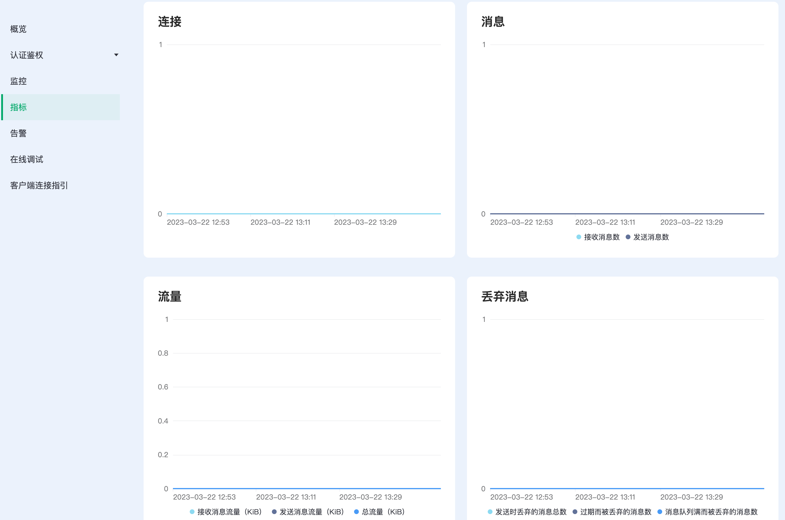

# 部署指标

Serverless 提供了连接、消息、流量、丢弃消息四种增量指标，可以查看每种指标对应的展示图表，某个时间点的详细信息。

## 连接

展示在时间段内，当前时间点的连接数。它提供以下 1 种指标：

| 指标                | 意义               |
| ------------------- | :----------------- |
| sessions    | session 数量 |

## 消息

展示在时间段内，消息的收发的增量情况。提供以下 2 种指标：

| 指标              | 意义                                     |
| ----------------- | :--------------------------------------- |
| messages_received | 接收来自客户端的消息数量                 |
| messages_sent     | 发送给客户端的消息数量                   |

## 流量

展示在时间段内，收发消息所产生的流量情况。提供以下 3 种指标：

| 指标               | 意义             |
| ------------------ | :--------------- |
| send_kibibytes     | 发送报文的千字节 |
| received_kibibytes | 接受报文的千字节 |
| total_kibibytes | 一共收发报文的千字节 |

## 丢弃消息

展示在时间段内，丢弃的消息数量增量情况，提供以下 3 种指标：

| 指标             | 意义                 |
| ---------------- | :------------------- |
| delivery_dropped | 发送时丢弃的消息总数 |
| delivery_dropped_queue_full | 消息队列满而被丢弃的消息数 |
| delivery_dropped_expire | 消息过期而被丢弃的消息数 |
