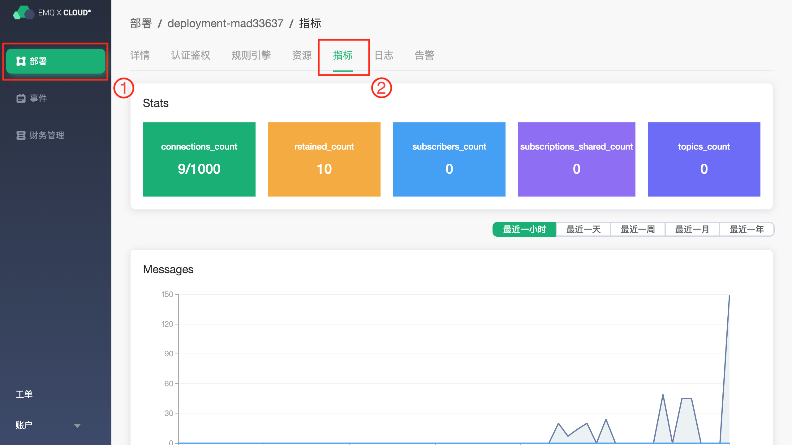
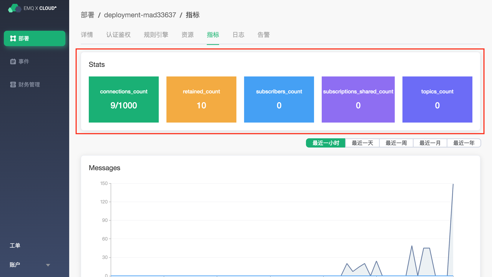
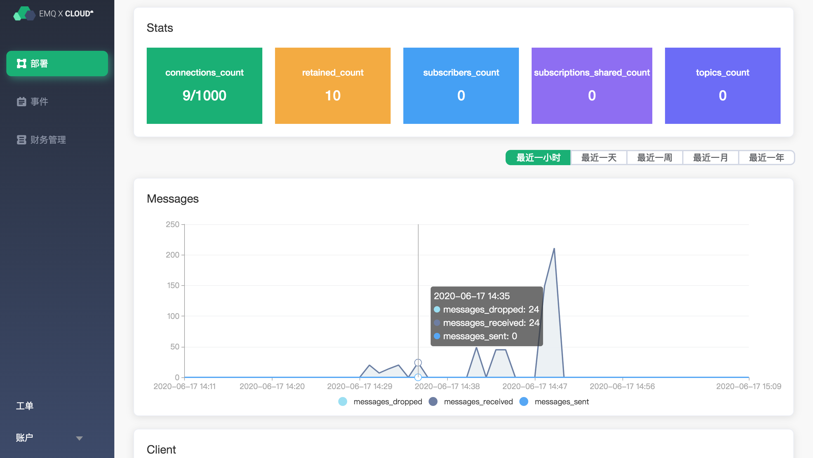
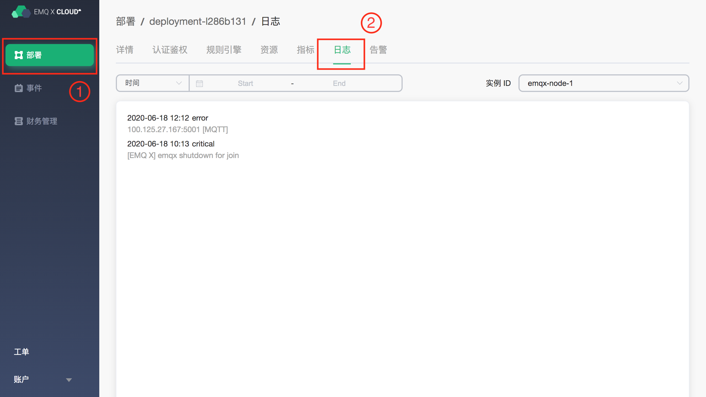
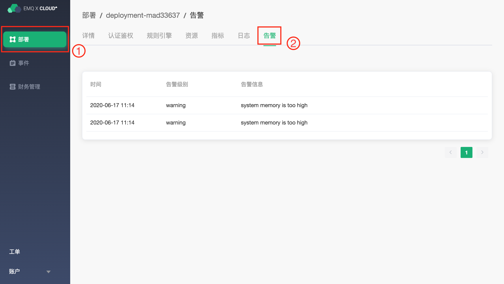

# 监控和告警

EMQ X Cloud 提供完整的监控和告警方案 

要查看部署的监控和告警，请导航至 [EMQ X Cloud 控制台](https://cloud.emqx.io/console/) 点击相应的部署，即可查看该部署的监控指标，日志以及告警。

### 监控

点击指标页面，将跳转到部署指标页面，在这里可以查看部署的指标信息。

#### EMQX 实时指标

在 Stats 模块里，提供最近一段时间内的 EMQX 数量指标。从左到右分别为：

1. 连接数量
2. 留存数量
3. 订阅数量
4. 共享订阅数
5. 主题数量

#### EMQX 增量指标

指标面还提供了 消息、客户端、报文、交付 四种增量指标。

把鼠标移动到图表上，可以查看每个图表，某个时间点的详细信息。

##### 消息

展示在时间段内，消息的收发的增量情况。提供以下 3 种指标：

| 指标              | 意义                                     |
| ----------------- | :--------------------------------------- |
| messages_dropped  | EMQ X 内部转发到订阅进程前丢弃的消息总数 |
| messages_received | 接收来自客户端的消息数量                 |
| messages_sent     | 发送给客户端的消息数量                   |

##### 客户端

展示在时间段内，与客户端交互的增量情况。它提供以下 4 种指标：

| 指标                | 意义               |
| ------------------- | :----------------- |
| client_connected    | 客户端成功连接次数 |
| client_disconnected | 客户端断开连接次数 |
| client_subscribe    | 客户端订阅次数     |
| client_unsubscribe  | 客户端取消订阅次数 |

##### 报文

展示在时间段内，收发的字节数的增量情况。提供以下 2 种指标：

| 指标               | 意义             |
| ------------------ | :--------------- |
| send_kibibytes     | 发送报文的千字节 |
| received_kibibytes | 接受报文的千字节 |

##### 交付

展示在时间段内，丢弃的消息数量增量情况，提供以下 1 种指标：

| 指标             | 意义                 |
| ---------------- | :------------------- |
| delivery_dropped | 发送时丢弃的消息总数 |

### 日志

点击日志页面，将跳转到部署日志页面，在这里可以查看部署日志相关消息

### 告警

点击告警页面，将跳转到部署告警页面，在这里可以查看部署告警相关消息

EMQ X Cloud 提供以下 5 种告警提示

| 告警类型              | 告警服务          | 告警级别  | 触发条件                                |
| ------------------- | ---------------- | -------- | ------------------------------------- |
| connections-high    | load_balancer    | warning  | 部署连接数大于购买规格 90%             |
| traffic-high        | load_balancer    | warning  | 流量突增                                |
| cpu-high            | instance         | warning  | 实例 cpu 负载使用率大于 75%               |
| memory-high         | instance         | warning  | 实例 memory 使用率大于 75%               |
| filesystem-high     | instance         | warning  | 实例 disk 使用率大于 75%                 |
