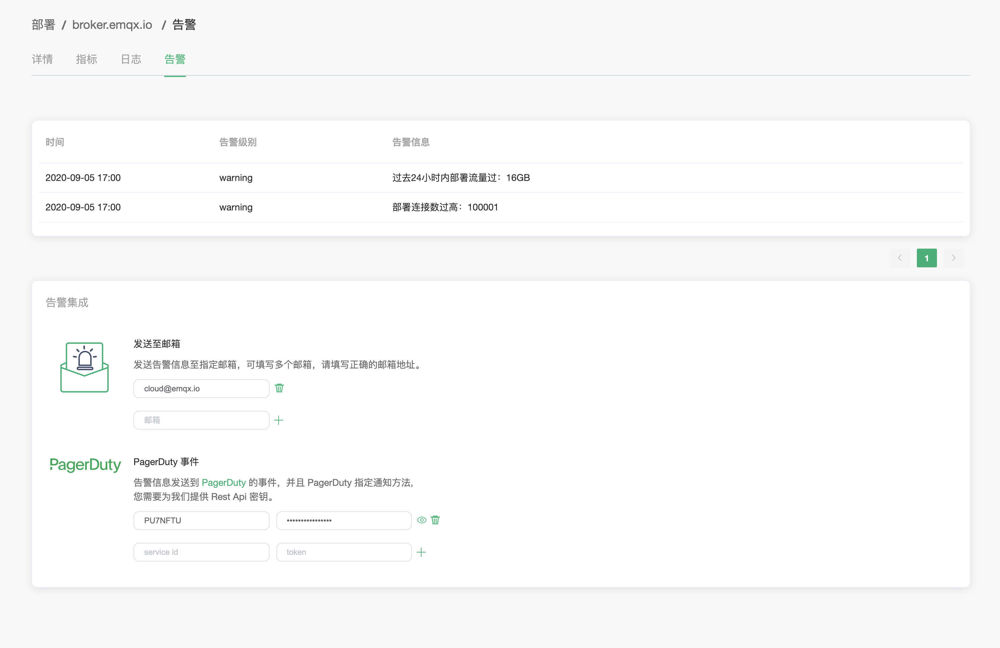

# 告警

### 告警信息

点击告警页面，将跳转到部署告警页面，在这里可以查看部署告警相关消息

EMQ X Cloud 提供以下 5 种告警提示

| 告警类型              | 告警服务          | 告警级别  | 触发条件                                |
| ------------------- | ---------------- | -------- | ------------------------------------- |
| connections-high    | load_balancer    | warning  | 部署连接数大于购买规格 90%             |
| traffic-high        | load_balancer    | warning  | 流量突增                                |
| cpu-high            | instance         | warning  | 实例 cpu 负载使用率大于 75%               |
| memory-high         | instance         | warning  | 实例 memory 使用率大于 75%               |
| filesystem-high     | instance         | warning  | 实例 disk 使用率大于 75%                 |

### 告警集成

EMQ X Cloud 提供两种方式的告警集成。

1. 通过邮箱告知
2. 通过 PagerDuty 事件告知

可以在 `告警` 页下方添加您需要的告警集成方式。
