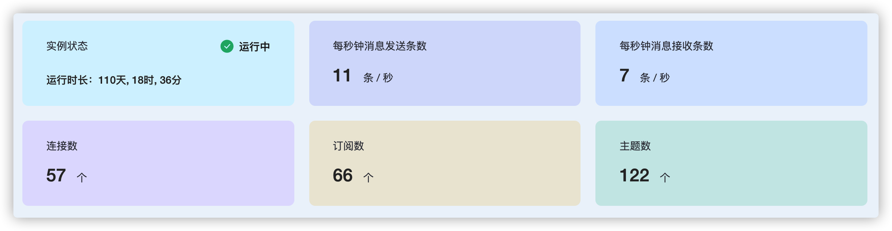
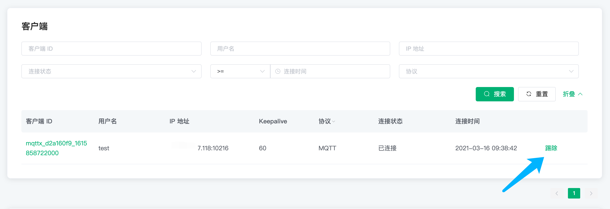
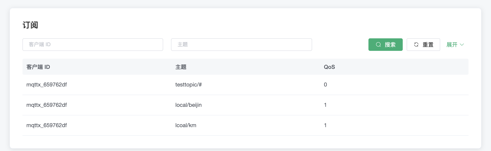

# 监控

EMQX Cloud 提供了监控指标，可实时查看连接数，TPS，订阅数和主题数等数据。

## 基础信息
包含以下几个监控指标
* 集群状态和集群运行时长
* 每秒钟消息发送条数
* 每秒钟消息接收条数
* 连接数
* 订阅数
* 主题数

## 客户端

客户端列表包含以下数据
* 客户端 ID
* 用户名
* IP 地址
* Keepalive
* 协议
* 连接状态
* 连接时间

以上数据除 Keepalive 以外都支持搜索，还可以点击列表项末尾的 `剔除` 按钮将客户端剔除下线

## 订阅

订阅列表包含以下数据
* 客户端 ID
* 主题
* QoS

搜索支持
* 客户端 ID
* topic 查询：例如：要搜索 `a/b`，可以通过 `a/b`，`a/+` 和 `a/#` 搜索到
* QoS
* 共享订阅组名称
